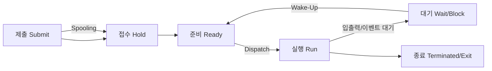

# 203 프로세스 상태 및 상태 전이

작성 기준일: 2026-06-01
검색/보강일: 2026-06-01
기준 PDF: `/Users/nes0903/Documents/study/정보처리기사/핵심요약집_2026_정보처리기사필기핵심요약.pdf`
PDF 확인 위치: 31페이지 `203 프로세스 상태 및 상태 전이`

## 한 줄 요약

- 프로세스는 제출, 접수, 준비, 실행, 대기, 종료 상태를 거치며, 전이는 CPU 할당, 입출력 대기, 이벤트 발생 등에 따라 일어난다.

## 한눈에 보는 구조

## PDF 기준 핵심

- 프로세스의 상태: 제출(Submit), 접수(Hold), 준비(Ready), 실행(Run), 대기(Wait, 보류, 블록), 종료(Terminated, Exit)
- 프로세스 상태 전이: Dispatch, Wake-Up, Spooling
- PDF의 상태명과 전이명은 영문 단서까지 함께 외우는 것이 안전하다.

## 개념 설명

- 제출(Submit): 사용자가 작업을 시스템에 제출한 상태이다.
- 접수(Hold): 작업이 보조기억장치 등에 보관되어 실행 준비를 기다리는 상태이다.
- 준비(Ready): CPU만 할당되면 즉시 실행할 수 있는 상태이다.
- 실행(Run): CPU를 점유하여 명령을 수행하는 상태이다.
- 대기(Wait/Block): 입출력 완료나 이벤트 발생을 기다리는 상태이다.
- 종료(Terminated/Exit): 실행이 끝나 시스템에서 제거되는 상태이다.

## 시험 포인트

- `Dispatch`는 준비 상태의 프로세스가 CPU를 받아 실행 상태로 가는 전이이다.
- `Wake-Up`은 대기 상태의 원인이 해소되어 준비 상태로 돌아가는 전이이다.
- `Spooling`은 느린 입출력 장치와 CPU 사이의 속도 차이를 완화하기 위해 보조기억장치에 작업을 모아 두는 처리로, 제출 작업이 접수 단계로 넘어가는 흐름과 함께 기억한다.
- 준비(Ready)와 대기(Wait)를 혼동하지 않는다. 준비는 CPU만 기다리고, 대기는 입출력이나 이벤트를 기다린다.

## 헷갈리는 비교

| 상태 | 핵심 의미 | 기다리는 대상 | 시험 단서 |
|---|---|---|---|
| Ready | 실행 가능하지만 CPU 미할당 | CPU | 준비 큐 |
| Run | CPU 점유 중 | 없음 | 현재 실행 |
| Wait/Block | 이벤트가 끝나야 실행 가능 | I/O, 사건 | 대기, 보류, 블록 |
| Terminated | 실행 완료 | 없음 | 종료, Exit |

## 예시 또는 암기 포인트

- 파일을 읽으려고 디스크 입출력을 요청한 프로세스는 `Run`에서 `Wait`로 간다.
- 디스크 입출력이 끝나면 `Wake-Up`되어 `Ready`로 돌아온다.
- 스케줄러가 Ready 큐에서 하나를 골라 CPU를 주면 `Dispatch`가 발생한다.
- 암기식: `Ready는 CPU 대기, Wait는 사건 대기`.

## 빠른 복습

- Dispatch의 방향은? Ready → Run.
- Wake-Up의 방향은? Wait/Block → Ready.
- Ready와 Wait의 차이는? Ready는 CPU만 받으면 되고, Wait는 이벤트가 끝나야 한다.

## 참고 링크

- [OSTEP - The Abstraction: The Process](https://pages.cs.wisc.edu/~remzi/OSTEP/cpu-intro.pdf)
- [OpenStax - Processes and Concurrency](https://openstax.org/books/introduction-computer-science/pages/6-3-processes-and-concurrency)
