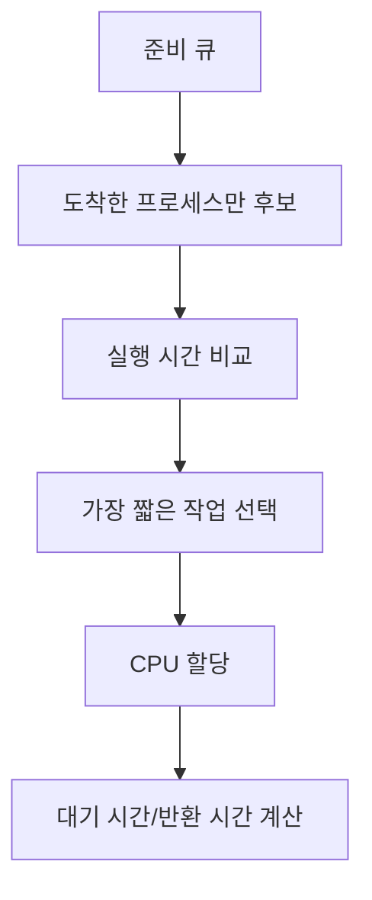

# 204 스케줄링 - SJF

작성 기준일: 2026-06-01
검색/보강일: 2026-06-01
기준 PDF: `/Users/nes0903/Documents/study/정보처리기사/핵심요약집_2026_정보처리기사필기핵심요약.pdf`
PDF 확인 위치: 31페이지 `204 스케줄링 - SJF`

## 한 줄 요약

- SJF는 실행 시간이 가장 짧은 프로세스에게 먼저 CPU를 할당하는 스케줄링 기법이다.

## 한눈에 보는 구조

## PDF 기준 핵심

- 실행 시간이 가장 짧은 프로세스에게 먼저 CPU를 할당하는 기법이다.
- PDF 예제는 제출 시간이 있는 경우와 없는 경우를 나누어 평균 실행 시간, 평균 대기 시간, 평균 반환 시간을 계산한다.
- 도착 시간이 있으면 아직 도착하지 않은 프로세스는 선택 후보가 아니다.

## 개념 설명

- SJF(Shortest Job First)는 CPU 버스트 시간이 짧은 작업을 먼저 처리한다.
- 비선점 SJF는 한 번 CPU를 받은 프로세스가 종료될 때까지 계속 실행된다.
- 선점형 변형은 SRT(Shortest Remaining Time) 또는 STCF로 설명되며, 남은 시간이 더 짧은 작업이 오면 현재 작업을 빼앗을 수 있다.
- 정보처리기사 초치기 범위에서는 `가장 짧은 실행 시간 우선`이라는 선택 기준과 계산 절차가 핵심이다.

## 시험 포인트

- 대기 시간 = 실행 시작 시각 - 도착 시각이다.
- 반환 시간 = 종료 시각 - 도착 시각이다.
- 도착 시간이 모두 0이면 실행 시간이 짧은 순서대로 정렬하면 된다.
- 도착 시간이 다르면 현재 시각에 준비 큐에 들어온 프로세스 중에서만 가장 짧은 것을 선택한다.
- 평균값은 각 프로세스별 값을 모두 더해 프로세스 수로 나눈다.

## 헷갈리는 비교

| 구분 | SJF | FCFS | HRN |
|---|---|---|---|
| 선택 기준 | 실행 시간 짧은 순 | 도착 순 | 응답률 큰 순 |
| 장점 | 평균 대기 시간 감소 가능 | 단순함 | 긴 작업의 기아 완화 |
| 약점 | 긴 작업 기아 가능 | 짧은 작업도 오래 기다림 | 계산식 필요 |
| 시험 단서 | Shortest Job | 먼저 도착 | 대기+서비스/서비스 |

## 예시 또는 암기 포인트

- 프로세스 실행 시간이 `P1=20`, `P2=7`, `P3=4`이고 모두 준비 상태라면 SJF 순서는 `P3 → P2 → P1`이다.
- 도착 시간이 `P1=0`, `P2=1`, `P3=2`라면 시각 0에는 P1만 있으므로 P1을 먼저 실행하는 비선점 풀이가 가능하다.
- 암기식: `SJF = 짧은 일 먼저`.

## 빠른 복습

- SJF의 기준은? 실행 시간이 가장 짧은 프로세스.
- 도착 시간이 있는 문제의 첫 단계는? 현재 시각에 도착한 프로세스만 후보로 본다.
- 반환 시간 공식은? 종료 시각 - 도착 시각.

## 참고 링크

- [OSTEP - Scheduling: Introduction](https://pages.cs.wisc.edu/~remzi/OSTEP/cpu-sched.pdf)
- [OpenStax - Processes and Concurrency](https://openstax.org/books/introduction-computer-science/pages/6-3-processes-and-concurrency)

<!-- study-links:start -->
## 관련 문서

- `스케줄링`: [[정보처리기사/4과목 프로그래밍 언어 활용/205 스케줄링 - HRN/205 스케줄링 - HRN|205 스케줄링 - HRN]]
<!-- study-links:end -->
