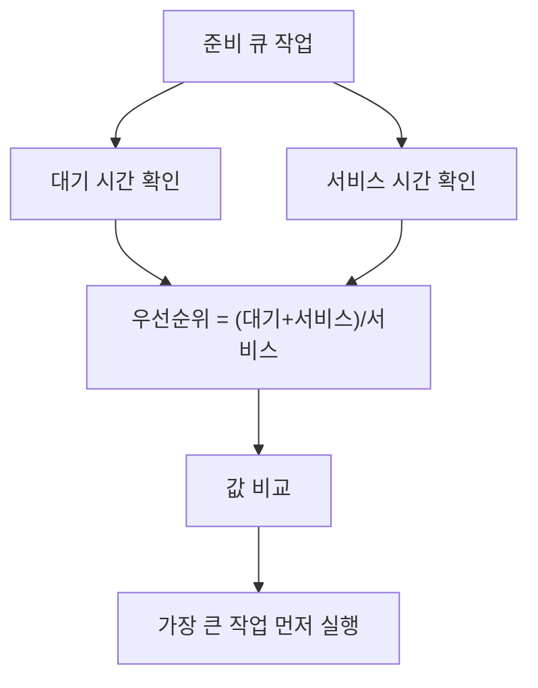

# 205 스케줄링 - HRN

작성 기준일: 2026-06-01
검색/보강일: 2026-06-01
기준 PDF: `/Users/nes0903/Documents/study/정보처리기사/핵심요약집_2026_정보처리기사필기핵심요약.pdf`
PDF 확인 위치: 31페이지 `205 스케줄링 - HRN`

## 한 줄 요약

- HRN은 `(대기 시간 + 서비스 시간) / 서비스 시간`으로 우선순위를 계산해 값이 큰 작업을 먼저 실행하는 기법이다.

## 한눈에 보는 구조

## PDF 기준 핵심

- HRN 방식의 우선순위 계산식은 `대기 시간 + 서비스 시간 / 서비스 시간` 형태로 제시되며, 의미상 `(대기 시간 + 서비스 시간) / 서비스 시간`으로 계산한다.
- 결과가 큰 값이 우선순위가 높다.
- PDF 예제:
- A: `(5+5)/5 = 2`
- B: `(10+6)/6 = 2.6`
- C: `(15+7)/7 = 3.1`
- D: `(20+8)/8 = 3.5`
- 가장 높은 우선순위는 D이다.

## 개념 설명

- HRN(Highest Response-ratio Next)은 SJF의 단점인 긴 작업의 기아 현상을 줄이기 위한 비선점 스케줄링 기법이다.
- 서비스 시간이 짧으면 기본적으로 유리하지만, 오래 기다린 작업도 대기 시간이 커져 우선순위가 점점 올라간다.
- 응답률을 사용하므로 단순히 짧은 작업만 계속 선택하지 않는다.

## 시험 포인트

- 공식의 괄호를 반드시 기억한다: `(대기 시간 + 서비스 시간) / 서비스 시간`.
- 우선순위 값이 `큰` 작업이 먼저다.
- 서비스 시간은 실행 시간 또는 처리 시간과 같은 의미로 출제될 수 있다.
- SJF는 짧은 작업 우선, HRN은 짧은 작업과 오래 기다린 작업을 함께 고려한다.

## 헷갈리는 비교

| 구분 | SJF | HRN |
|---|---|---|
| 기준 | 실행 시간이 가장 짧은 작업 | 응답률이 가장 큰 작업 |
| 대기 시간 반영 | 직접 반영하지 않음 | 반영함 |
| 긴 작업 기아 | 발생 가능 | 완화 가능 |
| 공식 | 없음 | `(대기+서비스)/서비스` |

## 예시 또는 암기 포인트

- 대기 시간이 같다면 서비스 시간이 짧은 작업이 HRN 값이 더 커지는 경향이 있다.
- 서비스 시간이 길어도 대기 시간이 충분히 길면 우선순위가 올라간다.
- 암기식: `HRN은 High Ratio, 큰 비율 먼저`.
- 계산 문제에서는 소수점 비교만 하면 되므로, 값이 가장 큰 작업을 고른다.

## 빠른 복습

- HRN 공식은? `(대기 시간 + 서비스 시간) / 서비스 시간`.
- 값이 큰가 작은가? 큰 값이 우선순위가 높다.
- HRN이 보완하려는 SJF의 약점은? 긴 작업의 기아 가능성.

## 참고 링크

- [OSTEP - Scheduling: Introduction](https://pages.cs.wisc.edu/~remzi/OSTEP/cpu-sched.pdf)
- [Highest Response Ratio Next Scheduling](https://en.wikipedia.org/wiki/Highest_response_ratio_next)

