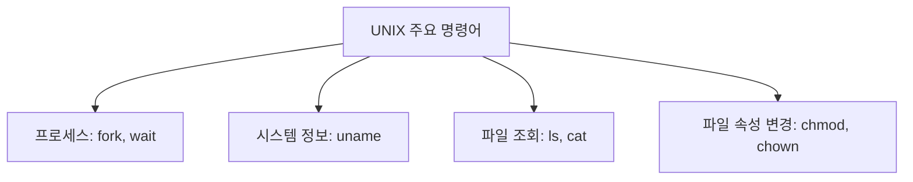

# 206 UNIX의 주요 명령어

작성 기준일: 2026-06-01
검색/보강일: 2026-06-01
기준 PDF: `/Users/nes0903/Documents/study/정보처리기사/핵심요약집_2026_정보처리기사필기핵심요약.pdf`
PDF 확인 위치: 31페이지 `206 UNIX의 주요 명령어`

## 한 줄 요약

- UNIX 주요 명령어는 프로세스 생성·대기, 시스템 정보 확인, 파일 목록·내용 확인, 권한·소유자 변경 기능으로 구분해 외운다.

## 한눈에 보는 구조

## PDF 기준 핵심

- `fork`: 새로운 프로세스를 생성한다.
- `uname`: 시스템 정보를 표시한다.
- `wait`: 상위 프로세스가 하위 프로세스 종료 등의 event를 기다린다.
- `chmod`: 파일의 보호 모드를 설정한다.
- `ls`: 현재 디렉터리 내의 파일 목록을 확인한다.
- `cat`: 파일 내용을 화면에 표시한다.
- `chown`: 소유자를 변경한다.

## 개념 설명

- `fork`는 부모 프로세스를 복제해 자식 프로세스를 만드는 시스템 호출이다.
- `wait`는 부모가 자식 프로세스의 종료 상태를 회수할 때 사용한다.
- `uname`은 운영체제 이름, 릴리스, 버전, 하드웨어 이름 같은 시스템 특성을 출력한다.
- `chmod`는 파일 접근 권한을 기호식 또는 8진수 모드로 바꾼다.
- `ls`는 디렉터리 엔트리 목록을 보여 주고, `cat`은 파일 내용을 표준 출력으로 이어 붙여 출력한다.
- `chown`은 파일의 사용자 소유자나 그룹 소유자를 변경한다.

## 시험 포인트

- `fork = 프로세스 생성`, `wait = 자식 종료 대기`를 한 쌍으로 외운다.
- `chmod`와 `chown`을 혼동하지 않는다. `mode`는 권한, `owner`는 소유자이다.
- `ls`는 목록, `cat`은 내용이다.
- `uname`은 사용자 이름이 아니라 시스템 이름과 시스템 정보이다.

## 헷갈리는 비교

| 명령어 | 기능 | 시험 단서 |
|---|---|---|
| fork | 새 프로세스 생성 | child process |
| wait | 자식 프로세스 종료 대기 | event, termination |
| uname | 시스템 정보 표시 | OS name, release |
| chmod | 보호 모드/권한 변경 | rwx, mode |
| chown | 소유자 변경 | owner |
| ls | 파일 목록 확인 | list |
| cat | 파일 내용 출력 | concatenate, display |

## 예시 또는 암기 포인트

- `chmod 755 run.sh`: 소유자는 읽기·쓰기·실행, 그룹/기타는 읽기·실행 권한을 갖게 한다.
- `chown user file.txt`: 파일 소유자를 `user`로 바꾼다.
- `uname -a`: 가능한 시스템 정보를 함께 출력한다.
- 암기식: `chmod는 모드, chown은 오너`.

## 빠른 복습

- 새 프로세스를 만드는 것은? `fork`.
- 하위 프로세스 종료를 기다리는 것은? `wait`.
- 파일 내용 출력은? `cat`.
- 파일 권한 변경은? `chmod`.

## 참고 링크

- [The Open Group - fork](https://pubs.opengroup.org/onlinepubs/9799919799/functions/fork.html)
- [The Open Group - uname](https://pubs.opengroup.org/onlinepubs/9799919799/utilities/uname.html)
- [The Open Group - wait](https://pubs.opengroup.org/onlinepubs/9699919799/utilities/wait.html)
- [The Open Group - ls](https://pubs.opengroup.org/onlinepubs/9799919799/utilities/ls.html)
- [The Open Group - cat](https://pubs.opengroup.org/onlinepubs/9799919799/utilities/cat.html)
- [The Open Group - chown](https://pubs.opengroup.org/onlinepubs/9799919799/utilities/chown.html)
- [GNU Coreutils - chmod invocation](https://www.gnu.org/software/coreutils/manual/html_node/chmod-invocation.html)

