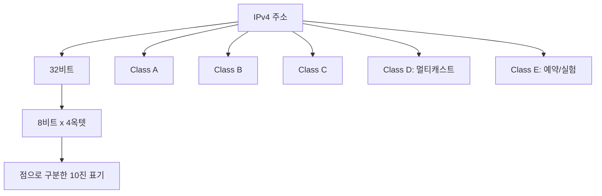

# 207 인터넷 주소 체계 - IPv4

작성 기준일: 2026-06-01
검색/보강일: 2026-06-01
기준 PDF: `/Users/nes0903/Documents/study/정보처리기사/핵심요약집_2026_정보처리기사필기핵심요약.pdf`
PDF 확인 위치: 31페이지 `207 인터넷 주소 체계 - IPv4`

## 한 줄 요약

- IPv4 주소는 8비트씩 4부분으로 된 총 32비트 주소이며, 전통적으로 A~E 클래스 체계로 구분한다.

## 한눈에 보는 구조

## PDF 기준 핵심

- 8비트씩 4부분, 총 32비트로 구성되어 있다.
- A 클래스에서 E 클래스까지 총 5단계로 구성되어 있다.
- 시험에서는 클래스 범위, 네트워크/호스트 비트 구분, 특수 용도를 함께 묻는 경우가 많다.

## 개념 설명

- IPv4는 인터넷 프로토콜 버전 4의 주소 체계이다.
- 주소는 보통 `192.168.0.1`처럼 점으로 나눈 10진수 4개로 표기한다.
- 각 부분은 8비트이므로 0~255 범위를 가진다.
- RFC 791의 전통적인 클래스풀 주소 체계는 상위 비트 패턴에 따라 A, B, C, D, E 클래스를 구분한다.
- 현대 네트워크는 CIDR을 주로 쓰지만, 정보처리기사에서는 A~E 클래스 구분이 여전히 자주 출제된다.

## 시험 포인트

- IPv4 총 길이: `32비트`.
- 표기 단위: `8비트 x 4개 = 4옥텟`.
- 클래스 A: 첫 비트 `0`, 대규모 네트워크.
- 클래스 B: 첫 비트 `10`, 중간 규모 네트워크.
- 클래스 C: 첫 비트 `110`, 소규모 네트워크.
- 클래스 D: 첫 비트 `1110`, 멀티캐스트.
- 클래스 E: 첫 비트 `1111`, 예약/실험용.

## 헷갈리는 비교

| 클래스 | 선두 비트 | 대략적 첫 옥텟 범위 | 주 용도 |
|---|---|---|---|
| A | 0 | 0~127 | 대규모 네트워크 |
| B | 10 | 128~191 | 중규모 네트워크 |
| C | 110 | 192~223 | 소규모 네트워크 |
| D | 1110 | 224~239 | 멀티캐스트 |
| E | 1111 | 240~255 | 예약/실험 |

## 예시 또는 암기 포인트

- `192.168.1.10`은 첫 옥텟이 192이므로 클래스 C 범위에 들어간다.
- `224.0.0.1`은 클래스 D 범위이므로 멀티캐스트 주소로 본다.
- 암기식: `IPv4 = 4개 점십진, 32비트`.
- 클래스 범위는 `A 0, B 128, C 192, D 224, E 240` 시작값을 기준으로 외우면 빠르다.

## 빠른 복습

- IPv4 주소 길이는? 32비트.
- IPv4는 몇 비트씩 몇 부분인가? 8비트씩 4부분.
- 클래스 D의 용도는? 멀티캐스트.
- 클래스는 몇 단계인가? A~E 총 5단계.

## 참고 링크

- [RFC 791 - Internet Protocol](https://www.rfc-editor.org/rfc/rfc791)
- [IBM - Internet Protocol Version 4](https://www.ibm.com/docs/en/zos/3.2.0?topic=ipv6-internet-protocol-version-4-ipv4)

<!-- study-links:start -->
## 관련 문서

- `인터넷 주소 체계`: [[정보처리기사/4과목 프로그래밍 언어 활용/208 인터넷 주소 체계 - IPv6/208 인터넷 주소 체계 - IPv6|208 인터넷 주소 체계 - IPv6]]
<!-- study-links:end -->
