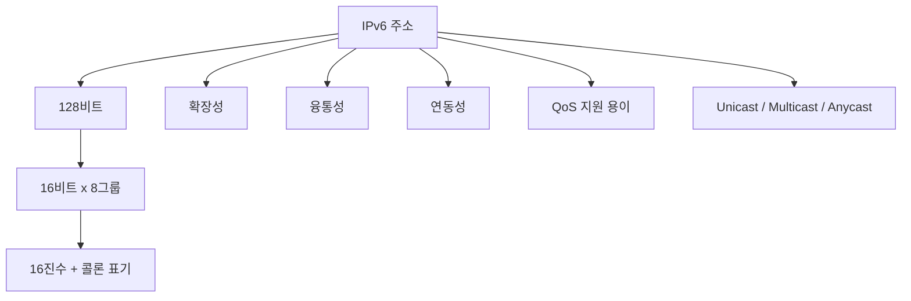

# 208 인터넷 주소 체계 - IPv6

작성 기준일: 2026-06-01
검색/보강일: 2026-06-01
기준 PDF: `/Users/nes0903/Documents/study/정보처리기사/핵심요약집_2026_정보처리기사필기핵심요약.pdf`
PDF 확인 위치: 31페이지 및 32페이지 연계 `208 인터넷 주소 체계 - IPv6`

## 한 줄 요약

- IPv6 주소는 16비트씩 8부분으로 된 총 128비트 주소이며, 유니캐스트·멀티캐스트·애니캐스트 주소 유형을 사용한다.

## 한눈에 보는 구조

## PDF 기준 핵심

- 16비트씩 8부분, 총 128비트로 구성되어 있다.
- 각 부분은 16진수로 표현하고 콜론(`:`)으로 구분한다.
- 확장성, 융통성, 연동성이 뛰어나며 QoS 지원이 용이하다.
- 주소 유형은 유니캐스트(Unicast), 멀티캐스트(Multicast), 애니캐스트(Anycast)로 구분한다.

## 개념 설명

- IPv6는 IPv4 주소 고갈 문제를 해결하기 위해 주소 길이를 32비트에서 128비트로 확장한 인터넷 프로토콜 주소 체계이다.
- 예시는 `2001:0db8:0000:0000:0000:ff00:0042:8329`처럼 16진수 그룹 8개로 표기한다.
- 연속된 0 그룹은 `::`로 한 번만 축약할 수 있다.
- RFC 8200은 IPv6가 IPv4의 후속 프로토콜이며 주소 크기가 128비트로 증가한다고 설명한다.
- RFC 4291은 IPv6 주소 유형을 유니캐스트, 애니캐스트, 멀티캐스트로 정의한다.

## 시험 포인트

- IPv6 총 길이: `128비트`.
- 표기 단위: `16비트 x 8부분`.
- 구분 기호: 콜론(`:`), 표현 진법: 16진수.
- IPv6에는 브로드캐스트가 없고, 해당 기능은 멀티캐스트가 대체한다고 이해한다.
- 주소 유형 3개를 반드시 구분한다: 유니캐스트, 멀티캐스트, 애니캐스트.

## 헷갈리는 비교

| 구분 | IPv4 | IPv6 |
|---|---|---|
| 주소 길이 | 32비트 | 128비트 |
| 표기 | 10진수 4옥텟, 점 구분 | 16진수 8그룹, 콜론 구분 |
| 예 | `192.168.0.1` | `2001:db8::1` |
| 주소 유형 | 클래스 A~E 중심으로 출제 | Unicast, Multicast, Anycast |
| 브로드캐스트 | 있음 | 없음, 멀티캐스트로 대체 |

## 예시 또는 암기 포인트

- 유니캐스트: 하나의 인터페이스에 전달한다.
- 멀티캐스트: 여러 인터페이스 집합 전체에 전달한다.
- 애니캐스트: 여러 인터페이스 중 라우팅상 가장 가까운 하나에 전달한다.
- 암기식: `IPv6 = 16비트 8칸, 총 128비트`.

## 빠른 복습

- IPv6 주소 길이는? 128비트.
- IPv6 표기 방식은? 16진수를 콜론으로 구분.
- IPv6 주소 유형 3가지는? Unicast, Multicast, Anycast.
- IPv6에 브로드캐스트가 있는가? 없다. 멀티캐스트가 역할을 대체한다.

## 참고 링크

- [RFC 8200 - Internet Protocol, Version 6 Specification](https://www.rfc-editor.org/rfc/rfc8200)
- [RFC 4291 - IP Version 6 Addressing Architecture](https://www.rfc-editor.org/rfc/rfc4291)

<!-- study-links:start -->
## 관련 문서

- `인터넷 주소 체계`: [[정보처리기사/4과목 프로그래밍 언어 활용/207 인터넷 주소 체계 - IPv4/207 인터넷 주소 체계 - IPv4|207 인터넷 주소 체계 - IPv4]]
<!-- study-links:end -->
