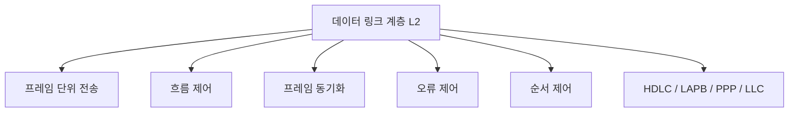

# 209 OSI 7계층 - 데이터 링크 계층(Data Link Layer)

작성 기준일: 2026-06-01
검색/보강일: 2026-06-01
기준 PDF: `/Users/nes0903/Documents/study/정보처리기사/핵심요약집_2026_정보처리기사필기핵심요약.pdf`
PDF 확인 위치: 32페이지 `209 OSI 7계층 - 데이터 링크 계층(Data Link Layer)`

## 한 줄 요약

- 데이터 링크 계층은 같은 링크에 인접한 시스템 사이에서 프레임 단위의 신뢰성 있고 효율적인 전송을 담당한다.

## 한눈에 보는 구조

## PDF 기준 핵심

- 인접한 개방 시스템들 간에 신뢰성 있고 효율적인 정보 전송을 할 수 있도록 한다.
- 기능: 흐름 제어, 프레임 동기화, 오류 제어, 순서 제어 등.
- 프로토콜: HDLC, LAPB, PPP, LLC 등.

## 개념 설명

- 데이터 링크 계층은 물리 계층이 전달하는 비트 흐름을 의미 있는 프레임으로 묶는다.
- 같은 LAN 또는 직접 연결된 노드 사이의 전송 오류를 감지하고 필요한 제어 정보를 붙인다.
- MAC 주소 기반 전달, 매체 접근 제어, 프레임 경계 구분이 함께 다뤄진다.
- IEEE 802 계열에서는 MAC 부계층과 LLC 부계층으로 나누어 설명하기도 한다.

## 시험 포인트

- 계층 번호는 `2계층`이다.
- PDU 단위는 `프레임(Frame)`이다.
- `인접 시스템`, `프레임`, `오류 제어`, `흐름 제어`가 나오면 데이터 링크 계층을 고른다.
- 라우팅이나 경로 설정은 네트워크 계층이므로 데이터 링크 계층과 혼동하지 않는다.

## 헷갈리는 비교

| 구분 | 데이터 링크 계층 | 네트워크 계층 |
|---|---|---|
| 범위 | 인접 노드 간 | 서로 다른 네트워크 간 |
| 주소 | MAC 주소 중심 | IP 주소 중심 |
| 단위 | 프레임 | 패킷 |
| 핵심 기능 | 프레임화, 오류/흐름 제어 | 경로 설정, 중계 |

## 예시 또는 암기 포인트

- PPP는 두 지점 간 링크에서 프레임 단위 전송을 제공하는 데이터 링크 계층 프로토콜로 출제된다.
- HDLC와 LAPB는 시험에서 데이터 링크 계층 프로토콜 묶음으로 기억한다.
- 암기식: `2계층은 프레임, MAC, 인접 노드`.

## 빠른 복습

- 데이터 링크 계층의 PDU는? 프레임.
- PDF에 나온 기능 4가지는? 흐름 제어, 프레임 동기화, 오류 제어, 순서 제어.
- 대표 프로토콜은? HDLC, LAPB, PPP, LLC.

## 참고 링크

- [ITU-T X.200 Basic Reference Model](https://www.itu.int/ITU-T/recommendations/rec.aspx?rec=2820)
- [IBM - What is the OSI model?](https://www.ibm.com/qa-ar/think/topics/osi-model)

