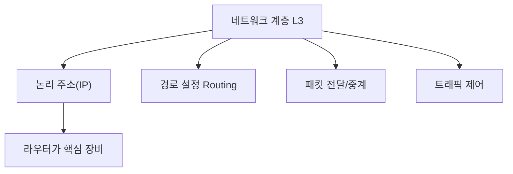

# 210 OSI 7계층 - 네트워크 계층(Network Layer)

작성 기준일: 2026-06-01
검색/보강일: 2026-06-01
기준 PDF: `/Users/nes0903/Documents/study/정보처리기사/핵심요약집_2026_정보처리기사필기핵심요약.pdf`
PDF 확인 위치: 32페이지 `210 OSI 7계층 - 네트워크 계층(Network Layer)`

## 한 줄 요약

- 네트워크 계층은 서로 다른 네트워크 사이의 연결, 경로 설정, 패킷 중계를 담당한다.

## 한눈에 보는 구조

## PDF 기준 핵심

- 개방 시스템들 간의 네트워크 연결을 관리하고 데이터를 교환 및 중계한다.
- 기능: 경로 설정, 트래픽 제어, 패킷 정보 전송 등.
- 데이터 링크 계층이 인접 노드 간 전송을 다룬다면, 네트워크 계층은 목적지까지의 경로를 다룬다.

## 개념 설명

- 네트워크 계층은 IP 주소 같은 논리 주소를 사용해 패킷이 어느 경로로 이동할지 결정한다.
- 라우터는 네트워크 계층 장비로, 목적지 네트워크에 맞는 다음 홉을 선택한다.
- 패킷이 여러 네트워크를 지나갈 때 각 구간의 데이터 링크는 바뀔 수 있지만, 네트워크 계층의 목적지 주소는 전체 경로 판단에 쓰인다.
- IBM의 OSI 설명도 네트워크 계층을 서로 다른 네트워크 사이의 노드 간 데이터 전송과 경로 결정 계층으로 설명한다.

## 시험 포인트

- 계층 번호는 `3계층`이다.
- PDU 단위는 `패킷(Packet)`이다.
- `경로 설정`, `라우팅`, `패킷`, `IP 주소`, `중계`가 나오면 네트워크 계층을 고른다.
- TCP/UDP의 포트와 종단 간 연결은 전송 계층이다.

## 헷갈리는 비교

| 구분 | 네트워크 계층 | 전송 계층 |
|---|---|---|
| 계층 | L3 | L4 |
| 범위 | 호스트까지의 경로 | 종단 프로세스 간 전송 |
| 주소 | IP 주소 | 포트 번호 |
| 대표 장비/프로토콜 | 라우터, IP | TCP, UDP |

## 예시 또는 암기 포인트

- PC에서 웹 서버로 가는 패킷이 여러 라우터를 거치면, 각 라우터의 경로 선택은 네트워크 계층 기능이다.
- `라우터 = 네트워크 계층 장비`로 먼저 외운다.
- 암기식: `3계층은 길 찾기`.

## 빠른 복습

- 네트워크 계층의 핵심 기능은? 경로 설정과 패킷 중계.
- 네트워크 계층의 주소는? IP 같은 논리 주소.
- 네트워크 계층 장비는? 라우터.

## 참고 링크

- [ITU-T X.200 Basic Reference Model](https://www.itu.int/ITU-T/recommendations/rec.aspx?rec=2820)
- [IBM - What is the OSI model?](https://www.ibm.com/qa-ar/think/topics/osi-model)

