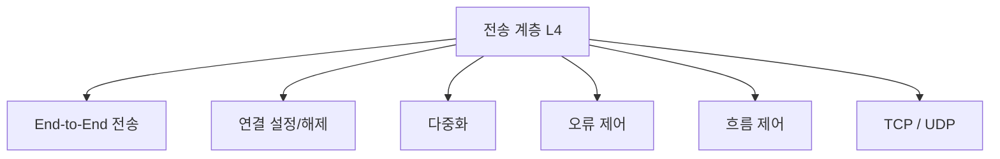

# 211 OSI 7계층 - 전송 계층(Transport Layer)

작성 기준일: 2026-06-01
검색/보강일: 2026-06-01
기준 PDF: `/Users/nes0903/Documents/study/정보처리기사/핵심요약집_2026_정보처리기사필기핵심요약.pdf`
PDF 확인 위치: 32페이지 `211 OSI 7계층 - 전송 계층(Transport Layer)`

## 한 줄 요약

- 전송 계층은 종단 시스템 사이에서 데이터 전송을 제어하고, 포트 기반 다중화와 오류·흐름 제어를 담당한다.

## 한눈에 보는 구조

## PDF 기준 핵심

- 종단 시스템(End-to-End) 간에 투명한 데이터 전송을 가능하게 한다.
- 기능: 전송 연결 설정, 데이터 전송, 연결 해제 기능, 주소 설정, 다중화, 오류 제어, 흐름 제어 등.
- TCP/IP에서 전송 계층의 대표 프로토콜은 TCP와 UDP이다.

## 개념 설명

- 전송 계층은 네트워크 계층이 목적지 호스트까지 전달한 데이터를 목적지 프로세스까지 연결한다.
- 포트 번호를 사용해 여러 응용 프로그램의 통신을 구분한다.
- TCP는 연결형, 신뢰성, 순서 제어, 흐름 제어를 제공한다.
- UDP는 비연결형으로 오버헤드가 작고 빠르지만, 신뢰성 보장은 응용 쪽에서 처리해야 한다.

## 시험 포인트

- 계층 번호는 `4계층`이다.
- `End-to-End`, `종단 간`, `다중화`, `포트`, `오류 제어`, `흐름 제어`는 전송 계층 단서이다.
- 경로 설정은 네트워크 계층이고, 대화 생성·동기 제어는 세션 계층이다.
- TCP와 UDP는 둘 다 전송 계층 프로토콜이지만 성격이 반대다.

## 헷갈리는 비교

| 구분 | 전송 계층 | 세션 계층 |
|---|---|---|
| 계층 | L4 | L5 |
| 핵심 | 종단 간 데이터 전달 | 대화 제어, 세션 관리 |
| 대표 단서 | TCP, UDP, 포트, 다중화 | 토큰, 동기점, 대화 관리 |
| 제어 | 오류/흐름 제어 | 대화 생성/관리/종료 |

## 예시 또는 암기 포인트

- 웹 브라우저가 같은 서버의 여러 서비스와 통신할 때 포트 번호로 응용을 구분하는 것은 전송 계층 관점이다.
- TCP 연결 설정과 해제는 전송 계층 기능으로 외운다.
- 암기식: `4계층은 끝에서 끝까지`.

## 빠른 복습

- 전송 계층의 범위는? 종단 시스템 간.
- 대표 프로토콜은? TCP, UDP.
- 전송 계층이 제공하는 주소 구분은? 포트 번호.

## 참고 링크

- [ITU-T X.200 Basic Reference Model](https://www.itu.int/ITU-T/recommendations/rec.aspx?rec=2820)
- [IBM - What is the OSI model?](https://www.ibm.com/qa-ar/think/topics/osi-model)

<!-- study-links:start -->
## 관련 문서

- `osi 7계층`: [[정보처리기사/4과목 프로그래밍 언어 활용/209 OSI 7계층 - 데이터 링크 계층(Data Link Layer)/209 OSI 7계층 - 데이터 링크 계층(Data Link Layer)|209 OSI 7계층 - 데이터 링크 계층(Data Link Layer)]]
- `네트워크 계층`: [[정보처리기사/4과목 프로그래밍 언어 활용/210 OSI 7계층 - 네트워크 계층(Network Layer)/210 OSI 7계층 - 네트워크 계층(Network Layer)|210 OSI 7계층 - 네트워크 계층(Network Layer)]]
- `세션 계층`: [[정보처리기사/4과목 프로그래밍 언어 활용/212 OSI 7계층 - 세션 계층(Session Layer)/212 OSI 7계층 - 세션 계층(Session Layer)|212 OSI 7계층 - 세션 계층(Session Layer)]]
- `흐름 제어`: [[정보처리기사/5과목 정보시스템 구축 관리/267 흐름 제어 - 정지-대기(Stop-and-Wait)/267 흐름 제어 - 정지-대기(Stop-and-Wait)|267 흐름 제어 - 정지-대기(Stop-and-Wait)]]
- `udp`: [[정보처리기사/4과목 프로그래밍 언어 활용/216 TCP IP 프로토콜 - UDP/216 TCP IP 프로토콜 - UDP|216 TCP/IP 프로토콜 - UDP]]
<!-- study-links:end -->
