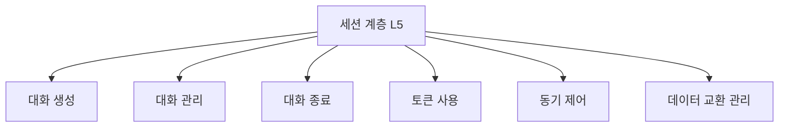

# 212 OSI 7계층 - 세션 계층(Session Layer)

작성 기준일: 2026-06-01
검색/보강일: 2026-06-01
기준 PDF: `/Users/nes0903/Documents/study/정보처리기사/핵심요약집_2026_정보처리기사필기핵심요약.pdf`
PDF 확인 위치: 32페이지 `212 OSI 7계층 - 세션 계층(Session Layer)`

## 한 줄 요약

- 세션 계층은 송수신 측의 대화 관계를 만들고 유지하며, 동기 제어와 데이터 교환 관리를 담당한다.

## 한눈에 보는 구조

## PDF 기준 핵심

- 송·수신 측 간의 관련성을 유지하고 대화 제어를 담당한다.
- 대화의 생성, 관리, 종료를 위해 토큰을 사용한다.
- 기능: 대화 구성 및 동기 제어, 데이터 교환 관리 등.

## 개념 설명

- 세션 계층은 통신하는 응용 사이의 논리적 대화 단위를 관리한다.
- 대화가 어느 방향으로 진행되는지, 중간 지점에서 동기점을 어떻게 둘지, 장애 후 어디서 다시 시작할지 같은 흐름을 다룬다.
- TCP/IP 모델에서는 세션 기능이 응용 계층이나 전송 계층 기능에 흡수되어 구현되는 경우가 많다.
- 정보처리기사에서는 실제 구현보다 OSI 계층별 역할 구분이 더 중요하다.

## 시험 포인트

- 계층 번호는 `5계층`이다.
- `대화 제어`, `토큰`, `동기 제어`, `세션 생성/관리/종료`가 나오면 세션 계층을 고른다.
- 포트 기반 전송, 오류 제어, 흐름 제어는 전송 계층과 연결된다.
- 데이터 표현, 암호화, 압축은 표현 계층이므로 세션 계층과 분리한다.

## 헷갈리는 비교

| 구분 | 전송 계층 | 세션 계층 | 표현 계층 |
|---|---|---|---|
| 계층 | L4 | L5 | L6 |
| 핵심 | 종단 간 전송 | 대화 제어 | 데이터 표현 형식 |
| 단서 | TCP, UDP, 포트 | 토큰, 동기점 | 암호화, 압축, 변환 |
| 시험 포인트 | 오류/흐름 제어 | 생성·관리·종료 | 코드 변환 |

## 예시 또는 암기 포인트

- 파일 전송 중 중간 동기점을 두고 장애 후 해당 지점부터 재개하는 개념은 세션 계층의 동기 제어로 이해한다.
- 토큰은 대화 제어 권한을 나타내는 시험 단서로 자주 쓰인다.
- 암기식: `5계층은 대화의 시작, 유지, 끝`.

## 빠른 복습

- 세션 계층의 핵심 단어는? 대화 제어.
- PDF에 나온 특별 단서는? 토큰 사용.
- 주요 기능은? 대화 구성, 동기 제어, 데이터 교환 관리.

## 참고 링크

- [ITU-T X.200 Basic Reference Model](https://www.itu.int/ITU-T/recommendations/rec.aspx?rec=2820)
- [IBM - What is the OSI model?](https://www.ibm.com/qa-ar/think/topics/osi-model)

<!-- study-links:start -->
## 관련 문서

- `osi 7계층`: [[정보처리기사/4과목 프로그래밍 언어 활용/209 OSI 7계층 - 데이터 링크 계층(Data Link Layer)/209 OSI 7계층 - 데이터 링크 계층(Data Link Layer)|209 OSI 7계층 - 데이터 링크 계층(Data Link Layer)]]
- `주요 기능`: [[정보처리기사/2과목 소프트웨어 개발/079 소프트웨어의 버전 등록 관련 주요 기능/079 소프트웨어의 버전 등록 관련 주요 기능|079 소프트웨어의 버전 등록 관련 주요 기능]]
- `전송 계층`: [[정보처리기사/4과목 프로그래밍 언어 활용/211 OSI 7계층 - 전송 계층(Transport Layer)/211 OSI 7계층 - 전송 계층(Transport Layer)|211 OSI 7계층 - 전송 계층(Transport Layer)]]
- `흐름 제어`: [[정보처리기사/5과목 정보시스템 구축 관리/267 흐름 제어 - 정지-대기(Stop-and-Wait)/267 흐름 제어 - 정지-대기(Stop-and-Wait)|267 흐름 제어 - 정지-대기(Stop-and-Wait)]]
- `osi`: [[정보처리기사/4과목 프로그래밍 언어 활용/210 OSI 7계층 - 네트워크 계층(Network Layer)/210 OSI 7계층 - 네트워크 계층(Network Layer)|210 OSI 7계층 - 네트워크 계층(Network Layer)]]
- `udp`: [[정보처리기사/4과목 프로그래밍 언어 활용/216 TCP IP 프로토콜 - UDP/216 TCP IP 프로토콜 - UDP|216 TCP/IP 프로토콜 - UDP]]
<!-- study-links:end -->
