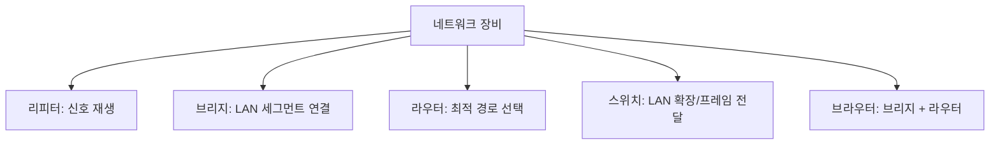

# 213 네트워크 관련 주요 장비

작성 기준일: 2026-06-01
검색/보강일: 2026-06-01
기준 PDF: `/Users/nes0903/Documents/study/정보처리기사/핵심요약집_2026_정보처리기사필기핵심요약.pdf`
PDF 확인 위치: 32페이지 `213 네트워크 관련 주요 장비`

## 한 줄 요약

- 네트워크 장비는 신호 재생, LAN 연결, 경로 선택, 세그먼트 확장, 브리지+라우터 통합 기능으로 구분해 외운다.

## 한눈에 보는 구조

## PDF 기준 핵심

- 리피터(Repeater): 원래의 신호 형태로 재생하여 다시 전송한다.
- 브리지(Bridge): LAN과 LAN을 연결하거나 LAN 안에서의 컴퓨터 그룹을 연결한다.
- 라우터(Router): 데이터 전송의 최적 경로를 선택한다.
- 스위치(Switch): LAN과 LAN을 연결하여 훨씬 더 큰 LAN을 만드는 장치이다.
- 브라우터(Brouter): 브리지와 라우터 기능을 모두 수행한다. 브리지 기능은 내부 네트워크 분리, 라우터 기능은 외부 네트워크 연결 용도로 사용한다.

## 개념 설명

- 리피터는 약해진 신호를 증폭·재생해 전송 거리를 늘리는 장비로 물리 계층 관점에서 이해한다.
- 브리지는 LAN 세그먼트를 연결하고 MAC 주소 기반으로 프레임을 전달하거나 차단한다.
- 스위치는 다중 포트 브리지처럼 동작하며 목적지 MAC 주소가 있는 포트로 프레임을 전달해 충돌 영역을 줄인다.
- 라우터는 IP 주소와 라우팅 테이블을 기준으로 서로 다른 네트워크 사이의 최적 경로를 선택한다.
- 브라우터는 라우팅 가능한 프로토콜은 라우팅하고, 그렇지 않은 트래픽은 브리지처럼 전달하는 장비로 이해한다.

## 시험 포인트

- `신호 재생`은 리피터이다.
- `최적 경로 선택`은 라우터이다.
- `LAN과 LAN 연결`, `세그먼트 연결`은 브리지 또는 스위치이다.
- `브리지 + 라우터`는 브라우터이다.
- 장비와 OSI 계층을 함께 묻는 문제에서는 리피터 L1, 브리지/스위치 L2, 라우터 L3로 정리한다.

## 헷갈리는 비교

| 장비 | 대표 계층 | 핵심 역할 | 시험 단서 |
|---|---|---|---|
| 리피터 | L1 | 신호 재생 | regenerate |
| 브리지 | L2 | LAN 세그먼트 연결 | bridge, MAC |
| 스위치 | L2 | 포트 기반 프레임 전달 | 큰 LAN, switching |
| 라우터 | L3 | 경로 선택 | routing, 최적 경로 |
| 브라우터 | L2/L3 | 브리지+라우터 | brouter |

## 예시 또는 암기 포인트

- 회사 내부 LAN을 부서별로 나누어 연결하면 브리지/스위치 개념이 나온다.
- 다른 네트워크로 나가는 게이트웨이 역할과 최적 경로 선택은 라우터가 맡는다.
- 암기식: `리피터는 신호, 라우터는 길, 브라우터는 둘 다`.

## 빠른 복습

- 최적 경로 선택 장비는? 라우터.
- 신호를 원래 형태로 재생하는 장비는? 리피터.
- 브리지와 라우터 기능을 모두 수행하는 장비는? 브라우터.

## 참고 링크

- [IBM - What is network topology?](https://www.ibm.com/think/topics/network-topology)
- [Webopedia - Brouter](https://www.webopedia.com/definitions/brouter/)

<!-- study-links:start -->
## 관련 문서

- `osi`: [[정보처리기사/4과목 프로그래밍 언어 활용/209 OSI 7계층 - 데이터 링크 계층(Data Link Layer)/209 OSI 7계층 - 데이터 링크 계층(Data Link Layer)|209 OSI 7계층 - 데이터 링크 계층(Data Link Layer)]]
- `lan`: [[정보처리기사/5과목 정보시스템 구축 관리/264 LAN의 표준 규격 - 802.11e/264 LAN의 표준 규격 - 802.11e|264 LAN의 표준 규격 - 802.11e]]
<!-- study-links:end -->
