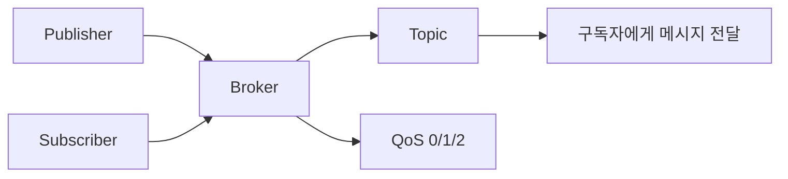

# 214 TCP/IP 프로토콜 - MQTT

작성 기준일: 2026-06-01
검색/보강일: 2026-06-01
기준 PDF: `/Users/nes0903/Documents/study/정보처리기사/핵심요약집_2026_정보처리기사필기핵심요약.pdf`
PDF 확인 위치: 32페이지 `214 TCP/IP 프로토콜 - MQTT`

## 한 줄 요약

- MQTT는 발행-구독 구조의 가벼운 메시징 프로토콜로, IoT처럼 자원이 제한된 환경에서 자주 사용된다.

## 한눈에 보는 구조

## PDF 기준 핵심

- 발행-구독 기반의 메시징 프로토콜이다.
- IoT 환경에서 자주 사용된다.
- TCP/IP 프로토콜 묶음에서 응용 계층 성격의 경량 메시징 프로토콜로 이해한다.

## 개념 설명

- MQTT(Message Queuing Telemetry Transport)는 클라이언트가 직접 서로 연결하지 않고 브로커를 통해 메시지를 주고받는 구조이다.
- 발행자(Publisher)는 특정 토픽으로 메시지를 보내고, 구독자(Subscriber)는 관심 있는 토픽을 구독한다.
- 브로커는 토픽을 기준으로 메시지를 필요한 구독자에게 전달한다.
- MQTT 공식 사이트와 OASIS 표준은 MQTT를 IoT용 경량 publish/subscribe 메시징 프로토콜로 설명한다.

## 시험 포인트

- 핵심 단서는 `발행-구독`, `메시징`, `IoT`, `경량`이다.
- 클라이언트끼리 직접 연결되는 구조가 아니라 브로커 중심 구조이다.
- HTTP처럼 요청-응답 중심으로만 생각하면 틀릴 수 있다.
- MQTT는 센서, 원격 장치, 저대역폭·불안정 네트워크 환경과 잘 맞는다.

## 헷갈리는 비교

| 구분 | MQTT | HTTP |
|---|---|---|
| 통신 패턴 | 발행-구독 | 요청-응답 |
| 중간 역할 | Broker | Web Server |
| 적합 환경 | IoT, 저대역폭 | 웹 문서/API |
| 시험 단서 | Topic, Publish, Subscribe | Request, Response |

## 예시 또는 암기 포인트

- 온도 센서가 `home/room1/temp` 토픽에 값을 발행하면, 해당 토픽을 구독한 앱이 값을 받는다.
- QoS는 메시지 전달 보장 수준으로, MQTT의 신뢰성 옵션을 설명할 때 등장한다.
- 암기식: `MQTT = IoT 메시지 발행-구독`.

## 빠른 복습

- MQTT의 통신 구조는? 발행-구독.
- MQTT에서 메시지를 중계하는 구성요소는? 브로커.
- 자주 쓰이는 환경은? IoT, 저대역폭, 자원 제약 환경.

## 참고 링크

- [MQTT.org - The Standard for IoT Messaging](https://mqtt.org/)
- [OASIS - MQTT Version 5.0](https://www.oasis-open.org/standard/mqtt-v5-0/)

<!-- study-links:start -->
## 관련 문서

- `ip 프로토콜`: [[정보처리기사/4과목 프로그래밍 언어 활용/215 TCP IP 프로토콜 - TCP/215 TCP IP 프로토콜 - TCP|215 TCP/IP 프로토콜 - TCP]]
<!-- study-links:end -->
