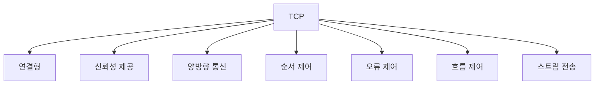

# 215 TCP/IP 프로토콜 - TCP

작성 기준일: 2026-06-01
검색/보강일: 2026-06-01
기준 PDF: `/Users/nes0903/Documents/study/정보처리기사/핵심요약집_2026_정보처리기사필기핵심요약.pdf`
PDF 확인 위치: 32페이지 `215 TCP/IP 프로토콜 - TCP`

## 한 줄 요약

- TCP는 신뢰성 있는 양방향 연결형 전송 서비스를 제공하는 전송 계층 프로토콜이다.

## 한눈에 보는 구조

## PDF 기준 핵심

- 신뢰성 있는 연결형 서비스를 제공한다.
- 양방향 연결형 서비스를 제공한다.
- 기능: 패킷의 다중화, 순서 제어, 오류 제어, 흐름 제어, 스트림 전송 등.

## 개념 설명

- TCP(Transmission Control Protocol)는 IP 위에서 동작하며 응용 프로그램 사이에 신뢰성 있는 바이트 스트림을 제공한다.
- 연결 설정 후 데이터를 주고받고, 통신이 끝나면 연결을 해제한다.
- 순서 번호와 확인 응답을 사용해 손실, 중복, 순서 뒤바뀜을 제어한다.
- 수신자가 처리할 수 있는 양을 조절하기 위해 흐름 제어를 수행한다.

## 시험 포인트

- `연결형`, `신뢰성`, `순서 제어`, `흐름 제어`, `오류 제어`는 TCP 단서이다.
- UDP와 비교할 때 TCP는 느릴 수 있지만 안정적이다.
- TCP는 메시지 경계보다 연속된 스트림 전송 관점이 중요하다.
- 웹, 이메일, 파일 전송처럼 정확성이 중요한 응용에서 자주 쓰인다.

## 헷갈리는 비교

| 구분 | TCP | UDP |
|---|---|---|
| 연결 | 연결형 | 비연결형 |
| 신뢰성 | 제공 | 보장하지 않음 |
| 순서 제어 | 제공 | 없음 |
| 속도/오버헤드 | 상대적으로 무거움 | 가볍고 빠름 |
| 데이터 관점 | 스트림 | 데이터그램 |

## 예시 또는 암기 포인트

- 웹 브라우저가 HTTPS 통신을 할 때 전송 계층에서는 일반적으로 TCP 연결 위에서 데이터가 오간다.
- `SYN`, `ACK` 같은 연결 설정 단서는 TCP와 연결된다.
- 암기식: `TCP = Trust, Control, Process order`.

## 빠른 복습

- TCP의 서비스 성격은? 신뢰성 있는 연결형.
- TCP의 데이터 관점은? 스트림 전송.
- TCP와 UDP 중 순서 제어를 제공하는 것은? TCP.

## 참고 링크

- [RFC 9293 - Transmission Control Protocol](https://www.rfc-editor.org/info/rfc9293/)

<!-- study-links:start -->
## 관련 문서

- `ip 프로토콜`: [[정보처리기사/4과목 프로그래밍 언어 활용/214 TCP IP 프로토콜 - MQTT/214 TCP IP 프로토콜 - MQTT|214 TCP/IP 프로토콜 - MQTT]]
- `전송 계층`: [[정보처리기사/4과목 프로그래밍 언어 활용/211 OSI 7계층 - 전송 계층(Transport Layer)/211 OSI 7계층 - 전송 계층(Transport Layer)|211 OSI 7계층 - 전송 계층(Transport Layer)]]
- `흐름 제어`: [[정보처리기사/5과목 정보시스템 구축 관리/267 흐름 제어 - 정지-대기(Stop-and-Wait)/267 흐름 제어 - 정지-대기(Stop-and-Wait)|267 흐름 제어 - 정지-대기(Stop-and-Wait)]]
- `udp`: [[정보처리기사/4과목 프로그래밍 언어 활용/216 TCP IP 프로토콜 - UDP/216 TCP IP 프로토콜 - UDP|216 TCP/IP 프로토콜 - UDP]]
<!-- study-links:end -->
