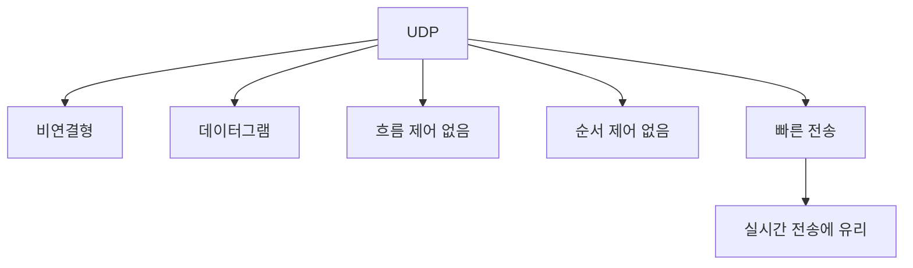

# 216 TCP/IP 프로토콜 - UDP

작성 기준일: 2026-06-01
검색/보강일: 2026-06-01
기준 PDF: `/Users/nes0903/Documents/study/정보처리기사/핵심요약집_2026_정보처리기사필기핵심요약.pdf`
PDF 확인 위치: 33페이지 `216 TCP/IP 프로토콜 - UDP`

## 한 줄 요약

- UDP는 비연결형 데이터그램 전송 프로토콜로, 제어 기능을 줄여 빠른 전송과 실시간 처리에 유리하다.

## 한눈에 보는 구조

## PDF 기준 핵심

- 비연결형 서비스를 제공한다.
- 흐름 제어나 순서 제어가 없어 전송 속도가 빠르다.
- 실시간 전송에 유리하다.

## 개념 설명

- UDP(User Datagram Protocol)는 IP 위에서 최소한의 전송 기능만 제공하는 프로토콜이다.
- 연결 설정 절차가 없고, 각 메시지를 독립적인 데이터그램으로 보낸다.
- 전달 보장, 중복 제거, 순서 보장, 흐름 제어를 기본적으로 제공하지 않는다.
- 대신 헤더와 처리 절차가 단순해 지연을 줄일 수 있다.

## 시험 포인트

- `비연결형`, `빠름`, `실시간`, `흐름 제어 없음`, `순서 제어 없음`은 UDP 단서이다.
- 신뢰성이 필요하면 응용 계층에서 별도의 재전송이나 확인 절차를 설계해야 한다.
- DNS, 음성/영상 스트리밍, 온라인 게임처럼 지연이 더 중요한 분야에서 자주 언급된다.
- `빠르다`는 표현은 제어 기능이 적다는 뜻이지, 모든 상황에서 무조건 높은 처리량을 보장한다는 뜻은 아니다.

## 헷갈리는 비교

| 구분 | UDP | TCP |
|---|---|---|
| 연결 | 비연결형 | 연결형 |
| 전송 단위 | 데이터그램 | 스트림 |
| 제어 기능 | 최소 | 풍부 |
| 실시간성 | 유리 | 상대적으로 불리 |
| 시험 단서 | 빠름, 순서 제어 없음 | 신뢰성, 흐름 제어 |

## 예시 또는 암기 포인트

- 실시간 음성 통화는 오래된 패킷을 늦게 받는 것보다 일부 손실을 감수하고 바로 재생하는 편이 나을 수 있어 UDP와 어울린다.
- DNS 질의도 짧은 요청·응답이 많아 UDP를 대표 예시로 자주 든다.
- 암기식: `UDP = 빠르지만 보장은 적다`.

## 빠른 복습

- UDP는 연결형인가? 비연결형.
- UDP에 흐름 제어나 순서 제어가 있는가? 기본적으로 없다.
- UDP가 유리한 전송은? 실시간 전송.

## 참고 링크

- [RFC 768 - User Datagram Protocol](https://www.rfc-editor.org/rfc/rfc768)

