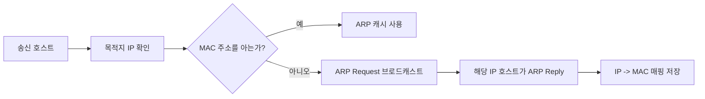

# 217 TCP/IP 프로토콜 - ARP

작성 기준일: 2026-06-01
검색/보강일: 2026-06-01
기준 PDF: `/Users/nes0903/Documents/study/정보처리기사/핵심요약집_2026_정보처리기사필기핵심요약.pdf`
PDF 확인 위치: 33페이지 `217 TCP/IP 프로토콜 - ARP`

## 한 줄 요약

- ARP는 IP 주소를 같은 네트워크에서 실제 전송에 필요한 물리적 주소인 MAC 주소로 변환한다.

## 한눈에 보는 구조

## PDF 기준 핵심

- 호스트의 IP 주소를 호스트와 연결된 네트워크 접속 장치의 물리적 주소(MAC Address)로 바꾼다.
- IP 주소는 논리 주소이고, MAC 주소는 데이터 링크 계층에서 실제 프레임 전달에 쓰이는 물리 주소로 이해한다.

## 개념 설명

- ARP(Address Resolution Protocol)는 IPv4 환경에서 같은 링크의 목적지 MAC 주소를 알아내는 데 사용된다.
- 송신자는 목적지 IP의 MAC 주소를 모르면 ARP 요청을 브로드캐스트한다.
- 해당 IP를 가진 호스트는 자신의 MAC 주소를 담아 ARP 응답을 보낸다.
- 얻은 매핑은 ARP 캐시에 저장되어 다음 통신 때 재사용된다.

## 시험 포인트

- `IP 주소 → MAC 주소` 방향을 정확히 기억한다.
- 반대 방향인 MAC 주소에서 IP 주소를 알아내는 것은 RARP로 구분된다.
- ARP는 DNS와 다르다. DNS는 도메인 이름을 IP 주소로 바꾸고, ARP는 IP를 MAC으로 바꾼다.
- ARP는 같은 LAN 안에서 프레임을 보낼 때 필요한 주소 해석으로 이해한다.

## 헷갈리는 비교

| 구분 | ARP | DNS | RARP |
|---|---|---|---|
| 변환 | IP → MAC | 도메인 이름 → IP | MAC → IP |
| 주요 계층 관점 | 네트워크/데이터 링크 연결 | 응용 계층 서비스 | 주소 역변환 |
| 시험 단서 | 물리 주소, MAC | 이름 해석 | Reverse |
| 대표 환경 | IPv4 LAN | 인터넷 이름 해석 | 초기 부팅 등 |

## 예시 또는 암기 포인트

- `192.168.0.10`으로 패킷을 보내려면 이 IP를 가진 장치의 MAC 주소를 알아야 프레임을 만들 수 있다.
- ARP 요청은 브로드캐스트, ARP 응답은 보통 요청한 호스트에게 직접 전달된다.
- 암기식: `ARP = Address Resolution, IP를 MAC으로`.

## 빠른 복습

- ARP의 변환 방향은? IP 주소 → MAC 주소.
- ARP와 DNS의 차이는? DNS는 이름을 IP로, ARP는 IP를 MAC으로 바꾼다.
- ARP 요청은 보통 어떤 방식으로 전송되는가? 브로드캐스트.

## 참고 링크

- [RFC 826 - Address Resolution Protocol](https://datatracker.ietf.org/doc/rfc826/)
- [IANA - ARP Parameters](https://www.iana.org/assignments/arp-parameters)

