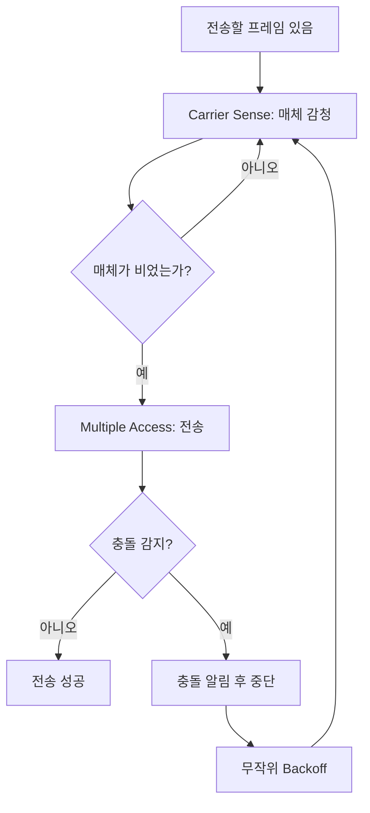

# 218 CSMA/CD

작성 기준일: 2026-06-01
검색/보강일: 2026-06-01
기준 PDF: `/Users/nes0903/Documents/study/정보처리기사/핵심요약집_2026_정보처리기사필기핵심요약.pdf`
PDF 확인 위치: 33페이지 `218 CSMA/CD`

## 한 줄 요약

- CSMA/CD는 IEEE 802.3 LAN에서 공유 전송 매체의 충돌을 감지하고 재전송 시점을 조절하는 MAC 방식이다.

## 한눈에 보는 구조

## PDF 기준 핵심

- IEEE 802.3 LAN에서 사용되는 전송 매체 접속 제어(MAC) 방식이다.
- `CSMA/CD`는 Carrier Sense Multiple Access with Collision Detection의 약자이다.
- 공유 매체를 여러 장치가 함께 사용할 때 충돌을 감지하고 재전송을 제어한다.

## 개념 설명

- Carrier Sense: 송신 전 전송 매체가 사용 중인지 감지한다.
- Multiple Access: 여러 노드가 같은 전송 매체에 접근할 수 있다.
- Collision Detection: 전송 중 충돌이 발생했는지 감지한다.
- 충돌이 감지되면 전송을 멈추고 일정 시간 대기한 뒤 다시 시도한다.
- IEEE 802.3 표준은 Ethernet LAN의 MAC 동작과 CSMA/CD 방식을 다룬다.

## 시험 포인트

- `IEEE 802.3`, `Ethernet`, `LAN`, `MAC`, `충돌 감지`가 나오면 CSMA/CD를 고른다.
- 무선 LAN의 대표 충돌 회피 방식인 CSMA/CA와 구분한다.
- CSMA/CD는 충돌을 감지하고, CSMA/CA는 충돌을 피하려고 한다.
- 스위치 기반 전이중 Ethernet에서는 충돌 도메인이 사실상 사라지므로 CSMA/CD의 의미가 줄어든다.

## 헷갈리는 비교

| 구분 | CSMA/CD | CSMA/CA |
|---|---|---|
| 핵심 | Collision Detection | Collision Avoidance |
| 방식 | 충돌 감지 후 재전송 | 충돌 가능성 회피 |
| 대표 표준 | IEEE 802.3 Ethernet | IEEE 802.11 WLAN |
| 시험 단서 | 유선 LAN, MAC 방식 | 무선 LAN, 회피 |

## 예시 또는 암기 포인트

- 허브를 쓰는 반이중 Ethernet에서는 여러 장치가 동시에 말하면 충돌이 생길 수 있어 CSMA/CD가 필요하다.
- 스위치를 쓰는 전이중 환경은 송수신 경로가 분리되어 충돌 감지 필요성이 낮다.
- 암기식: `CD는 Detect, CA는 Avoid`.

## 빠른 복습

- CSMA/CD의 표준 연결은? IEEE 802.3.
- CD의 뜻은? Collision Detection.
- CSMA/CD와 CSMA/CA의 차이는? CD는 충돌 감지, CA는 충돌 회피.

## 참고 링크

- [IEEE SA - IEEE 802.3-2022](https://standards.ieee.org/standard/802_3-2022.html)

<!-- study-links:start -->
## 관련 문서

- `csma`: [[정보처리기사/5과목 정보시스템 구축 관리/263 CSMA CA/263 CSMA CA|263 CSMA/CA]]
- `lan`: [[정보처리기사/5과목 정보시스템 구축 관리/264 LAN의 표준 규격 - 802.11e/264 LAN의 표준 규격 - 802.11e|264 LAN의 표준 규격 - 802.11e]]
<!-- study-links:end -->
