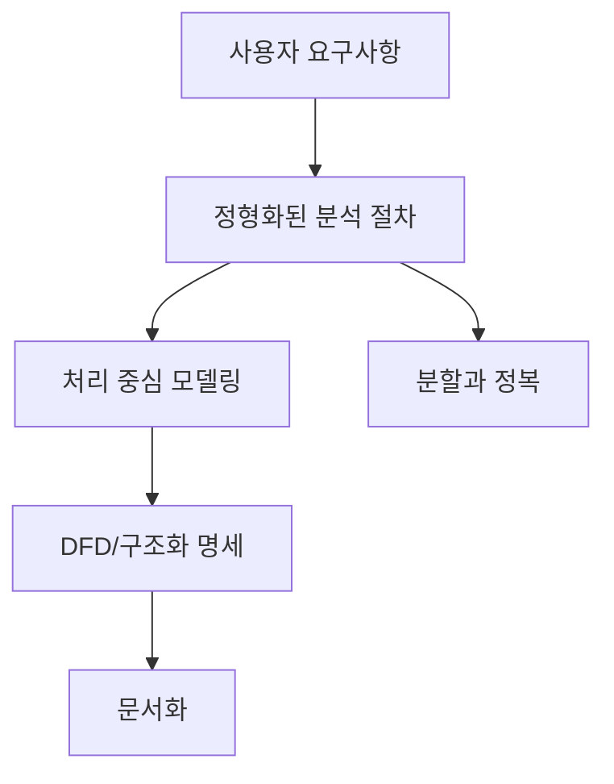

# 219 구조적 방법론

작성 기준일: 2026-06-01
검색/보강일: 2026-06-04
기준 PDF: `/Users/nes0903/Documents/study/정보처리기사/핵심요약집_2026_정보처리기사필기핵심요약.pdf`
PDF 확인 위치: 33페이지 `219 구조적 방법론`

## 한 줄 요약

- 구조적 방법론은 사용자 요구사항을 정형화된 절차로 분석·문서화하는 처리(Process) 중심 개발 방법론이다.

## 한눈에 보는 구조

## PDF 기준 핵심

- 정형화된 분석 절차에 따라 사용자 요구사항을 파악하여 문서화하는 처리(Process) 중심의 방법론이다.
- 복잡한 문제를 다루기 위해 분할과 정복(Divide and Conquer) 원리를 적용한다.
- `처리 중심`, `정형화`, `분할과 정복`이 핵심 단서이다.

## 개념 설명

- 구조적 방법론은 큰 시스템을 작은 기능 단위로 나누어 분석하고 설계한다.
- 요구사항을 자료 흐름, 처리 과정, 저장소, 외부 개체의 관계로 표현하는 방식과 잘 맞는다.
- DFD는 구조적 분석에서 시스템의 입력, 처리, 출력, 데이터 저장 흐름을 시각화하는 대표 도구이다.
- 객체보다 기능과 절차 흐름을 중심으로 생각한다는 점이 객체지향 방법론과 다르다.

## 시험 포인트

- `처리 중심`은 구조적 방법론, `자료 중심`은 정보공학 방법론으로 구분한다.
- 복잡한 문제를 작은 모듈로 나누는 `분할과 정복` 원리가 자주 출제된다.
- 산출물 단서로 DFD, 자료 사전, 구조적 명세서가 함께 나올 수 있다.
- 사용자 요구사항을 문서화한다는 표현이 나오면 구조적 분석 맥락을 의심한다.

## 헷갈리는 비교

| 구분 | 구조적 방법론 | 정보공학 방법론 |
|---|---|---|
| 중심 | 처리(Process) | 자료(Data) |
| 주요 사고 | 기능 분해, 분할과 정복 | 전사 데이터, ERD |
| 대표 도구 | DFD, 구조도 | ERD, 데이터 모델 |
| 시험 단서 | 요구사항 문서화, 처리 중심 | 데이터베이스 설계, 자료 중심 |

## 예시 또는 암기 포인트

- 주문 시스템을 `주문 접수`, `재고 확인`, `결제 처리`, `배송 요청`으로 나누는 사고가 구조적 접근이다.
- 암기식: `구조적 = 처리 중심 + 분할과 정복`.

## 빠른 복습

- 구조적 방법론의 중심은? 처리(Process).
- 복잡한 문제를 다루는 원리는? 분할과 정복.
- 대표 분석 도구로 연결되는 것은? DFD.

## 상세 보강

- 구조적 방법론은 시스템을 `입력 → 처리 → 출력` 관점으로 해석한다.
- 시험에서 `Process`, `DFD`, `자료 흐름`, `분할과 정복`, `정형화된 분석 절차`가 같이 나오면 구조적 방법론으로 연결한다.
- 기능 분해는 큰 업무를 작은 처리 단위로 나누는 사고이며, 하향식 설계와 함께 이해하면 쉽다.
- 구조적 분석 산출물은 문제 영역을 명확히 설명하는 데 강하지만, 데이터와 행위를 하나로 묶어 재사용하는 객체지향적 사고와는 거리가 있다.
- 실무 예로 주문 업무를 `주문 접수`, `결제`, `재고 확인`, `배송 지시`로 나누면 처리 중심 분석이다.

| 시험 단서 | 구조적 방법론으로 판단하는 이유 |
|---|---|
| DFD | 자료가 어떤 처리로 흘러가는지 표현 |
| 처리 중심 | 데이터 자체보다 기능·절차 흐름을 우선 |
| 분할과 정복 | 복잡한 시스템을 작은 처리 단위로 분해 |
| 문서화 | 요구사항을 정형 산출물로 남김 |

## 참고 링크

- [IBM - What is a Data Flow Diagram?](https://www.ibm.com/think/topics/data-flow-diagram)
- [IEEE Computer Society - SWEBOK Guide V3.0](https://ieeecs-media.computer.org/media/education/swebok/swebok-v3.pdf)
