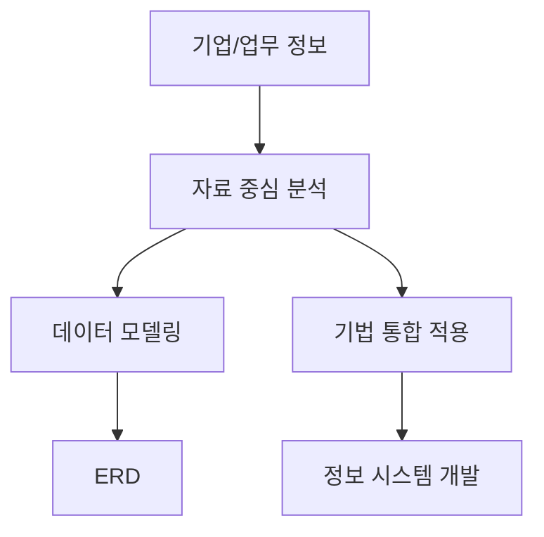
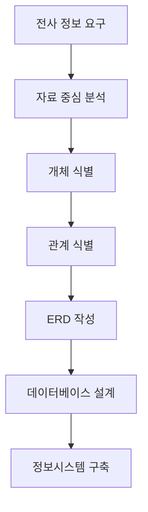

# 220 정보공학 방법론

작성 기준일: 2026-06-01
검색/보강일: 2026-06-04
기준 PDF: `/Users/nes0903/Documents/study/정보처리기사/핵심요약집_2026_정보처리기사필기핵심요약.pdf`
PDF 확인 위치: 33페이지 `220 정보공학 방법론`

## 한 줄 요약

- 정보공학 방법론은 정보 시스템 개발을 위해 정형화된 기법을 통합 적용하는 자료(Data) 중심 방법론이다.

## 한눈에 보는 구조

## PDF 기준 핵심

- 정보 시스템 개발을 위해 정형화된 기법들을 상호 연관성 있게 통합 및 적용하는 자료(Data) 중심의 방법론이다.
- 데이터베이스 설계를 위한 데이터 모델링으로 개체 관계도(ERD)를 사용한다.
- `자료 중심`, `데이터 모델링`, `ERD`가 핵심 단서이다.

## 개념 설명

- 정보공학 방법론은 조직 전체의 데이터를 자산으로 보고, 데이터 구조를 먼저 정리해 시스템 개발의 기준으로 삼는다.
- 업무 프로세스가 바뀌어도 핵심 데이터 구조는 비교적 안정적이라는 전제와 잘 맞는다.
- ERD는 개체, 속성, 관계를 표현해 데이터베이스 설계의 출발점으로 사용된다.
- 구조적 방법론이 기능 분해에 집중한다면, 정보공학은 데이터 모델과 데이터 흐름의 일관성에 더 집중한다.

## 시험 포인트

- `자료 중심`이라는 말이 나오면 정보공학 방법론을 고른다.
- ERD는 정보공학 방법론의 대표 단서이다.
- 구조적 방법론의 DFD와 정보공학 방법론의 ERD를 바꿔 외우지 않는다.
- `정형화된 기법들을 통합`한다는 PDF 문구를 기억한다.

## 헷갈리는 비교

| 구분 | 정보공학 방법론 | 컴포넌트 기반 방법론 |
|---|---|---|
| 중심 | 자료, 데이터 모델 | 재사용 컴포넌트 |
| 대표 산출물 | ERD | 요구사항 정의서, 컴포넌트 명세 |
| 목표 | 전사적 데이터 일관성 | 조립 기반 개발 |
| 시험 단서 | Data, ERD | CBD, component |

## 예시 또는 암기 포인트

- 고객, 주문, 상품, 결제 간 관계를 먼저 모델링하고 이를 기반으로 시스템을 설계하면 정보공학 접근에 가깝다.
- 암기식: `정보공학 = Data + ERD`.

## 빠른 복습

- 정보공학 방법론의 중심은? 자료(Data).
- 데이터베이스 설계에 쓰는 대표 모델은? ERD.
- 구조적 방법론과 가장 큰 차이는? 처리 중심이 아니라 자료 중심이다.

## 상세 보강

- 정보공학 방법론은 정보 시스템 전체를 장기적으로 바라보고, 업무에서 공통으로 쓰는 데이터를 먼저 안정화하려는 접근이다.
- 구조적 방법론이 처리 흐름을 쪼개는 데 강하다면, 정보공학 방법론은 데이터 모델을 중심으로 업무 간 연관성을 통합한다.
- PDF의 `정형화된 기법들을 상호 연관성 있게 통합 및 적용`은 단일 기법이 아니라 전사적 방법론임을 뜻한다.
- ERD는 개체, 속성, 관계를 시각화하므로 데이터베이스 설계와 바로 연결된다.
- 시험에서는 `자료 중심`, `데이터 모델링`, `ERD`, `정보 시스템 개발`이 함께 나오면 정보공학 방법론이다.

| 비교 항목 | 구조적 방법론 | 정보공학 방법론 |
|---|---|---|
| 출발점 | 기능·처리 절차 | 전사 데이터 |
| 대표 산출물 | DFD, 구조적 명세 | ERD, 데이터 모델 |
| 적합 상황 | 업무 절차 분석 | 데이터베이스 중심 시스템 |
| 함정 | ERD를 구조적 방법론 산출물로 착각 | DFD를 정보공학 산출물로 착각 |

## 참고 링크

- [IEEE Computer Society - SWEBOK Guide V3.0](https://ieeecs-media.computer.org/media/education/swebok/swebok-v3.pdf)
- [Information Engineering Methodology - ScienceDirect](https://www.sciencedirect.com/science/article/pii/S0736585305800942)

<!-- study-links:start -->
## 관련 문서

- `컴포넌트 기반 방법론`: [[정보처리기사/5과목 정보시스템 구축 관리/221 컴포넌트 기반 (CBD) 방법론/221 컴포넌트 기반 (CBD) 방법론|221 컴포넌트 기반 (CBD) 방법론]]
- `구조적 방법론`: [[정보처리기사/5과목 정보시스템 구축 관리/219 구조적 방법론/219 구조적 방법론|219 구조적 방법론]]
<!-- study-links:end -->
