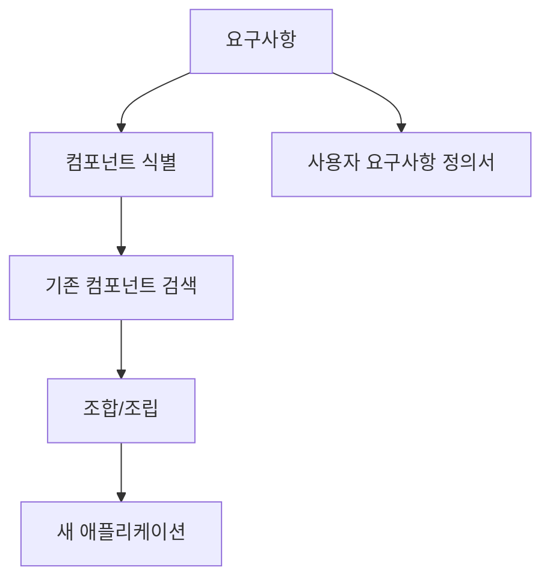
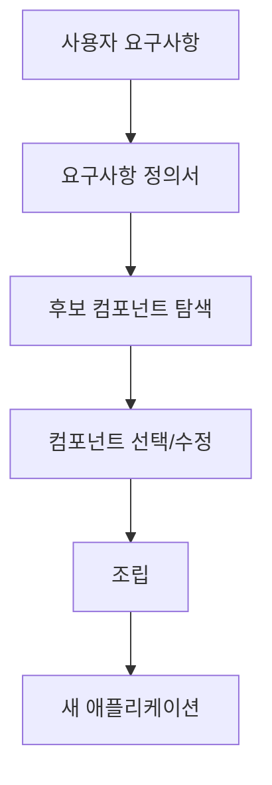

# 221 컴포넌트 기반 (CBD) 방법론

작성 기준일: 2026-06-01
검색/보강일: 2026-06-04
기준 PDF: `/Users/nes0903/Documents/study/정보처리기사/핵심요약집_2026_정보처리기사필기핵심요약.pdf`
PDF 확인 위치: 33페이지 `221 컴포넌트 기반 (CBD) 방법론`

## 한 줄 요약

- CBD 방법론은 기존 시스템이나 소프트웨어 컴포넌트를 조합해 새로운 애플리케이션을 만드는 재사용 중심 개발 방법론이다.

## 한눈에 보는 구조

## PDF 기준 핵심

- 기존의 시스템이나 소프트웨어를 구성하는 컴포넌트를 조합하여 하나의 새로운 애플리케이션을 만드는 방법론이다.
- 분석 단계에서 사용자 요구사항 정의서가 산출된다.
- `컴포넌트`, `조합`, `재사용`, `사용자 요구사항 정의서`를 함께 기억한다.

## 개념 설명

- 컴포넌트는 명확한 인터페이스를 가지고 독립적으로 배포·교체·재사용될 수 있는 소프트웨어 단위이다.
- CBD는 모든 기능을 처음부터 만들기보다 검증된 부품을 찾아 조립하는 방식으로 생산성을 높인다.
- CMU SEI 자료에서도 컴포넌트 기반 개발은 재사용 가능한 컴포넌트를 큰 시스템의 구성 요소로 활용하는 방향으로 설명된다.
- 성공하려면 컴포넌트 명세, 인터페이스 계약, 호환성 검증이 중요하다.

## 시험 포인트

- CBD는 `Component Based Development` 또는 `Component Based Software Development`로 연결된다.
- `조립`, `재사용`, `부품`, `컴포넌트`가 나오면 CBD를 고른다.
- 분석 단계 산출물로 `사용자 요구사항 정의서`가 PDF에 명시되어 있다.
- 컴포넌트를 단순 함수와 혼동하지 말고, 독립성과 인터페이스를 갖춘 재사용 단위로 이해한다.

## 헷갈리는 비교

| 구분 | CBD | 소프트웨어 재사용 |
|---|---|---|
| 의미 | 컴포넌트 조립 기반 개발 방법론 | 기존 산출물을 다시 활용하는 넓은 개념 |
| 단위 | 컴포넌트 | 코드, 설계, 문서, 모듈 등 |
| 시험 단서 | 기존 컴포넌트 조합 | 개발 시간/비용 절감 |
| 산출물 단서 | 사용자 요구사항 정의서 | 재사용 라이브러리, 블록 |

## 예시 또는 암기 포인트

- 결제, 인증, 알림 컴포넌트를 조합해 쇼핑몰 애플리케이션을 만드는 방식이 CBD 사고이다.
- 암기식: `CBD = Component를 조립해서 Build`.

## 빠른 복습

- CBD의 핵심은? 기존 컴포넌트 조합.
- PDF에 나온 분석 단계 산출물은? 사용자 요구사항 정의서.
- CBD가 기대하는 효과는? 재사용을 통한 생산성 향상.

## 상세 보강

- CBD는 애플리케이션을 처음부터 모두 개발하기보다 이미 존재하는 컴포넌트를 조합해 구축하는 방식이다.
- 컴포넌트는 독립적으로 배포·교체될 수 있는 소프트웨어 단위로 이해하면 된다.
- PDF에서 중요한 단서는 `기존 시스템이나 소프트웨어를 구성하는 컴포넌트 조합`과 `분석 단계의 사용자 요구사항 정의서`이다.
- 재사용 가능한 컴포넌트를 쓰면 생산성과 품질은 좋아질 수 있지만, 인터페이스 불일치나 컴포넌트 의존성 관리가 어려워질 수 있다.
- 시험에서는 CBD를 단순 라이브러리 사용과 혼동하지 말고, 방법론 차원의 분석·선택·조립 흐름으로 본다.

| 구분 | 핵심 |
|---|---|
| 목적 | 기존 컴포넌트 조립으로 개발 효율 향상 |
| 분석 산출물 | 사용자 요구사항 정의서 |
| 장점 | 재사용, 개발 기간 단축, 품질 안정 |
| 주의점 | 컴포넌트 인터페이스, 버전, 호환성 관리 |

## 참고 링크

- [CMU SEI - Component-Based Software Development](https://www.sei.cmu.edu/library/from-subroutines-to-subsystems-component-based-software-development/)
- [CMU SEI - Technical Concepts of Component-Based Software Engineering](https://www.sei.cmu.edu/library/volume-ii-technical-concepts-of-component-based-software-engineering-2nd-edition/)
