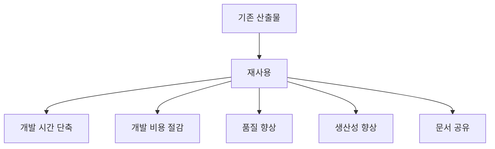
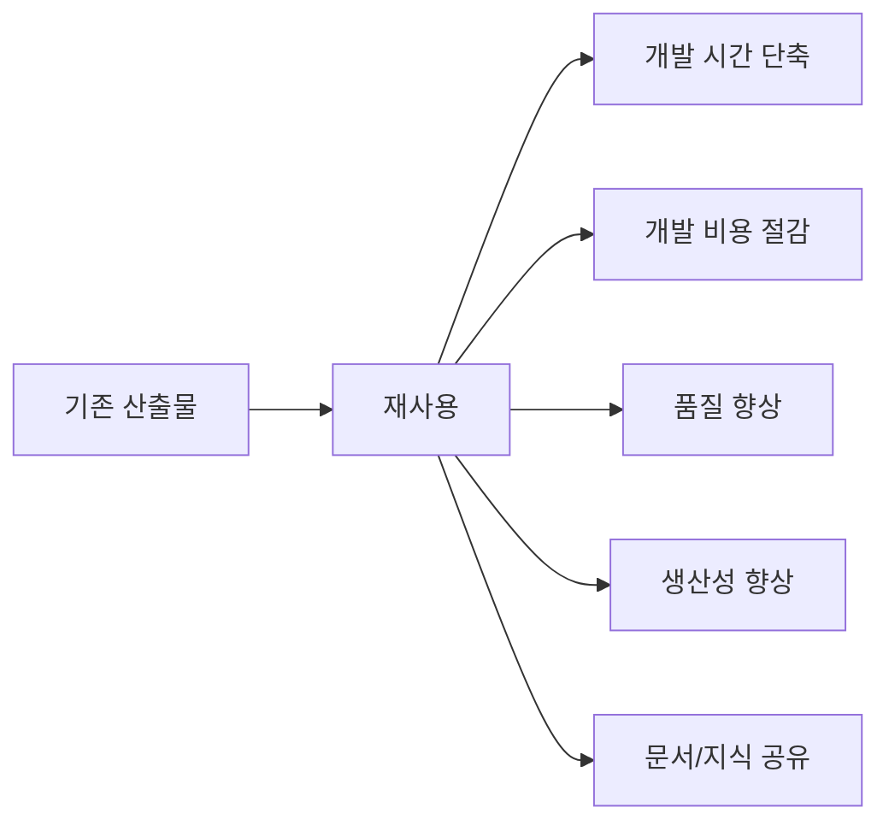

# 222 소프트웨어 재사용의 이점

작성 기준일: 2026-06-01
검색/보강일: 2026-06-04
기준 PDF: `/Users/nes0903/Documents/study/정보처리기사/핵심요약집_2026_정보처리기사필기핵심요약.pdf`
PDF 확인 위치: 33페이지 `222 소프트웨어 재사용의 이점`

## 한 줄 요약

- 소프트웨어 재사용은 이미 검증된 산출물을 다시 활용해 시간·비용을 줄이고 품질과 생산성을 높이는 전략이다.

## 한눈에 보는 구조

## PDF 기준 핵심

- 개발 시간과 비용 단축.
- 소프트웨어 품질 향상.
- 소프트웨어 개발의 생산성 향상.
- 시스템 명세, 설계, 코드 등 문서 공유.

## 개념 설명

- 재사용 대상은 소스코드뿐 아니라 요구사항, 설계, 테스트 케이스, 문서, 아키텍처 패턴까지 포함될 수 있다.
- 이미 사용되어 검증된 자산을 활용하면 결함 가능성을 줄이고 개발 속도를 높일 수 있다.
- 조직 차원의 저장소, 표준 인터페이스, 버전 관리가 재사용 성공의 기반이 된다.
- 무조건 가져다 쓰는 것이 아니라 현재 요구사항과 품질 기준에 맞는지 검토해야 한다.

## 시험 포인트

- `시간 단축`, `비용 절감`, `품질 향상`, `생산성 향상`, `문서 공유`를 PDF 목록 그대로 암기한다.
- 재사용은 CBD보다 넓은 개념이다.
- 재사용의 이점이 아닌 단점으로는 초기 구축 비용, 표준화 부담, 부적합 컴포넌트 위험 등을 떠올릴 수 있다.
- 시험은 장점 목록 중 틀린 항목을 섞는 형태로 나올 수 있다.

## 헷갈리는 비교

| 구분 | 재사용의 이점 | 재사용의 주의점 |
|---|---|---|
| 비용 | 반복 개발 감소 | 재사용 자산 구축 비용 |
| 품질 | 검증 자산 활용 | 맥락 부적합 시 결함 가능 |
| 속도 | 개발 기간 단축 | 탐색·평가 시간 필요 |
| 지식 | 문서·설계 공유 | 표준 관리 필요 |

## 예시 또는 암기 포인트

- 로그인 모듈을 여러 프로젝트에서 재사용하면 매번 인증 로직을 새로 만들지 않아도 된다.
- 암기식: `재사용 장점 = 시간, 비용, 품질, 생산성, 공유`.

## 빠른 복습

- 재사용으로 줄어드는 것은? 개발 시간과 비용.
- 재사용으로 높아지는 것은? 품질과 생산성.
- 공유 대상은? 시스템 명세, 설계, 코드 등 문서.

## 상세 보강

- 소프트웨어 재사용은 코드만 다시 쓰는 것이 아니라 명세, 설계, 테스트 자산, 문서, 컴포넌트까지 포함하는 넓은 개념이다.
- 이미 검증된 산출물을 사용하므로 결함이 줄고 품질 안정성이 올라간다.
- 반복 개발을 줄여 일정과 비용을 낮추고, 개발자는 새로운 업무 로직이나 통합 문제에 집중할 수 있다.
- PDF의 이점 네 가지는 그대로 암기해야 한다: `시간·비용 단축`, `품질 향상`, `생산성 향상`, `문서 공유`.
- 단, 재사용 자산이 표준화되어 있지 않으면 수정 비용이 커질 수 있으므로 재사용 저장소와 버전 관리가 중요하다.

| 이점 | 시험 해석 |
|---|---|
| 개발 시간/비용 단축 | 이미 만든 자산을 다시 활용 |
| 품질 향상 | 검증된 모듈 사용 |
| 생산성 향상 | 반복 구현 감소 |
| 문서 공유 | 명세·설계·코드 재활용 |

## 참고 링크

- [CMU SEI - Establishing a Basis for Software Reuse](https://www.sei.cmu.edu/history-of-innovation/establishing-a-basis-for-software-reuse/)
- [CMU SEI - Component-Based Software Development](https://www.sei.cmu.edu/library/from-subroutines-to-subsystems-component-based-software-development/)
