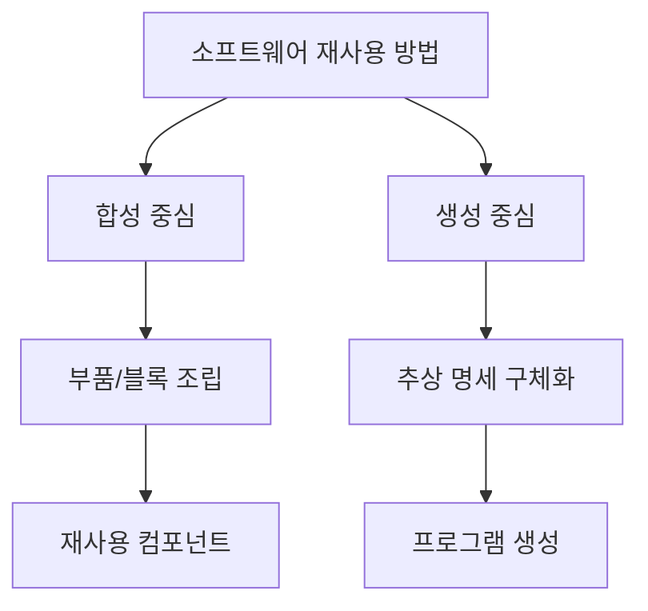
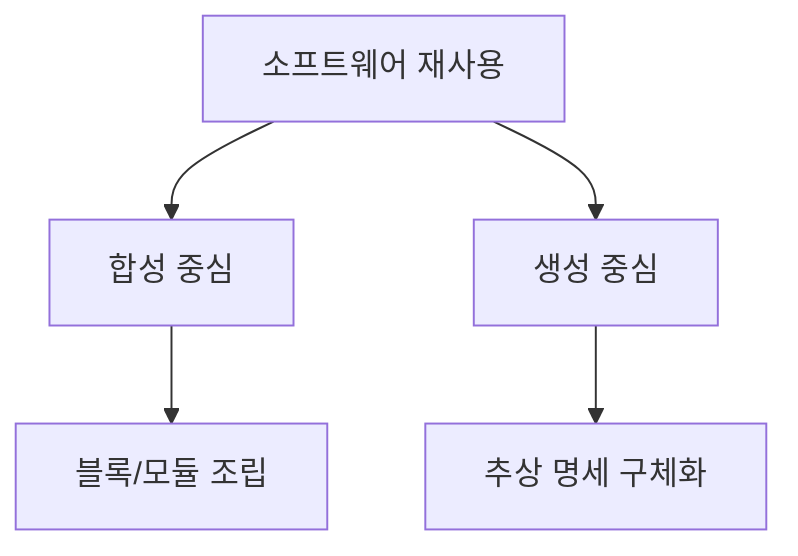

# 223 소프트웨어 재사용 방법

작성 기준일: 2026-06-01
검색/보강일: 2026-06-04
기준 PDF: `/Users/nes0903/Documents/study/정보처리기사/핵심요약집_2026_정보처리기사필기핵심요약.pdf`
PDF 확인 위치: 34페이지 `223 소프트웨어 재사용 방법`

## 한 줄 요약

- 소프트웨어 재사용 방법은 모듈을 조립하는 합성 중심과 추상 명세를 구체화하는 생성 중심으로 나뉜다.

## 한눈에 보는 구조

## PDF 기준 핵심

- 합성 중심: 전자 칩과 같은 소프트웨어 부품, 즉 블록(모듈)을 만들어 끼워 맞추어 소프트웨어를 완성시키는 방법.
- 생성 중심: 추상화 형태로 쓰인 명세를 구체화하여 프로그램을 만드는 방법.
- `합성 = 조립`, `생성 = 명세 구체화`로 구분한다.

## 개념 설명

- 합성 중심 재사용은 미리 만들어진 모듈, 라이브러리, 컴포넌트를 선택해 조립하는 방식이다.
- 생성 중심 재사용은 요구사항이나 설계 명세를 기반으로 코드나 시스템 구조를 생성하는 방식이다.
- 합성 중심은 부품의 인터페이스 호환성이 중요하고, 생성 중심은 명세의 정확성과 생성 규칙이 중요하다.
- 재사용 전략은 조직의 도메인, 표준, 도구 성숙도에 따라 달라진다.

## 시험 포인트

- `전자 칩`, `부품`, `블록`, `끼워 맞춤`은 합성 중심 단서이다.
- `추상화 명세`, `구체화`, `프로그램 생성`은 생성 중심 단서이다.
- 합성 중심을 CBD와 연결해서 이해하면 쉽지만, PDF에서는 재사용 방법의 한 유형으로 따로 묻는다.
- 생성 중심은 단순 복사 재사용이 아니라 명세에서 산출물을 만들어 내는 접근이다.

## 헷갈리는 비교

| 구분 | 합성 중심 | 생성 중심 |
|---|---|---|
| 핵심 | 부품 조립 | 명세 구체화 |
| 재사용 대상 | 모듈, 블록, 컴포넌트 | 추상 명세, 생성 규칙 |
| 시험 단서 | 끼워 맞춤 | 구체화 |
| 비유 | 전자 칩 조립 | 설계도에서 산출물 생성 |

## 예시 또는 암기 포인트

- 공통 인증 모듈과 결제 모듈을 가져와 조립하면 합성 중심이다.
- 화면 정의 명세에서 코드 템플릿을 생성하면 생성 중심에 가깝다.
- 암기식: `합성은 붙이고, 생성은 만든다`.

## 빠른 복습

- 합성 중심의 핵심은? 부품 또는 모듈 조립.
- 생성 중심의 핵심은? 추상 명세를 구체화해 프로그램 생성.
- 전자 칩 비유는 어느 쪽인가? 합성 중심.

## 상세 보강

- `합성 중심`은 만들어 둔 부품을 끼워 맞추는 방식이다. PDF의 전자 칩 비유가 이 의미를 설명한다.
- `생성 중심`은 도메인 지식이나 추상 명세를 바탕으로 구체 프로그램을 만들어 내는 방식이다.
- 합성 중심은 컴포넌트, 라이브러리, 모듈 조립과 연결되고, 생성 중심은 자동 코드 생성이나 모델 기반 개발과 연결해 이해하면 쉽다.
- 시험에서는 두 방법의 출발점이 다르다. 합성 중심은 `부품`, 생성 중심은 `명세`가 핵심 단서이다.
- 재사용 문제는 보통 “이점”과 “방법”이 함께 출제되므로 222번과 같이 복습한다.

| 구분 | 합성 중심 | 생성 중심 |
|---|---|---|
| 핵심 재료 | 소프트웨어 부품, 블록, 모듈 | 추상화된 명세 |
| 개발 방식 | 조립 | 구체화·생성 |
| 쉬운 비유 | 레고 블록 조립 | 설계도로 제품 생성 |
| 시험 단서 | 끼워 맞춤 | 추상 명세 |

## 참고 링크

- [CMU SEI - Establishing a Basis for Software Reuse](https://www.sei.cmu.edu/history-of-innovation/establishing-a-basis-for-software-reuse/)
- [IEEE Computer Society - SWEBOK Guide V3.0](https://ieeecs-media.computer.org/media/education/swebok/swebok-v3.pdf)
