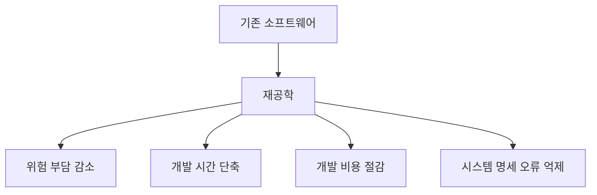
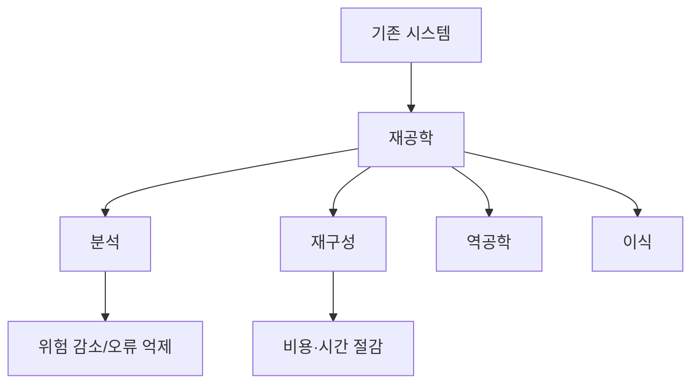

# 224 소프트웨어 재공학의 이점

작성 기준일: 2026-06-01
검색/보강일: 2026-06-04
기준 PDF: `/Users/nes0903/Documents/study/정보처리기사/핵심요약집_2026_정보처리기사필기핵심요약.pdf`
PDF 확인 위치: 34페이지 `224 소프트웨어 재공학의 이점`

## 한 줄 요약

- 소프트웨어 재공학은 기존 시스템을 분석·개선해 위험과 비용을 줄이고 품질 있는 유지보수를 가능하게 한다.

## 한눈에 보는 구조

## PDF 기준 핵심

- 위험 부담 감소.
- 개발 시간 단축.
- 개발 비용 절감.
- 시스템 명세의 오류 억제.

## 개념 설명

- 재공학은 오래된 소프트웨어를 폐기하지 않고 분석, 구조 개선, 변환 등을 통해 다시 활용 가능한 상태로 만드는 활동이다.
- 기존 업무 지식과 검증된 기능을 보존하므로 전면 신규 개발보다 위험이 낮을 수 있다.
- NIST의 소프트웨어 재공학 자료도 기존 소프트웨어의 구조와 정보를 회복하고 개선하는 도구·활동을 다룬다.
- 단순 유지보수는 결함 수정 중심일 수 있지만, 재공학은 구조와 산출물의 체계적 개선까지 포함한다.

## 시험 포인트

- 재공학 이점 목록을 PDF 그대로 외운다.
- `위험 부담 감소`와 `시스템 명세 오류 억제`는 보기에서 빠지기 쉬운 단서이다.
- 재사용은 기존 산출물을 다시 쓰는 전략이고, 재공학은 기존 시스템을 분석·개선하는 활동이다.
- 신규 개발보다 기존 자산 활용에 초점이 있다.

## 헷갈리는 비교

| 구분 | 재사용 | 재공학 |
|---|---|---|
| 초점 | 기존 산출물 활용 | 기존 시스템 분석·개선 |
| 대표 효과 | 시간/비용 절감, 품질 향상 | 위험 감소, 명세 오류 억제 |
| 대상 | 모듈, 설계, 코드, 문서 | 운영 중인 기존 소프트웨어 |
| 시험 단서 | reuse | reverse, restructuring, migration |

## 예시 또는 암기 포인트

- 오래된 업무 시스템의 코드를 분석하고 구조를 개선한 뒤 새 환경으로 옮기는 작업은 재공학이다.
- 암기식: `재공학 이점 = 위험↓ 시간↓ 비용↓ 오류↓`.

## 빠른 복습

- 재공학의 대표 이점 4가지는? 위험 부담 감소, 개발 시간 단축, 개발 비용 절감, 시스템 명세 오류 억제.
- 재공학은 새로 만드는가? 기존 시스템을 분석·개선한다.
- 재사용과의 차이는? 재사용은 산출물 활용, 재공학은 기존 시스템 개선.

## 상세 보강

- 재공학은 오래된 시스템을 폐기하지 않고 분석·개선·변환하여 계속 활용하는 접근이다.
- 신규 개발보다 기존 업무 지식과 검증된 기능을 보존할 수 있어 위험 부담이 작다.
- 개발 시간과 비용을 줄일 수 있지만, 낡은 구조를 무조건 유지하면 기술 부채가 남을 수 있다.
- PDF의 `시스템 명세의 오류 억제`는 기존 시스템을 분석하면서 실제 동작과 문서 사이의 불일치를 줄인다는 의미로 이해한다.
- 재사용은 “만든 것을 다시 쓰는 것”, 재공학은 “기존 것을 분석해 개선하는 것”으로 구분한다.

| 이점 | 이유 |
|---|---|
| 위험 부담 감소 | 이미 운영 검증된 기능을 기반으로 개선 |
| 개발 시간 단축 | 전면 재개발 범위를 줄임 |
| 개발 비용 절감 | 기존 자산과 업무 지식 활용 |
| 명세 오류 억제 | 실제 시스템 분석으로 산출물 정합성 확보 |

## 참고 링크

- [NIST - Software Reengineering](https://www.govinfo.gov/content/pkg/GOVPUB-C13-47662724baf87597656507c28c7fd8e4/pdf/GOVPUB-C13-47662724baf87597656507c28c7fd8e4.pdf)
