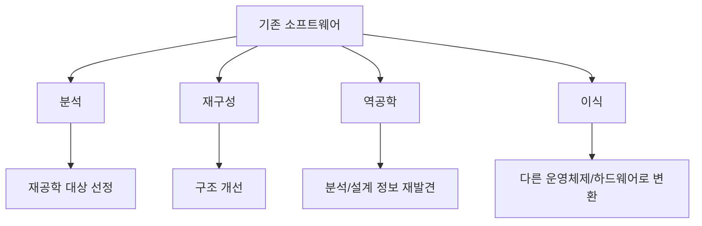
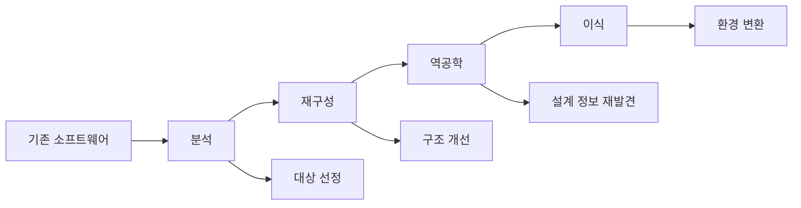

# 225 소프트웨어 재공학의 주요 활동

작성 기준일: 2026-06-01
검색/보강일: 2026-06-04
기준 PDF: `/Users/nes0903/Documents/study/정보처리기사/핵심요약집_2026_정보처리기사필기핵심요약.pdf`
PDF 확인 위치: 34페이지 `225 소프트웨어 재공학의 주요 활동`

## 한 줄 요약

- 재공학의 주요 활동은 분석, 재구성, 역공학, 이식이며 각각 기존 시스템 이해·구조 개선·정보 회복·환경 변환을 담당한다.

## 한눈에 보는 구조

## PDF 기준 핵심

- 분석(Analysis): 기존 소프트웨어의 명세서를 확인하여 동작을 이해하고, 재공학할 대상을 선정하는 활동.
- 재구성(Restructuring): 기존 소프트웨어의 구조를 향상시키기 위해 코드를 재구성하는 활동.
- 역공학(Reverse Engineering): 기존 소프트웨어를 분석하여 개발 과정과 데이터 처리 과정을 설명하는 분석 및 설계 정보를 재발견하거나 다시 만들어 내는 활동.
- 이식(Migration): 기존 소프트웨어를 다른 운영체제나 하드웨어 환경에서 사용할 수 있도록 변환하는 활동.

## 개념 설명

- 분석은 무엇을 바꿀지 결정하기 위한 이해 단계이다.
- 재구성은 기능은 유지하면서 내부 구조나 코드 품질을 개선하는 활동이다.
- 역공학은 코드에서 설계 정보, 데이터 구조, 업무 규칙을 거꾸로 추출한다.
- 이식은 플랫폼, 운영체제, 하드웨어, 런타임 환경 변화에 맞게 소프트웨어를 옮기는 활동이다.

## 시험 포인트

- `명세서 확인`, `동작 이해`, `대상 선정`은 분석이다.
- `코드 구조 향상`은 재구성이다.
- `분석 및 설계 정보 재발견`은 역공학이다.
- `다른 운영체제나 하드웨어 환경`은 이식이다.

## 헷갈리는 비교

| 활동 | 핵심 | 시험 단서 |
|---|---|---|
| 분석 | 기존 시스템 이해 | 명세서 확인, 대상 선정 |
| 재구성 | 내부 구조 개선 | 코드 재구성 |
| 역공학 | 상위 정보 회복 | 설계 정보 재발견 |
| 이식 | 실행 환경 변경 | OS, 하드웨어 변환 |

## 예시 또는 암기 포인트

- COBOL 코드를 분석해 업무 규칙과 데이터 흐름을 문서화하면 역공학이다.
- 같은 기능을 유지하면서 함수 구조를 정리하면 재구성이다.
- 암기식: `분석은 이해, 재구성은 정리, 역공학은 거꾸로, 이식은 옮김`.

## 빠른 복습

- 설계 정보를 재발견하는 활동은? 역공학.
- 다른 OS에서 쓰도록 변환하는 활동은? 이식.
- 코드 구조를 향상시키는 활동은? 재구성.

## 상세 보강

- `분석`은 무엇을 고칠지 판단하는 단계이다. 기존 명세와 실제 동작을 확인하고 재공학 대상을 고른다.
- `재구성`은 외부 기능을 크게 바꾸기보다 내부 구조와 코드를 이해하기 쉽게 정리하는 활동이다.
- `역공학`은 코드나 실행 시스템을 분석하여 설계 정보, 데이터 처리 과정, 구조 정보를 다시 찾아내는 활동이다.
- `이식`은 운영체제, 하드웨어, 플랫폼이 바뀌어도 기존 소프트웨어를 사용할 수 있게 변환하는 활동이다.
- 시험에서는 `재구성 = 코드 구조 향상`, `역공학 = 분석·설계 정보 재발견`, `이식 = 다른 환경으로 변환`을 정확히 구분한다.

| 활동 | 핵심 동사 | 대표 단서 |
|---|---|---|
| 분석 | 확인·선정 | 명세서, 동작 이해 |
| 재구성 | 정리·개선 | 코드 구조 향상 |
| 역공학 | 재발견 | 분석/설계 정보 추출 |
| 이식 | 변환 | OS·하드웨어 환경 변경 |

## 참고 링크

- [NIST - Software Reengineering](https://www.govinfo.gov/content/pkg/GOVPUB-C13-47662724baf87597656507c28c7fd8e4/pdf/GOVPUB-C13-47662724baf87597656507c28c7fd8e4.pdf)

<!-- study-links:start -->
## 관련 문서

- `회복`: [[정보처리기사/5과목 정보시스템 구축 관리/286 회복(Recovery)/286 회복(Recovery)|286 회복(Recovery)]]
<!-- study-links:end -->
