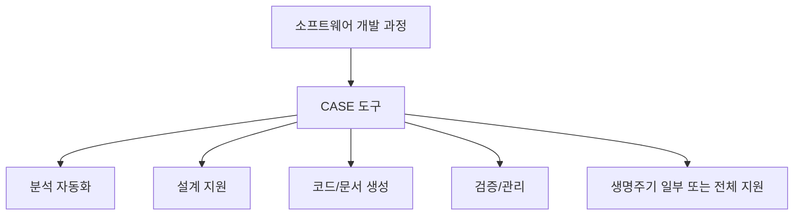
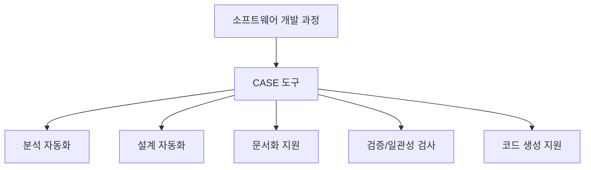

# 226 CASE(Computer Aided Software Engineering)

작성 기준일: 2026-06-01
검색/보강일: 2026-06-04
기준 PDF: `/Users/nes0903/Documents/study/정보처리기사/핵심요약집_2026_정보처리기사필기핵심요약.pdf`
PDF 확인 위치: 34페이지 `226 CASE(Computer Aided Software Engineering)`

## 한 줄 요약

- CASE는 소프트웨어 개발 과정 전체 또는 일부를 컴퓨터와 전용 도구로 자동화하는 소프트웨어 공학 지원 기술이다.

## 한눈에 보는 구조

## PDF 기준 핵심

- 소프트웨어 개발 과정 전체 또는 일부를 컴퓨터와 전용 소프트웨어 도구를 사용하여 자동화하는 것이다.
- CASE는 개발자 개인 도구라기보다 분석, 설계, 구현, 테스트, 유지보수 활동을 체계적으로 지원하는 도구군으로 이해한다.

## 개념 설명

- CASE(Computer Aided Software Engineering)는 개발 생명주기 산출물 작성과 관리, 모델링, 문서화, 코드 생성, 검증 활동을 돕는다.
- 상위 CASE는 주로 요구 분석·설계 영역을, 하위 CASE는 구현·테스트 영역을 지원한다고 구분하기도 한다.
- 통합 CASE(I-CASE)는 생명주기 전반의 산출물과 저장소를 연결해 일관성을 높이는 방향이다.
- NIST 자료는 CASE를 소프트웨어와 시스템 개발 생명주기 전체를 공학적으로 지원하는 개념으로 설명한다.

## 시험 포인트

- `컴퓨터 지원`, `전용 소프트웨어 도구`, `자동화`, `개발 과정 전체 또는 일부`가 핵심 단서이다.
- CASE는 개발 방법론이 아니라 방법론을 지원하는 도구·환경에 가깝다.
- 뒤의 `CASE의 원천 기술`, `CASE의 주요 기능` 목록과 함께 묶어 외운다.
- 생명주기 전 단계 연결, 그래픽 지원, 오류 검증 같은 기능 단서가 자주 이어진다.

## 헷갈리는 비교

| 구분 | CASE | 개발 방법론 |
|---|---|---|
| 성격 | 도구/자동화 환경 | 절차와 원칙 |
| 대상 | 분석·설계·구현·테스트 지원 | 개발 수행 방식 |
| 단서 | Computer Aided, 자동화 | 구조적, 정보공학, CBD |
| 산출물 | 모델, 문서, 코드, 저장소 | 단계별 산출물 |

## 예시 또는 암기 포인트

- DFD나 ERD를 그리고 모델의 일관성을 검사하며 문서를 자동 생성하는 도구는 CASE로 볼 수 있다.
- 암기식: `CASE = 개발을 컴퓨터가 Assist`.

## 빠른 복습

- CASE의 뜻은? Computer Aided Software Engineering.
- CASE의 핵심 기능은? 개발 과정 자동화 지원.
- 전체 생명주기를 모두 지원해야만 CASE인가? 전체 또는 일부를 지원해도 CASE이다.

## 상세 보강

- CASE는 개발자가 수행하는 분석, 설계, 문서화, 코드 생성, 테스트 일부를 도구로 지원하거나 자동화한다.
- `Computer Aided`라는 표현처럼 개발 활동을 컴퓨터가 보조하는 것이며, 개발자를 완전히 대체한다는 뜻은 아니다.
- 상위 CASE는 요구 분석·설계처럼 앞 단계에, 하위 CASE는 구현·테스트처럼 뒤 단계에 초점을 둔다.
- 통합 CASE는 생명주기 전반의 산출물과 저장소를 연결하여 추적성과 일관성을 높인다.
- 시험에서 CASE는 `자동화`, `전용 소프트웨어 도구`, `생명주기 지원`, `그래픽/검증/문서화`와 함께 출제된다.

| 구분 | 초점 | 예시 활동 |
|---|---|---|
| Upper CASE | 분석·설계 | 요구사항 모델링, DFD/ERD 작성 |
| Lower CASE | 구현·테스트 | 코드 생성, 테스트 지원 |
| Integrated CASE | 전 생명주기 | 저장소 기반 산출물 추적 |

## 참고 링크

- [NIST Special Publication 500-208 - CASE](https://www.govinfo.gov/content/pkg/GOVPUB-C13-7e2e5139be6a030552d25cdc5e2bb0bc/pdf/GOVPUB-C13-7e2e5139be6a030552d25cdc5e2bb0bc.pdf)
- [Oracle - Computer Aided Software Engineering Guide](https://docs.oracle.com/cd/E26228_01/doc.93/e21955.pdf)
