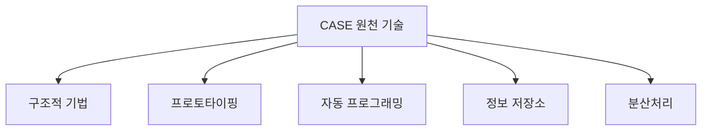

# 227 CASE의 원천 기술

작성 기준일: 2026-06-01
검색/보강일: 2026-06-04
기준 PDF: `/Users/nes0903/Documents/study/정보처리기사/핵심요약집_2026_정보처리기사필기핵심요약.pdf`
PDF 확인 위치: 34페이지 `227 CASE의 원천 기술`

## 한 줄 요약

- CASE의 원천 기술은 구조적 기법, 프로토타이핑, 자동 프로그래밍, 정보 저장소, 분산처리이다.

## 한눈에 보는 구조

## PDF 기준 핵심

- 구조적 기법.
- 프로토타이핑.
- 자동 프로그래밍.
- 정보 저장소.
- 분산처리.

## 개념 설명

- 구조적 기법은 분석·설계를 정형화된 모델로 표현하게 해 CASE 도구가 산출물을 다루기 쉽게 한다.
- 프로토타이핑은 빠른 시제품 작성과 사용자 피드백 반영을 지원한다.
- 자동 프로그래밍은 명세나 모델에서 코드 또는 코드 골격을 생성하는 기술과 연결된다.
- 정보 저장소는 모델, 문서, 코드, 메타데이터를 일관되게 관리하는 CASE 저장소이다.
- 분산처리는 여러 개발자와 도구가 네트워크 환경에서 협업하도록 돕는다.

## 시험 포인트

- 원천 기술 5가지를 목록형으로 암기해야 한다.
- `정보 저장소`는 CASE의 핵심 기반이다. 여러 산출물의 일관성 유지와 연결된다.
- 자동 프로그래밍은 CASE의 코드 생성, 문서 생성 기능과 연결된다.
- 프로토타이핑은 CASE 기능이 아니라 원천 기술 목록에도 들어간다.

## 헷갈리는 비교

| 원천 기술 | 의미 | CASE와의 연결 |
|---|---|---|
| 구조적 기법 | 정형 모델링 | 분석/설계 자동화 |
| 프로토타이핑 | 시제품 작성 | 요구 확인 |
| 자동 프로그래밍 | 산출물 자동 생성 | 코드/문서 생성 |
| 정보 저장소 | 산출물 저장·관리 | 일관성 유지 |
| 분산처리 | 분산 환경 지원 | 협업/통합 |

## 예시 또는 암기 포인트

- CASE 도구가 ERD를 저장소에 보관하고 코드 골격을 생성하면 `정보 저장소 + 자동 프로그래밍`이 결합된 예이다.
- 암기식: `구프자정분 = 구조적, 프로토, 자동, 정보저장소, 분산`.

## 빠른 복습

- CASE 원천 기술은 몇 가지인가? 5가지.
- 저장소와 연결되는 원천 기술은? 정보 저장소.
- 모델에서 코드 생성을 떠올리게 하는 것은? 자동 프로그래밍.

## 상세 보강

- 구조적 기법은 DFD, 구조도, 자료 사전 같은 모델링 기법을 CASE 도구가 지원할 수 있게 한 기반이다.
- 프로토타이핑은 요구사항을 빠르게 확인하고 사용자 피드백을 반영하는 기반 기술이다.
- 자동 프로그래밍은 모델이나 명세에서 코드 또는 코드 골격을 생성하는 기술과 연결된다.
- 정보 저장소는 산출물, 모델, 코드, 메타데이터를 일관되게 관리하는 CASE의 핵심 기반이다.
- 분산처리는 여러 개발자와 도구가 네트워크 환경에서 산출물을 공유하고 협업할 수 있게 한다.

| 원천 기술 | CASE에서의 의미 |
|---|---|
| 구조적 기법 | 분석·설계 모델 작성 기반 |
| 프로토타이핑 | 사용자 요구 확인 |
| 자동 프로그래밍 | 코드 생성·자동화 |
| 정보 저장소 | 산출물 통합 관리 |
| 분산처리 | 협업과 공유 |

## 참고 링크

- [NIST Special Publication 500-208 - CASE](https://www.govinfo.gov/content/pkg/GOVPUB-C13-7e2e5139be6a030552d25cdc5e2bb0bc/pdf/GOVPUB-C13-7e2e5139be6a030552d25cdc5e2bb0bc.pdf)
- [Oracle - Computer Aided Software Engineering Guide](https://docs.oracle.com/cd/E26228_01/doc.93/e21955.pdf)
