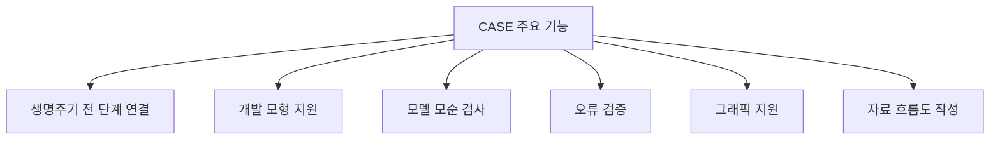
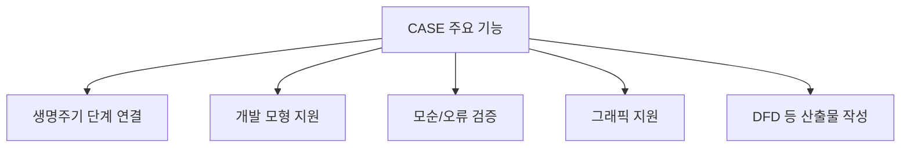

# 228 CASE의 주요 기능

작성 기준일: 2026-06-01
검색/보강일: 2026-06-04
기준 PDF: `/Users/nes0903/Documents/study/정보처리기사/핵심요약집_2026_정보처리기사필기핵심요약.pdf`
PDF 확인 위치: 34페이지 `228 CASE의 주요 기능`

## 한 줄 요약

- CASE의 주요 기능은 생명주기 단계 연결, 개발 모형 지원, 모델 오류 검증, 그래픽 지원, 자료 흐름도 작성이다.

## 한눈에 보는 구조

## PDF 기준 핵심

- 소프트웨어 생명 주기 전 단계의 연결.
- 다양한 소프트웨어 개발 모형 지원.
- 모델들의 모순 검사 및 오류 검증.
- 그래픽 지원.
- 자료 흐름도 작성 등.

## 개념 설명

- CASE는 분석, 설계, 구현, 테스트, 유지보수 산출물을 연결해 변경 영향 추적을 쉽게 한다.
- 개발 모형 지원은 폭포수, 프로토타입, 나선형 등 방법론별 산출물 작성을 돕는다는 의미이다.
- 모델 모순 검사와 오류 검증은 잘못된 관계, 누락된 정의, 불일치한 자료 흐름을 찾아내는 기능이다.
- 그래픽 지원은 DFD, ERD, 구조도 같은 모델을 시각적으로 작성하고 관리하는 기능과 연결된다.

## 시험 포인트

- `생명 주기 전 단계 연결`은 CASE의 대표 기능으로 자주 나온다.
- `모델의 모순 검사 및 오류 검증`은 단순 그림 도구와 CASE를 구분하는 단서이다.
- `자료 흐름도 작성`은 구조적 분석 지원 기능과 연결한다.
- 원천 기술 목록과 주요 기능 목록을 섞어 묻는 문제에 주의한다.

## 헷갈리는 비교

| 구분 | CASE 원천 기술 | CASE 주요 기능 |
|---|---|---|
| 성격 | CASE를 가능하게 하는 기반 기술 | CASE가 제공하는 기능 |
| 예 | 구조적 기법, 정보 저장소 | 생명주기 연결, 오류 검증 |
| 시험 함정 | 프로토타이핑 | 그래픽 지원 |
| 암기 방향 | 기반 | 결과 기능 |

## 예시 또는 암기 포인트

- 개발자가 DFD를 그리고 도구가 자료 흐름의 누락이나 모순을 찾아내면 CASE 주요 기능의 예이다.
- 암기식: `연결, 지원, 검사, 검증, 그래픽, DFD`.

## 빠른 복습

- CASE가 연결하는 범위는? 소프트웨어 생명 주기 전 단계.
- 모델 품질과 관련된 기능은? 모순 검사 및 오류 검증.
- 그래픽 기능의 대표 산출물은? 자료 흐름도.

## 상세 보강

- CASE의 핵심은 여러 개발 단계에서 생기는 산출물을 끊기지 않게 연결하는 것이다.
- 요구사항 변경이 설계, 코드, 테스트에 어떤 영향을 주는지 추적할 수 있으면 변경 관리가 쉬워진다.
- 모델들의 모순 검사와 오류 검증은 산출물 간 불일치를 줄여 품질을 높이는 기능이다.
- 그래픽 지원은 복잡한 분석·설계 모델을 시각적으로 작성하고 이해하게 해 준다.
- 시험에서는 `생명주기 전 단계 연결`, `개발 모형 지원`, `모순 검사`, `오류 검증`, `그래픽`, `자료 흐름도`를 묶어서 외운다.

| 기능 | 기대 효과 |
|---|---|
| 단계 연결 | 추적성 확보 |
| 모형 지원 | 다양한 개발 방법론 적용 |
| 모순/오류 검증 | 품질 향상 |
| 그래픽 지원 | 모델 이해도 향상 |
| DFD 작성 | 구조적 분석 산출물 생성 |

## 참고 링크

- [NIST Special Publication 500-208 - CASE](https://www.govinfo.gov/content/pkg/GOVPUB-C13-7e2e5139be6a030552d25cdc5e2bb0bc/pdf/GOVPUB-C13-7e2e5139be6a030552d25cdc5e2bb0bc.pdf)
- [Oracle - Computer Aided Software Engineering Guide](https://docs.oracle.com/cd/E26228_01/doc.93/e21955.pdf)

<!-- study-links:start -->
## 관련 문서

- `주요 기능`: [[정보처리기사/2과목 소프트웨어 개발/079 소프트웨어의 버전 등록 관련 주요 기능/079 소프트웨어의 버전 등록 관련 주요 기능|079 소프트웨어의 버전 등록 관련 주요 기능]]
<!-- study-links:end -->
