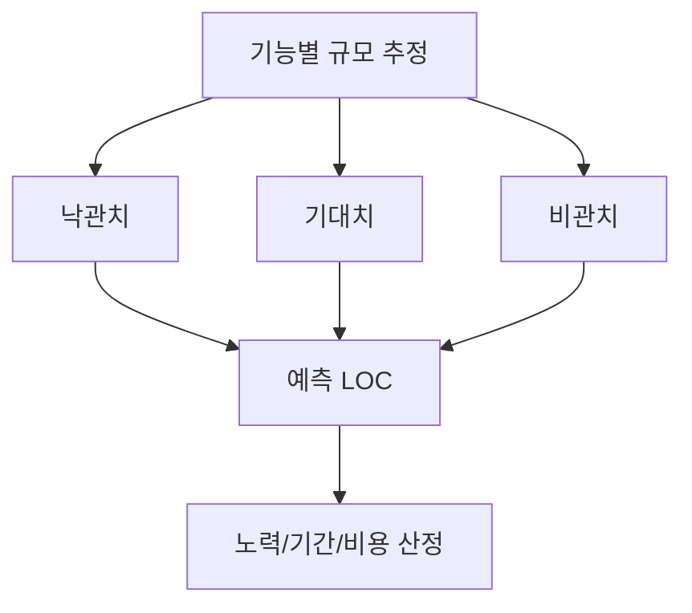
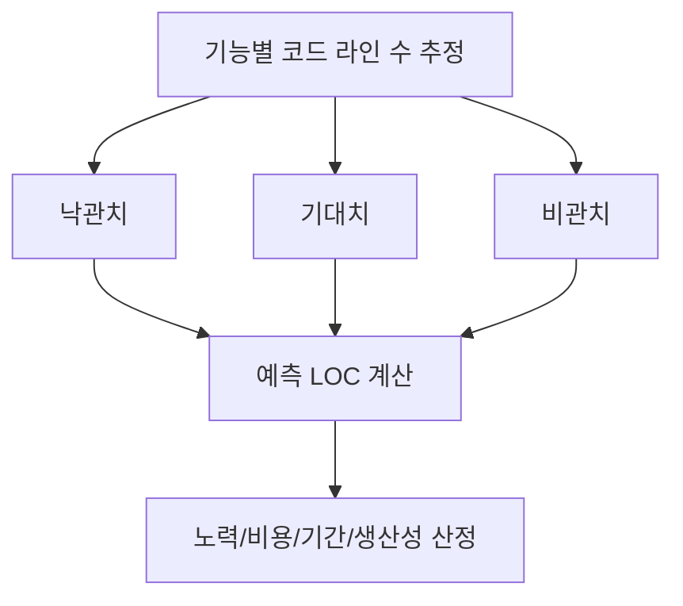

# 229 비용 산정 기법 - LOC 기법

작성 기준일: 2026-06-01
검색/보강일: 2026-06-04
기준 PDF: `/Users/nes0903/Documents/study/정보처리기사/핵심요약집_2026_정보처리기사필기핵심요약.pdf`
PDF 확인 위치: 34페이지 `229 비용 산정 기법 - LOC 기법`

## 한 줄 요약

- LOC 기법은 기능별 원시 코드 라인 수를 예측해 노력, 기간, 비용을 산정하는 규모 기반 비용 산정 기법이다.

## 한눈에 보는 구조

## PDF 기준 핵심

- 소프트웨어 각 기능의 원시 코드 라인 수의 비관치, 낙관치, 기대치를 측정한다.
- 예측치를 구하고 이를 이용하여 비용을 산정하는 기법이다.
- `LOC = Lines of Code`, 즉 코드 라인 수 기반 산정이다.

## 개념 설명

- LOC 기법은 개발할 소프트웨어의 규모를 코드 라인 수로 보고 비용을 추정한다.
- 기능별로 예상 라인 수를 나누어 추정한 뒤 합산해 전체 규모를 계산한다.
- 비슷한 과거 프로젝트의 생산성 자료가 있으면 더 현실적인 산정이 가능하다.
- 단점은 언어, 개발 도구, 프레임워크, 코드 스타일에 따라 라인 수가 크게 달라질 수 있다는 점이다.

## 시험 포인트

- `비관치`, `낙관치`, `기대치`가 나오면 LOC 산정 또는 PERT식 추정과 연결한다.
- LOC는 기능 점수와 달리 개발자 관점의 코드 규모에 의존한다.
- 비용 산정 흐름은 `LOC 예측 → 노력 산정 → 비용/기간/생산성 계산`이다.
- NASA 소프트웨어 공학 지침도 LOC와 기능 점수 같은 규모 측정값이 비용 추정의 입력으로 쓰일 수 있음을 설명한다.

## 헷갈리는 비교

| 구분 | LOC 기법 | 기능 점수(FP) |
|---|---|---|
| 기준 | 코드 라인 수 | 사용자 기능 크기 |
| 관점 | 개발자/구현 중심 | 사용자 기능 중심 |
| 언어 영향 | 큼 | 상대적으로 작음 |
| 시험 단서 | 원시 코드 라인 수 | 입력, 출력, 질의, 파일, 인터페이스 |

## 예시 또는 암기 포인트

- 기능 A는 500라인, 기능 B는 800라인처럼 기능별 규모를 잡은 뒤 전체 LOC를 산정한다.
- 암기식: `LOC는 Line으로 Cost를 본다`.

## 빠른 복습

- LOC 기법의 기준은? 원시 코드 라인 수.
- PDF에 나온 세 추정값은? 비관치, 낙관치, 기대치.
- LOC 산정 후 계산하는 것은? 노력, 개발 비용, 개발 기간, 생산성.

## 상세 보강

- LOC 기법은 소프트웨어 규모를 원시 코드 라인 수로 보고 비용을 추정한다.
- 비관치, 낙관치, 기대치를 잡는 이유는 초기에 정확한 규모를 알기 어렵기 때문이다.
- 기능별 LOC를 합산해 전체 규모를 예측하고, 생산성이나 인력 투입 기준을 적용해 노력과 비용을 계산한다.
- 장점은 이해와 계산이 쉽다는 점이고, 단점은 언어·개발 방식·재사용 수준에 따라 코드 라인 수가 크게 달라진다는 점이다.
- 시험에서는 `원시 코드 라인 수`, `비관치/낙관치/기대치`, `예측치`가 나오면 LOC 기법이다.

| 항목 | 의미 |
|---|---|
| 낙관치 | 가장 적은 코드 라인 수로 구현될 경우 |
| 기대치 | 보통 예상되는 코드 라인 수 |
| 비관치 | 가장 많은 코드 라인 수가 필요한 경우 |
| 한계 | 요구사항 단계에서는 정확한 LOC 추정이 어렵다 |

## 참고 링크

- [NASA Software Engineering Handbook - Cost Estimation](https://swehb.nasa.gov/pages/viewpage.action?pageId=16458278)
