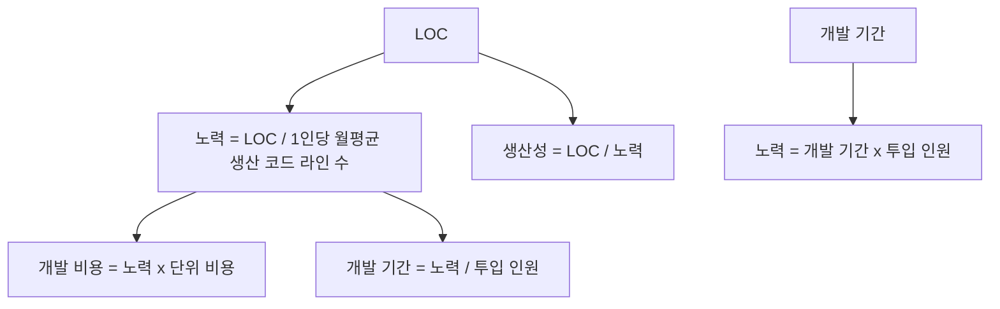
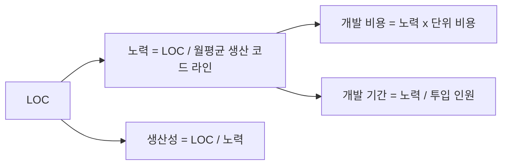

# 230 LOC 기법의 산정 공식

작성 기준일: 2026-06-01
검색/보강일: 2026-06-04
기준 PDF: `/Users/nes0903/Documents/study/정보처리기사/핵심요약집_2026_정보처리기사필기핵심요약.pdf`
PDF 확인 위치: 34페이지 `230 LOC 기법의 산정 공식`

## 한 줄 요약

- LOC 공식은 노력, 비용, 기간, 생산성을 서로 변환하는 계산형 공식으로 출제된다.

## 한눈에 보는 구조

## PDF 기준 핵심

- 노력(인월) = 개발 기간 × 투입 인원.
- 노력(인월) = LOC / 1인당 월평균 생산 코드 라인 수.
- 개발 비용 = 노력(인월) × 단위 비용(1인당 월평균 인건비).
- 개발 기간 = 노력(인월) / 투입 인원.
- 생산성 = LOC / 노력(인월).

## 개념 설명

- `인월`은 한 사람이 한 달 일하는 작업량을 뜻한다.
- 같은 노력이라도 투입 인원이 늘면 개발 기간은 짧아질 수 있지만, 실제 프로젝트에서는 의사소통 비용이 추가될 수 있다.
- 시험 계산에서는 PDF 공식 그대로 대입하는 것이 우선이다.
- LOC 예측치가 주어지면 생산성과 투입 인원, 단위 비용을 통해 비용과 기간을 순서대로 계산한다.

## 시험 포인트

- 단위가 가장 중요하다. `월`, `인원`, `원/인월`, `라인/인월`을 맞춰야 한다.
- 생산성 공식은 `LOC / 노력`이다. 반대로 쓰지 않는다.
- 개발 기간 공식은 `노력 / 투입 인원`이다.
- 개발 비용은 기간이 아니라 노력에 단위 비용을 곱한다.

## 헷갈리는 비교

| 항목 | 공식 | 자주 하는 실수 |
|---|---|---|
| 노력 | 기간 × 인원 | 인원으로 다시 나눔 |
| 노력 | LOC / 생산성 | 생산성 / LOC로 계산 |
| 비용 | 노력 × 단위 비용 | 기간 × 단위 비용 |
| 기간 | 노력 / 인원 | LOC / 인원만 계산 |
| 생산성 | LOC / 노력 | 노력 / LOC |

## 예시 또는 암기 포인트

- LOC가 30,000라인이고 1인당 월평균 3,000라인이면 노력은 `10인월`이다.
- 단위 비용이 500만 원이면 개발 비용은 `10 × 500만 원`이다.
- 투입 인원이 5명이면 개발 기간은 `10 / 5 = 2개월`이다.

## 빠른 복습

- 노력 공식 2가지는? `기간 × 인원`, `LOC / 1인당 월평균 생산 코드 라인 수`.
- 비용 공식은? `노력 × 단위 비용`.
- 생산성 공식은? `LOC / 노력`.

## 상세 보강

- LOC 공식 문제는 단위를 먼저 맞추는 것이 중요하다. 노력은 보통 `인월` 단위로 계산한다.
- `개발 기간 × 투입 인원`과 `LOC / 1인당 월평균 생산 코드 라인 수`는 모두 노력을 구하는 식이다.
- 개발 비용은 노력에 1인당 월평균 인건비를 곱한다.
- 생산성은 투입 노력 대비 산출 코드 라인 수이므로 `LOC / 노력`이다.
- 시험에서는 숫자를 대입하기 전에 `노력`, `비용`, `기간`, `생산성` 중 무엇을 묻는지 확인한다.

| 구하는 값 | 공식 | 단서 |
|---|---|---|
| 노력 | 개발 기간 × 투입 인원 | 인월 |
| 노력 | LOC / 월평균 생산 LOC | 생산성 기준 |
| 비용 | 노력 × 단위 비용 | 인건비 |
| 기간 | 노력 / 투입 인원 | 일정 |
| 생산성 | LOC / 노력 | 1인월당 코드량 |

## 참고 링크

- [NASA Software Engineering Handbook - Cost Estimation](https://swehb.nasa.gov/pages/viewpage.action?pageId=16458278)
