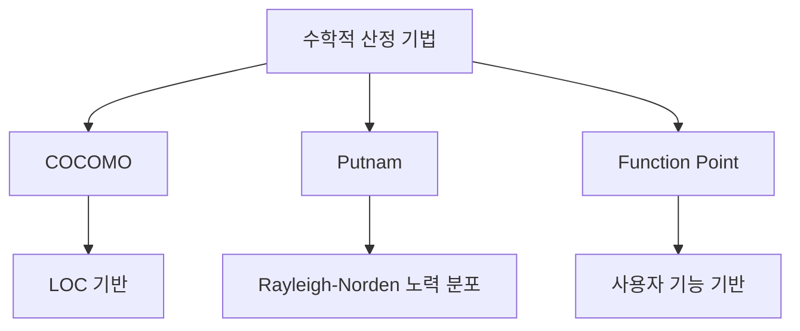
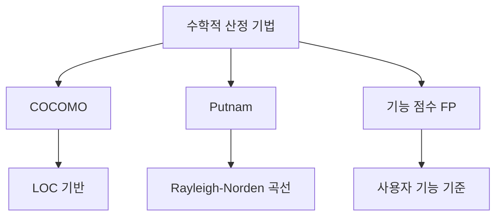

# 231 수학적 산정 기법의 종류

작성 기준일: 2026-06-01
검색/보강일: 2026-06-04
기준 PDF: `/Users/nes0903/Documents/study/정보처리기사/핵심요약집_2026_정보처리기사필기핵심요약.pdf`
PDF 확인 위치: 35페이지 `231 수학적 산정 기법의 종류`

## 한 줄 요약

- 수학적 산정 기법은 경험식과 규모 지표를 이용해 비용을 계산하며, COCOMO, Putnam, 기능 점수 모형이 대표적이다.

## 한눈에 보는 구조

## PDF 기준 핵심

- COCOMO(COnstructive COst MOdel) 모형.
- Putnam 모형.
- 기능 점수(Function Point) 모형.
- 이 세 가지를 `수학적 산정 기법`의 대표 종류로 외운다.

## 개념 설명

- 수학적 산정 기법은 소프트웨어 규모와 생산성, 경험적 계수 등을 사용해 비용을 정량적으로 예측한다.
- COCOMO는 LOC 규모와 개발 유형에 기반한 비용 산정 모델이다.
- Putnam은 노력의 시간적 분포를 Rayleigh-Norden 곡선으로 설명하는 모형이다.
- 기능 점수는 내부 구현 라인 수보다 사용자가 인식하는 기능 규모를 기준으로 삼는다.

## 시험 포인트

- `COCOMO`, `Putnam`, `기능 점수`를 묶어서 외운다.
- COCOMO는 Boehm, Putnam은 Rayleigh-Norden, 기능 점수는 입력/출력/질의/파일/인터페이스 단서와 연결한다.
- 전문가 감정, 델파이식 추정은 수학적 산정 기법 목록과 구분한다.
- 자동화 도구 SLIM은 Putnam 모델 기반으로 뒤 주제와 연결된다.

## 헷갈리는 비교

| 기법 | 핵심 기준 | 시험 단서 |
|---|---|---|
| COCOMO | LOC, 개발 유형 | Boehm, Organic |
| Putnam | 노력 분포 | Rayleigh-Norden |
| FP | 사용자 기능 | 입력, 출력, 질의 |

## 예시 또는 암기 포인트

- 코드 규모가 주어지고 Organic/Semi-Detached/Embedded가 나오면 COCOMO 쪽이다.
- 입력 양식, 출력 보고서, 데이터 파일이 나오면 기능 점수 쪽이다.
- 암기식: `수학 산정 3형제 = 코푸기`.

## 빠른 복습

- 수학적 산정 기법 3가지는? COCOMO, Putnam, 기능 점수.
- Rayleigh-Norden과 연결되는 것은? Putnam.
- 사용자 기능 수와 연결되는 것은? 기능 점수.

## 상세 보강

- 수학적 산정 기법은 경험이나 전문가 감각만으로 추정하지 않고, 모델·공식·계량 요소를 이용한다.
- COCOMO는 원시 프로그램 규모인 LOC에 기반한 비용 산정 기법이다.
- Putnam은 생명주기 전체 노력 분포를 Rayleigh-Norden 곡선으로 설명하는 모델이다.
- 기능 점수는 사용자 관점의 기능 수와 복잡도를 바탕으로 규모를 산정한다.
- 시험에서는 `LOC = COCOMO`, `Rayleigh-Norden = Putnam`, `입출력/파일/인터페이스 = 기능 점수`로 빠르게 매칭한다.

| 기법 | 중심 기준 | 핵심 단서 |
|---|---|---|
| COCOMO | LOC | Boehm, Organic/Semi-detached/Embedded |
| Putnam | 노력 분포 | Rayleigh-Norden |
| FP | 기능 수 | 입력, 출력, 질의, 파일, 인터페이스 |

## 참고 링크

- [NASA Software Engineering Handbook - Cost Estimation](https://swehb.nasa.gov/pages/viewpage.action?pageId=16458278)
- [IFPUG - Function Point Analysis](https://ifpug.org/ifpug-standards/fpa)
