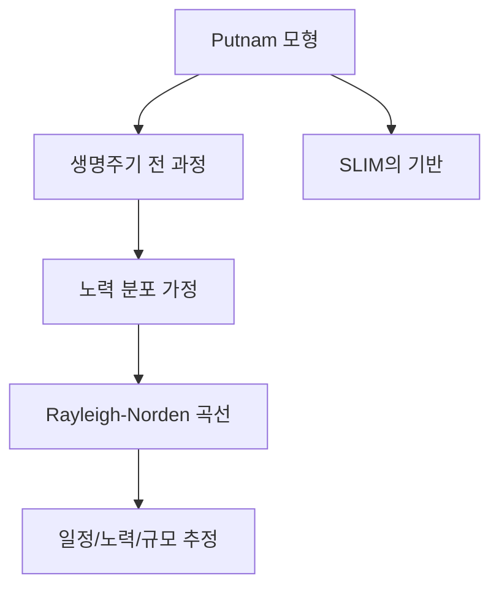
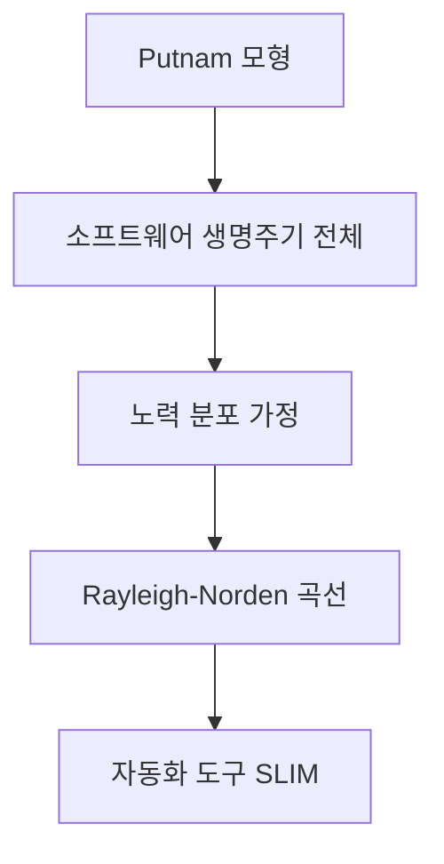

# 232 비용 산정 기법 - Putnam 모형

작성 기준일: 2026-06-01
검색/보강일: 2026-06-04
기준 PDF: `/Users/nes0903/Documents/study/정보처리기사/핵심요약집_2026_정보처리기사필기핵심요약.pdf`
PDF 확인 위치: 35페이지 `232 비용 산정 기법 - Putnam 모형`

## 한 줄 요약

- Putnam 모형은 소프트웨어 생명주기 전 과정의 노력 분포를 Rayleigh-Norden 곡선으로 가정하는 비용 산정 모형이다.

## 한눈에 보는 구조

## PDF 기준 핵심

- 소프트웨어 생명 주기의 전 과정 동안에 사용될 노력의 분포를 가정해 주는 모형이다.
- Rayleigh-Norden 곡선의 노력 분포도를 기초로 한다.
- 자동화 추정 도구 SLIM의 이론 기반으로도 연결된다.

## 개념 설명

- Putnam 모형은 개발 노력이 시간에 따라 일정하게 쓰이지 않고 특정 시점에 집중되는 분포를 따른다고 본다.
- Rayleigh-Norden 곡선은 프로젝트 진행에 따른 인력 투입과 노력 분포를 설명하는 데 사용된다.
- 일정 단축이 노력 증가와 품질 위험으로 이어질 수 있음을 설명하는 모델로도 이해할 수 있다.
- LOC 기반 COCOMO와 달리 노력의 시간 분포를 더 강조한다.

## 시험 포인트

- `Putnam = Rayleigh-Norden`은 반드시 연결한다.
- `소프트웨어 생명주기 전 과정의 노력 분포`라는 표현이 나오면 Putnam이다.
- `SLIM`이 나오면 Putnam 모델 기반 자동화 추정 도구로 연결한다.
- Boehm은 COCOMO이므로 Putnam과 섞지 않는다.

## 헷갈리는 비교

| 구분 | Putnam | COCOMO |
|---|---|---|
| 제안/연결 | Putnam, Rayleigh-Norden | Boehm |
| 중심 | 노력 분포 | LOC 기반 비용 |
| 도구 연결 | SLIM | COCOMO 계열 |
| 시험 단서 | 생명주기 전 과정 | Organic, Embedded |

## 예시 또는 암기 포인트

- 프로젝트 초반에는 투입이 적고 중반에 노력이 집중되며 후반에 감소하는 곡선 형태를 떠올린다.
- 암기식: `Putnam은 곡선, COCOMO는 코드 규모`.

## 빠른 복습

- Putnam 모형의 핵심 곡선은? Rayleigh-Norden.
- Putnam이 보는 대상은? 생명주기 전 과정의 노력 분포.
- SLIM과 연결되는 모형은? Putnam.

## 상세 보강

- Putnam 모형은 프로젝트 전체 기간 동안 노력이 어떻게 투입되는지를 분포 관점에서 본다.
- 개발 초반에는 투입 노력이 작고, 중간에 커졌다가, 종료 시점에 다시 줄어드는 형태를 Rayleigh-Norden 곡선으로 설명한다.
- LOC처럼 단순 규모만 보는 것이 아니라 시간에 따른 인력 투입과 생산성의 관계를 함께 고려한다.
- 시험에서는 Putnam 자체보다 `Rayleigh-Norden 곡선`과 `SLIM의 기반`이라는 연결이 자주 중요하다.
- COCOMO와 비교하면 COCOMO는 Boehm·LOC, Putnam은 노력 분포·Rayleigh-Norden이 핵심이다.

| 구분 | Putnam | COCOMO |
|---|---|---|
| 핵심 | 생명주기 노력 분포 | LOC 기반 비용 산정 |
| 대표 단서 | Rayleigh-Norden | Boehm |
| 자동화 도구 | SLIM | COCOMO 도구 |
| 관점 | 시간에 따른 노력 | 규모에 따른 노력 |

## 참고 링크

- [NASA NTRS - Cost Estimation, COCOMO, SLIM](https://ntrs.nasa.gov/api/citations/19840015068/downloads/19840015068.pdf)
