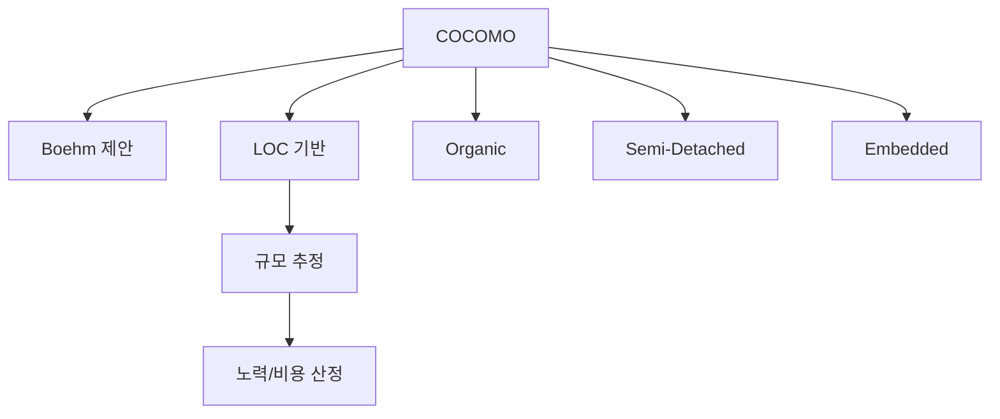
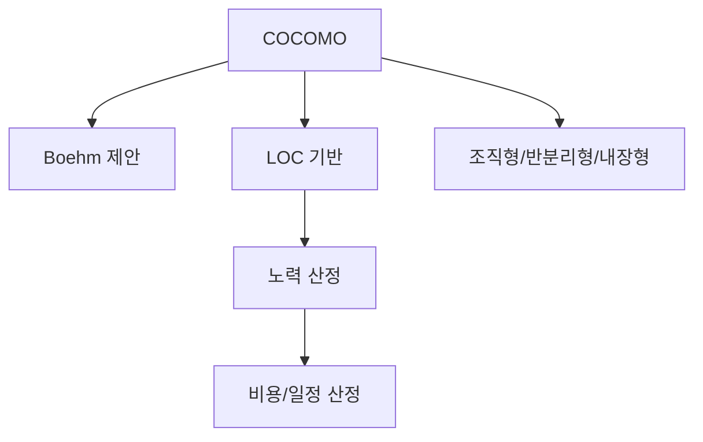

# 233 비용 산정 기법 - COCOMO

작성 기준일: 2026-06-01
검색/보강일: 2026-06-04
기준 PDF: `/Users/nes0903/Documents/study/정보처리기사/핵심요약집_2026_정보처리기사필기핵심요약.pdf`
PDF 확인 위치: 35페이지 `233 비용 산정 기법 - COCOMO`

## 한 줄 요약

- COCOMO는 Boehm이 제안한 LOC 기반 소프트웨어 비용 산정 모형이다.

## 한눈에 보는 구조

## PDF 기준 핵심

- 보헴(Boehm)이 제안했다.
- 원시 프로그램의 규모(LOC)에 의한 비용 산정 기법이다.
- 개발 유형은 조직형, 반분리형, 내장형으로 이어서 출제된다.

## 개념 설명

- COCOMO는 Constructive Cost Model의 약자이다.
- 기본 사고는 소프트웨어 규모가 커질수록 필요한 노력과 비용도 경험식에 따라 증가한다는 것이다.
- 프로젝트 성격과 복잡도에 따라 Organic, Semi-Detached, Embedded 유형을 구분한다.
- NASA 지침도 소프트웨어 비용 산정에서 Boehm의 COCOMO와 COCOMO II를 중요한 참고 모델로 언급한다.

## 시험 포인트

- `Boehm`, `LOC`, `COCOMO`를 한 세트로 외운다.
- Putnam의 Rayleigh-Norden과 섞지 않는다.
- COCOMO 유형의 규모 기준 `50KDSI`, `300KDSI`가 같이 출제된다.
- `COnstructive COst MOdel`의 대문자 조합이 COCOMO이다.

## 헷갈리는 비교

| 구분 | COCOMO | LOC 기법 |
|---|---|---|
| 성격 | 경험적 비용 산정 모형 | 라인 수 기반 추정 기법 |
| 제안자 | Boehm | 특정 제안자보다 산정 방식 |
| 기준 | LOC와 개발 유형 | 기능별 코드 라인 수 |
| 시험 단서 | Organic/Semi/Embedded | 낙관치/기대치/비관치 |

## 예시 또는 암기 포인트

- `KDSI`는 Kilo Delivered Source Instructions로, 전달 원시 명령어 수를 천 단위로 본 규모 표현이다.
- 암기식: `COCOMO = 보헴 + LOC`.

## 빠른 복습

- COCOMO 제안자는? Boehm.
- COCOMO의 산정 기준은? LOC.
- COCOMO 개발 유형 3가지는? 조직형, 반분리형, 내장형.

## 상세 보강

- COCOMO는 Constructive Cost Model의 약자로, 소프트웨어 규모를 LOC로 보고 노력·비용·일정을 추정한다.
- Boehm이 제안했다는 인물 단서가 시험에 자주 붙는다.
- 프로젝트 난이도와 개발 환경에 따라 조직형, 반분리형, 내장형으로 나누어 계수를 다르게 적용한다.
- LOC 기반이므로 초기 요구사항 단계에서 정확한 규모를 모르면 오차가 커질 수 있다.
- 시험에서는 `Boehm`, `원시 프로그램 규모`, `LOC`, `조직형/반분리형/내장형`을 한 묶음으로 외운다.

| 단서 | 판단 |
|---|---|
| Boehm | COCOMO |
| LOC 기반 비용 산정 | COCOMO 또는 LOC 기법 |
| 개발 유형 3가지 | COCOMO의 프로젝트 유형 |
| Rayleigh-Norden | COCOMO가 아니라 Putnam |

## 참고 링크

- [NASA Software Engineering Handbook - Cost Estimation](https://swehb.nasa.gov/pages/viewpage.action?pageId=16458278)
- [NASA NTRS - Cost Estimation, COCOMO, SLIM](https://ntrs.nasa.gov/api/citations/19840015068/downloads/19840015068.pdf)
