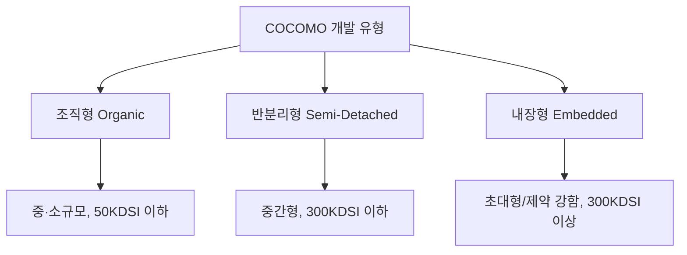
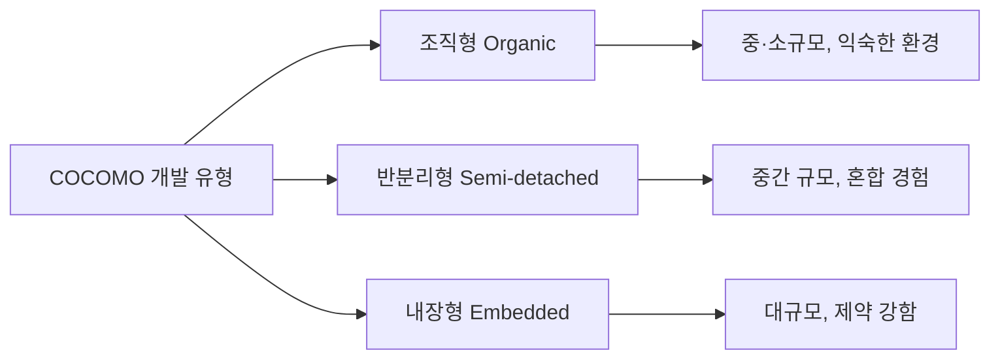

# 234 COCOMO의 소프트웨어 개발 유형

작성 기준일: 2026-06-01
검색/보강일: 2026-06-04
기준 PDF: `/Users/nes0903/Documents/study/정보처리기사/핵심요약집_2026_정보처리기사필기핵심요약.pdf`
PDF 확인 위치: 35페이지 `234 COCOMO의 소프트웨어 개발 유형`

## 한 줄 요약

- COCOMO 개발 유형은 규모와 복잡도에 따라 조직형, 반분리형, 내장형으로 구분된다.

## 한눈에 보는 구조

## PDF 기준 핵심

- 조직형(Organic Mode): 기관 내부에서 개발된 중·소규모 소프트웨어. 일괄 자료 처리, 과학기술 계산용, 비즈니스 자료 처리용으로 5만(50KDSI) 라인 이하.
- 반분리형(Semi-Detached Mode): 조직형과 내장형의 중간형. 트랜잭션 처리 시스템, 운영체제, DBMS 등 30만(300KDSI) 라인 이하.
- 내장형(Embedded Mode): 초대형 규모의 트랜잭션 처리 시스템이나 운영체제 등 30만(300KDSI) 라인 이상의 소프트웨어.

## 개념 설명

- 조직형은 비교적 경험 있는 소규모 팀이 익숙한 환경에서 개발하는 유형이다.
- 반분리형은 규모와 복잡도가 중간이며, 조직형보다 제약과 인터페이스가 많다.
- 내장형은 하드웨어, 운영체제, 실시간성, 안전성 등 강한 제약이 있는 대규모 시스템에 가깝다.
- 시험에서는 예시 시스템과 라인 수 기준을 함께 제시하고 유형을 고르게 한다.

## 시험 포인트

- `50KDSI 이하 = 조직형`을 먼저 고정한다.
- `300KDSI 이하 중간형 = 반분리형`이다.
- `300KDSI 이상 초대형 = 내장형`이다.
- 운영체제가 반분리형 예시에도 나오고 내장형 예시에도 나올 수 있으므로, 규모와 제약 조건을 함께 본다.

## 헷갈리는 비교

| 유형 | 규모 기준 | 대표 예 | 시험 단서 |
|---|---|---|---|
| 조직형 | 50KDSI 이하 | 일괄 처리, 과학 계산, 비즈니스 처리 | 중·소규모 |
| 반분리형 | 300KDSI 이하 | 트랜잭션, OS, DBMS | 중간형 |
| 내장형 | 300KDSI 이상 | 초대형 트랜잭션, OS | 대규모, 제약 강함 |

## 예시 또는 암기 포인트

- 단순 사내 업무 처리 프로그램은 조직형에 가깝다.
- 대규모 실시간 제어 시스템은 내장형으로 보는 것이 자연스럽다.
- 암기식: `조직 50, 반분리 300 이하, 내장 300 이상`.

## 빠른 복습

- COCOMO 유형 3가지는? 조직형, 반분리형, 내장형.
- 50KDSI 이하 중·소규모는? 조직형.
- 300KDSI 이상 초대형은? 내장형.

## 상세 보강

- 조직형은 비교적 작고 익숙한 업무, 안정된 개발 환경, 경험 많은 팀에 어울린다.
- 반분리형은 조직형과 내장형의 중간 성격이다. 일부 경험은 있지만 시스템 복잡도나 제약이 더 크다.
- 내장형은 하드웨어, 실시간 처리, 엄격한 성능·안전성 제약이 강한 대규모 시스템에 가깝다.
- 시험에서는 `기관 내부`, `중·소규모`가 나오면 조직형, `제약 조건`, `대규모`, `하드웨어 밀접`이 나오면 내장형으로 판단한다.
- 반분리형은 이름 그대로 양쪽 특성이 섞인 중간 단계이다.

| 유형 | 규모/난이도 | 시험 단서 |
|---|---|---|
| 조직형 | 작고 단순 | 기관 내부, 익숙한 업무 |
| 반분리형 | 중간 | 혼합 경험, 중간 규모 |
| 내장형 | 크고 복잡 | 강한 제약, 실시간, 하드웨어 |

## 참고 링크

- [NASA Software Engineering Handbook - Cost Estimation](https://swehb.nasa.gov/pages/viewpage.action?pageId=16458278)

<!-- study-links:start -->
## 관련 문서

- `cocomo`: [[정보처리기사/5과목 정보시스템 구축 관리/233 비용 산정 기법 - COCOMO/233 비용 산정 기법 - COCOMO|233 비용 산정 기법 - COCOMO]]
- `트랜잭션`: [[ACID-트랜잭션/ACID-트랜잭션|ACID 트랜잭션 상세 정리]]
<!-- study-links:end -->
