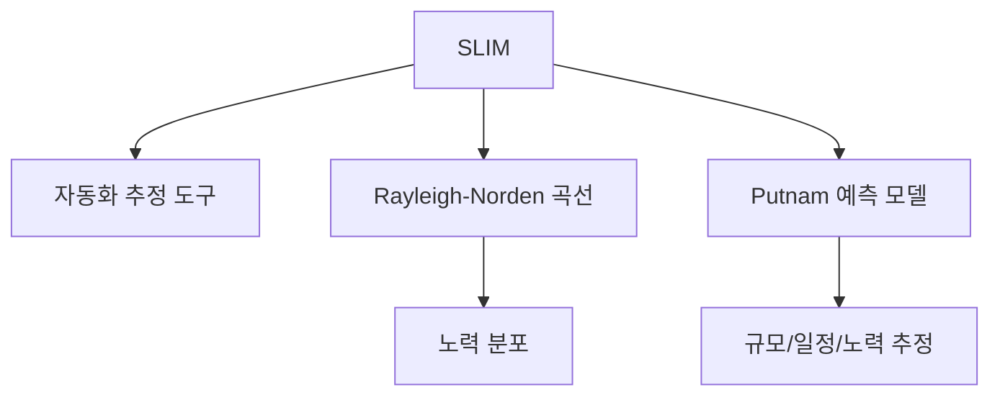
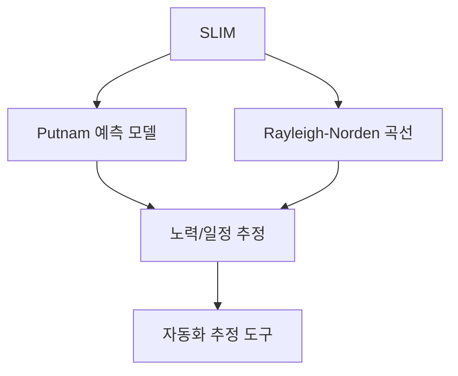

# 235 자동화 추정 도구 - SLIM

작성 기준일: 2026-06-01
검색/보강일: 2026-06-04
기준 PDF: `/Users/nes0903/Documents/study/정보처리기사/핵심요약집_2026_정보처리기사필기핵심요약.pdf`
PDF 확인 위치: 35페이지 `235 자동화 추정 도구 - SLIM`

## 한 줄 요약

- SLIM은 Rayleigh-Norden 곡선과 Putnam 예측 모델을 기초로 한 자동화 소프트웨어 비용 추정 도구이다.

## 한눈에 보는 구조

## PDF 기준 핵심

- Rayleigh-Norden 곡선과 Putnam 예측 모델을 기초로 하여 개발된 자동화 추정 도구이다.
- SLIM은 별도 모형처럼 보이지만 시험에서는 Putnam 모형과 강하게 연결한다.

## 개념 설명

- SLIM(Software Life-cycle Management)은 프로젝트 규모, 생산성, 일정, 인력 투입 등을 추정하는 도구로 알려져 있다.
- Putnam 모델의 노력 분포 개념을 자동화 도구 형태로 활용한다.
- COCOMO가 Boehm과 LOC 기반 유형에 연결된다면, SLIM은 Putnam과 Rayleigh-Norden에 연결된다.
- 시험에서는 도구 이름과 기반 이론을 묻는 단순 암기형이 자주 나온다.

## 시험 포인트

- `SLIM = Rayleigh-Norden + Putnam`으로 바로 연결한다.
- 자동화 추정 도구라는 표현이 나오면 SLIM을 고른다.
- COCOMO는 비용 산정 모형이고, SLIM은 자동화 추정 도구로 구분한다.
- Rayleigh-Norden은 Putnam 모형에서도 반복되는 단서이다.

## 헷갈리는 비교

| 구분 | SLIM | COCOMO |
|---|---|---|
| 성격 | 자동화 추정 도구 | 비용 산정 모형 |
| 기반 | Putnam, Rayleigh-Norden | Boehm, LOC |
| 시험 단서 | 자동화 도구 | 개발 유형 |
| 초점 | 노력 분포 기반 추정 | 규모 기반 비용 산정 |

## 예시 또는 암기 포인트

- 문제에서 `Rayleigh-Norden 곡선과 Putnam 예측 모델 기반 도구`라고 쓰면 답은 SLIM이다.
- 암기식: `SLIM은 Putnam을 도구로 Slim하게`.

## 빠른 복습

- SLIM의 기반 2가지는? Rayleigh-Norden 곡선, Putnam 예측 모델.
- SLIM의 성격은? 자동화 추정 도구.
- Boehm과 연결되는 것은? COCOMO.

## 상세 보강

- SLIM은 Software Life-cycle Management 계열의 자동화 추정 도구로 이해하면 된다.
- PDF의 핵심은 이름보다 연결 관계이다: `SLIM = Rayleigh-Norden 곡선 + Putnam 예측 모델`.
- Putnam 모형이 노력 분포를 설명하고, SLIM은 이를 기반으로 프로젝트 규모·일정·노력을 추정하는 도구로 연결된다.
- COCOMO의 유형이나 LOC 공식과 직접 연결하지 않는다.
- 시험에서 `자동화 추정 도구`, `Rayleigh-Norden`, `Putnam`이 함께 나오면 SLIM이다.

| 항목 | 정리 |
|---|---|
| 도구 성격 | 자동화 비용/일정 추정 |
| 기반 모델 | Putnam |
| 기반 곡선 | Rayleigh-Norden |
| 비교 | COCOMO는 Boehm과 LOC가 핵심 |

## 참고 링크

- [NASA NTRS - Cost Estimation, COCOMO, SLIM](https://ntrs.nasa.gov/api/citations/19840015068/downloads/19840015068.pdf)
