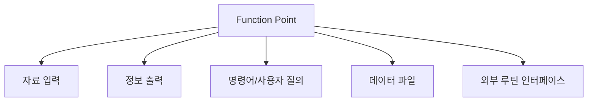
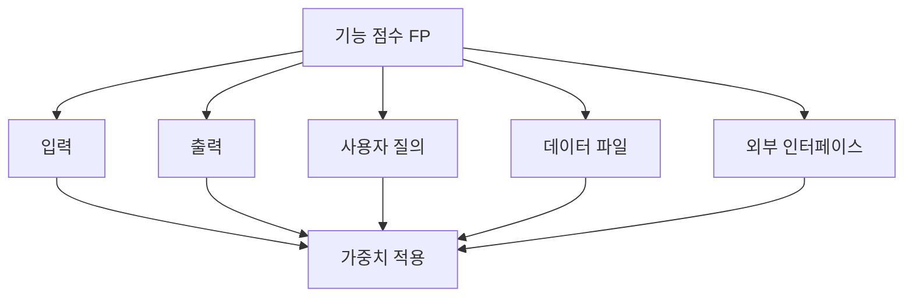

# 236 기능 점수(FP) 모형 - 가중치 증대 요인

작성 기준일: 2026-06-01
검색/보강일: 2026-06-04
기준 PDF: `/Users/nes0903/Documents/study/정보처리기사/핵심요약집_2026_정보처리기사필기핵심요약.pdf`
PDF 확인 위치: 35페이지 `236 기능 점수(FP) 모형 - 가중치 증대 요인`

## 한 줄 요약

- 기능 점수 모형은 사용자에게 보이는 기능을 입력, 출력, 질의, 파일, 외부 인터페이스 기준으로 산정한다.

## 한눈에 보는 구조

## PDF 기준 핵심

- 자료 입력(입력 양식).
- 정보 출력(출력 보고서).
- 명령어(사용자 질의수).
- 데이터 파일.
- 필요한 외부 루틴과의 인터페이스.

## 개념 설명

- 기능 점수는 코드 라인이 아니라 사용자가 인식하는 기능 규모를 측정한다.
- IFPUG는 기능 점수 분석을 기능 규모 측정 표준 방법으로 설명하며, 비용과 일정 추정의 기반으로 활용할 수 있다고 설명한다.
- PDF의 `자료 입력`은 외부 입력, `정보 출력`은 외부 출력, `사용자 질의`는 조회 기능, `데이터 파일`은 내부 논리 파일, `외부 루틴 인터페이스`는 외부 인터페이스 파일과 연결해 이해할 수 있다.
- 언어와 구현 방식이 달라도 사용자 기능이 같으면 기능 점수는 비교적 안정적으로 유지된다.

## 시험 포인트

- FP 가중치 증대 요인 5가지를 목록으로 외운다.
- `입력 양식`, `출력 보고서`, `사용자 질의`, `데이터 파일`, `외부 인터페이스`가 핵심이다.
- LOC는 구현 규모, FP는 사용자 기능 규모라는 차이를 구분한다.
- 시험에서는 `자료 입력`과 `정보 출력`을 단순 I/O가 아니라 기능 규모 산정 요소로 묻는다.

## 헷갈리는 비교

| FP 요소 | PDF 표현 | 의미 |
|---|---|---|
| External Input | 자료 입력 | 입력 양식, 데이터 입력 |
| External Output | 정보 출력 | 출력 보고서 |
| External Inquiry | 명령어 | 사용자 질의 |
| Internal Logical File | 데이터 파일 | 내부 관리 데이터 |
| External Interface File | 외부 루틴 인터페이스 | 외부 시스템 연계 |

## 예시 또는 암기 포인트

- 회원 가입 화면은 입력, 매출 통계 보고서는 출력, 회원 조회는 질의로 분류할 수 있다.
- 암기식: `입출질파일인터페이스`.

## 빠른 복습

- FP는 무엇 중심인가? 사용자에게 보이는 기능.
- PDF의 5요소는? 자료 입력, 정보 출력, 명령어, 데이터 파일, 외부 루틴 인터페이스.
- LOC보다 언어 영향이 적은 이유는? 코드 라인이 아니라 기능을 세기 때문이다.

## 상세 보강

- 기능 점수는 개발자가 작성할 코드 라인보다 사용자가 받는 기능의 양을 중심으로 소프트웨어 규모를 산정한다.
- PDF의 다섯 요소는 기능 점수 산정에서 자주 쓰이는 기능 유형과 맞닿아 있다.
- 입력은 등록·수정 같은 외부 입력, 출력은 보고서나 화면 출력, 명령어는 사용자 질의, 데이터 파일은 내부 논리 파일, 외부 루틴 인터페이스는 외부 시스템 연계를 떠올리면 된다.
- FP는 언어에 덜 종속적이므로 LOC보다 사용자 관점 추정에 유리하다.
- 시험에서는 `입력/출력/질의/파일/인터페이스`가 나오면 기능 점수 모형이다.

| PDF 표현 | 기능 점수 관점 |
|---|---|
| 자료 입력 | 외부 입력 |
| 정보 출력 | 외부 출력 |
| 명령어 | 사용자 질의 |
| 데이터 파일 | 내부 데이터 파일 |
| 외부 루틴 인터페이스 | 외부 인터페이스 파일 |

## 참고 링크

- [IFPUG - Function Point Analysis](https://ifpug.org/ifpug-standards/fpa)
