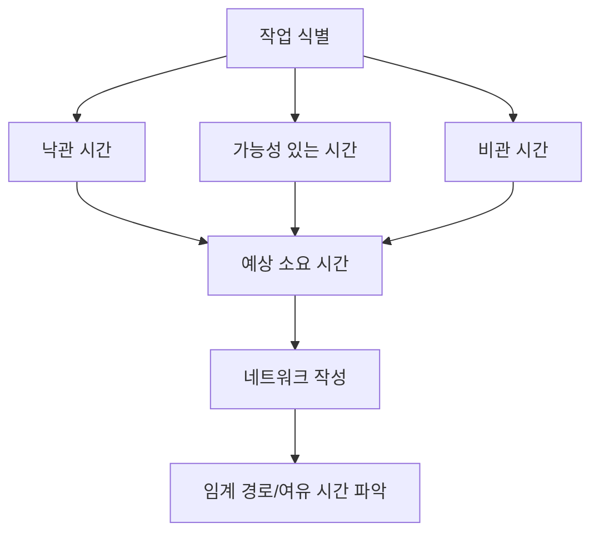
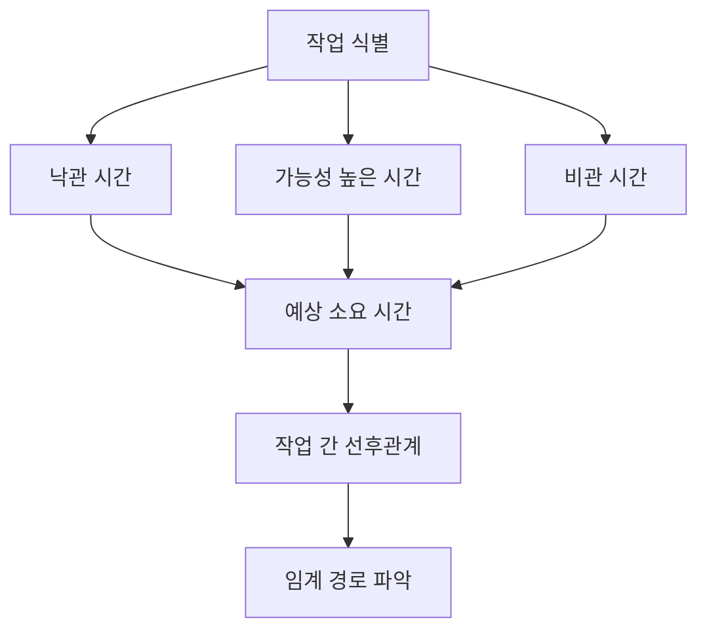

# 237 PERT(프로그램 평가 및 검토 기술)

작성 기준일: 2026-06-01
검색/보강일: 2026-06-04
기준 PDF: `/Users/nes0903/Documents/study/정보처리기사/핵심요약집_2026_정보처리기사필기핵심요약.pdf`
PDF 확인 위치: 35페이지 `237 PERT(프로그램 평가 및 검토 기술)`

## 한 줄 요약

- PERT는 작업별 낙관·가능·비관 시간을 고려해 일정과 작업 관계, 임계 경로를 분석하는 프로젝트 일정 기법이다.

## 한눈에 보는 구조

## PDF 기준 핵심

- 각 작업별로 낙관적인 경우, 가능성이 있는 경우, 비관적인 경우로 나누어 각 단계별 종료 시기를 결정하는 방법이다.
- 결정 경로, 작업에 대한 경계 시간, 작업 간의 상호 관련성 등을 알 수 있다.
- 불확실한 작업 시간을 세 가지 추정값으로 다루는 것이 특징이다.

## 개념 설명

- PERT(Program Evaluation and Review Technique)는 프로젝트 작업의 선후 관계를 네트워크로 표현한다.
- 각 활동의 낙관 시간, 최빈 시간, 비관 시간을 사용해 예상 시간을 계산한다.
- 일반적인 PERT 기대 시간 공식은 `(낙관 + 4 × 최빈 + 비관) / 6`이다.
- 계산된 활동 시간을 바탕으로 전체 일정, 여유 시간, 임계 경로를 파악한다.

## 시험 포인트

- `낙관`, `가능`, `비관` 세 추정값이 나오면 PERT를 떠올린다.
- PERT는 작업 간 상호 관련성과 경계 시간, 임계 경로 파악에 쓰인다.
- 간트 차트가 막대 일정표라면, PERT는 네트워크 기반 일정 분석이다.
- 임계 경로는 가장 긴 경로이며 전체 프로젝트 기간을 결정한다.

## 헷갈리는 비교

| 구분 | PERT | 간트 차트 |
|---|---|---|
| 표현 | 네트워크 | 막대 도표 |
| 강점 | 선후 관계, 임계 경로 | 일정 시각화 |
| 시간 추정 | 낙관/가능/비관 | 작업 기간 표시 |
| 시험 단서 | Program Evaluation and Review Technique | 수평 막대 |

## 예시 또는 암기 포인트

- 어떤 작업이 빠르면 4일, 보통 6일, 늦으면 10일이면 PERT 기대 시간은 `(4+4×6+10)/6`이다.
- 암기식: `PERT = 세 시간 추정 + 네트워크`.

## 빠른 복습

- PERT의 세 시간 추정은? 낙관, 가능성 있는 경우, 비관.
- PERT로 알 수 있는 것은? 결정 경로, 경계 시간, 작업 간 상호 관련성.
- PERT와 연결되는 경로는? 임계 경로.

## 상세 보강

- PERT는 불확실성이 있는 프로젝트 일정 추정에 적합한 네트워크 기반 일정 관리 기법이다.
- PDF의 `낙관적인 경우`, `가능성이 있는 경우`, `비관적인 경우`는 3점 추정의 핵심이다.
- 일반적으로 예상 시간은 `(낙관치 + 4 × 가능성 높은 치 + 비관치) / 6`으로 설명된다.
- 작업 간 선후관계와 경계 시간을 알 수 있어 전체 일정에서 지연되면 안 되는 작업을 찾는 데 도움을 준다.
- 시험에서는 PERT와 간트 차트를 구분한다. PERT는 네트워크·선후관계, 간트는 막대 도표·작업 기간 표시이다.

| 구분 | PERT | 간트 차트 |
|---|---|---|
| 표현 | 네트워크 | 막대 도표 |
| 강조 | 선후관계, 임계 경로 | 작업별 일정 |
| 시간 추정 | 낙관/가능/비관 | 실제 기간 표시 |
| 시험 단서 | 경계 시간, 상호 관련성 | 수평 막대 |

## 참고 링크

- [Praxis Framework - PERT analysis](https://www.praxisframework.org/en/library/pert-analysis)
- [NASA Software Engineering Handbook - Cost Estimation](https://swehb.nasa.gov/pages/viewpage.action?pageId=16458278)

<!-- study-links:start -->
## 관련 문서

- `간트 차트`: [[정보처리기사/5과목 정보시스템 구축 관리/239 간트 차트(Gantt Chart)/239 간트 차트(Gantt Chart)|239 간트 차트(Gantt Chart)]]
<!-- study-links:end -->
