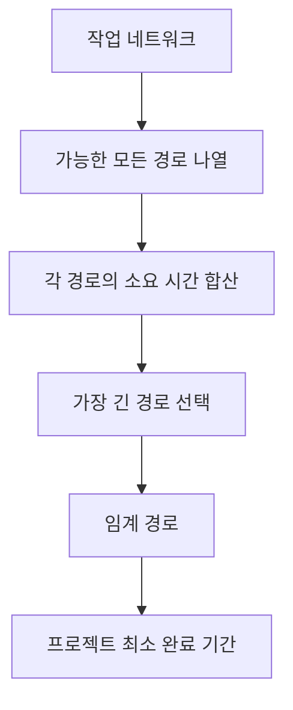

# 238 임계 경로 소요 기일

작성 기준일: 2026-06-01
검색/보강일: 2026-06-04
기준 PDF: `/Users/nes0903/Documents/study/정보처리기사/핵심요약집_2026_정보처리기사필기핵심요약.pdf`
PDF 확인 위치: 35페이지 `238 임계 경로 소요 기일`

## 한 줄 요약

- 임계 경로 소요 기일은 프로젝트 네트워크에서 시작부터 종료까지의 경로 중 기간 합이 가장 긴 경로의 총 소요 시간이다.

## 한눈에 보는 구조

## PDF 기준 핵심

- 임계 경로는 최장 경로를 의미한다.
- PDF 그림에서는 굵은 선으로 임계 경로를 표시한다.
- 소요 기일 문제는 각 경로의 작업 시간을 더해 가장 큰 값을 찾는 계산형 문제이다.

## 개념 설명

- 임계 경로(Critical Path)는 프로젝트 완료일을 직접 결정하는 작업들의 연속이다.
- 임계 경로에 있는 작업이 지연되면 전체 프로젝트도 지연된다.
- 임계 경로에 있지 않은 작업은 일정 여유가 있을 수 있다.
- PERT/CPM 문제에서는 네트워크의 모든 시작-종료 경로를 비교하거나, 전진/후진 계산으로 여유 시간을 구한다.

## 시험 포인트

- `임계 경로 = 최장 경로`를 가장 먼저 적용한다.
- 가장 작업 수가 많은 경로가 아니라 `기간 합이 가장 큰 경로`이다.
- 경로별 소요 기간을 하나씩 더해 비교한다.
- 임계 경로의 여유 시간은 일반적으로 0으로 본다.

## 헷갈리는 비교

| 구분 | 의미 | 시험 단서 |
|---|---|---|
| 임계 경로 | 기간 합이 가장 긴 경로 | 최장 경로, 굵은 선 |
| 여유 시간 | 지연되어도 전체 일정에 영향 없는 시간 | Slack, Float |
| 최단 경로 | 가장 짧은 경로 | 임계 경로가 아님 |
| 작업 수 | 활동 개수 | 기간과 다를 수 있음 |

## 예시 또는 암기 포인트

- 경로 A가 12일, 경로 B가 19일, 경로 C가 16일이면 임계 경로는 B이고 소요 기일은 19일이다.
- 계산 순서: `경로 나열 → 작업 시간 합산 → 최대값 선택`.
- 암기식: `Critical은 길어서 위험한 경로`.

## 빠른 복습

- 임계 경로란? 시작부터 종료까지의 최장 경로.
- 임계 경로가 지연되면? 전체 프로젝트 완료가 지연된다.
- 계산할 때 무엇을 비교하는가? 각 경로의 작업 기간 합.

## 상세 보강

- 임계 경로는 시작점에서 종료점까지 이어지는 여러 경로 중 소요 기간이 가장 긴 경로이다.
- 가장 긴 경로가 중요한 이유는 그 경로가 전체 프로젝트 완료 시점을 결정하기 때문이다.
- 임계 경로 위의 작업이 지연되면 전체 프로젝트도 지연될 가능성이 높다.
- 반대로 임계 경로가 아닌 작업은 일정 여유, 즉 여유 시간(Float/Slack)을 가질 수 있다.
- 시험 문제에서 네트워크 그림이 나오면 모든 가능한 경로의 기간을 더한 뒤 가장 큰 값을 찾는다.

| 개념 | 핵심 |
|---|---|
| 임계 경로 | 최장 경로 |
| 임계 경로 소요 기일 | 프로젝트 최소 완료 기간 |
| 여유 시간 | 임계 경로가 아닌 작업의 조정 가능 시간 |
| 함정 | 가장 짧은 경로가 아니라 가장 긴 경로 |

## 참고 링크

- [Praxis Framework - PERT analysis](https://www.praxisframework.org/en/library/pert-analysis)

<!-- study-links:start -->
## 관련 문서

- `pert`: [[정보처리기사/5과목 정보시스템 구축 관리/237 PERT(프로그램 평가 및 검토 기술)/237 PERT(프로그램 평가 및 검토 기술)|237 PERT(프로그램 평가 및 검토 기술)]]
<!-- study-links:end -->
