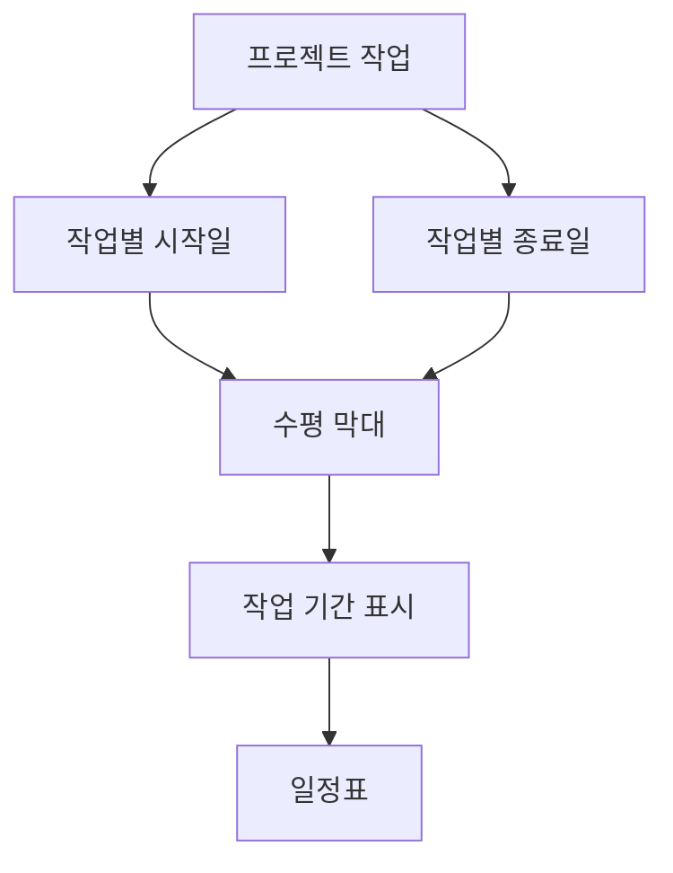
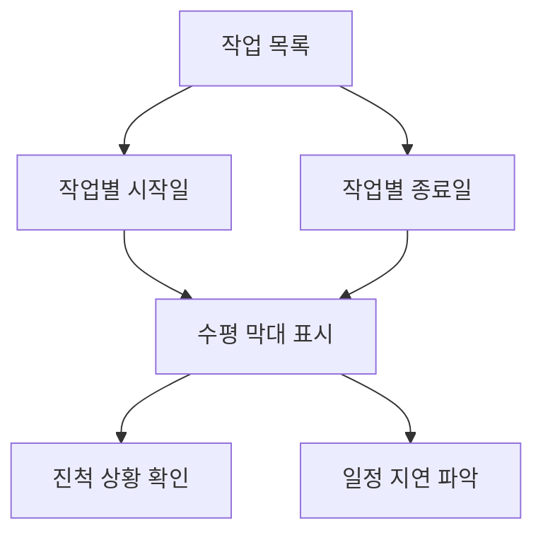

# 239 간트 차트(Gantt Chart)

작성 기준일: 2026-06-01
검색/보강일: 2026-06-04
기준 PDF: `/Users/nes0903/Documents/study/정보처리기사/핵심요약집_2026_정보처리기사필기핵심요약.pdf`
PDF 확인 위치: 36페이지 `239 간트 차트(Gantt Chart)`

## 한 줄 요약

- 간트 차트는 프로젝트 작업 일정을 수평 막대로 표현해 작업 기간과 진행 일정을 한눈에 보여 주는 일정표이다.

## 한눈에 보는 구조

## PDF 기준 핵심

- 프로젝트의 작업 일정을 막대 도표를 이용하여 표시하는 프로젝트 일정표이다.
- 수평 막대의 길이는 각 작업(Task)의 기간을 나타낸다.
- `수평 막대`, `작업 기간`, `일정표`가 핵심 단서이다.

## 개념 설명

- 간트 차트는 세로축에 작업 목록, 가로축에 시간을 두고 작업별 기간을 막대로 표시한다.
- 작업의 시작일과 종료일, 진행률, 담당자, 선후 관계를 함께 표시할 수 있다.
- PERT가 네트워크와 임계 경로 파악에 강하다면, 간트 차트는 일정 현황을 시각적으로 공유하는 데 강하다.
- 프로젝트 관리 도구에서 가장 널리 쓰이는 일정 시각화 방식 중 하나이다.

## 시험 포인트

- `막대 도표`, `수평 막대`, `작업 기간`이 나오면 간트 차트이다.
- 임계 경로, 낙관/비관/가능 시간은 PERT와 연결한다.
- 막대 길이가 기간을 의미한다는 PDF 문장을 그대로 기억한다.
- 작업 간 복잡한 의존관계 분석보다는 일정 표시 기능에 초점이 있다.

## 헷갈리는 비교

| 구분 | 간트 차트 | PERT |
|---|---|---|
| 표현 방식 | 막대 도표 | 네트워크 |
| 핵심 | 일정 표시 | 작업 관계와 임계 경로 |
| 시간 표현 | 수평 막대 길이 | 활동 시간과 경로 |
| 시험 단서 | Gantt, Bar | 낙관/가능/비관 |

## 예시 또는 암기 포인트

- `요구사항 분석: 6/1~6/5`, `설계: 6/6~6/12`처럼 작업 기간을 막대로 표시하면 간트 차트이다.
- 암기식: `간트 = 가로 막대 일정표`.

## 빠른 복습

- 간트 차트의 표시 방식은? 막대 도표.
- 수평 막대의 길이는 무엇을 뜻하는가? 각 작업의 기간.
- PERT와 다른 점은? 네트워크 분석보다 일정 표시가 중심이다.

## 상세 보강

- 간트 차트는 프로젝트 작업을 시간 축 위의 수평 막대로 표현한다.
- 막대의 위치는 시작·종료 시점을, 막대의 길이는 작업 기간을 나타낸다.
- 장점은 한눈에 일정과 진행 상태를 확인하기 쉽다는 점이다.
- 단점은 복잡한 선후관계나 임계 경로를 분석하는 데는 PERT/CPM보다 약하다는 점이다.
- 시험에서는 `막대 도표`, `수평 막대`, `작업 기간`이 나오면 간트 차트이다.

| 구분 | 간트 차트 | PERT |
|---|---|---|
| 표현 | 시간 축의 막대 | 네트워크 |
| 강점 | 일정 가시화 | 선후관계·임계 경로 |
| 핵심 단서 | 수평 막대 길이 | 낙관/가능/비관, 경계 시간 |

## 참고 링크

- [PMI - What is Project Management?](https://www.pmi.org/about/learn-about-pmi/what-is-project-management)

<!-- study-links:start -->
## 관련 문서

- `요구사항 분석`: [[정보처리기사/1과목 소프트웨어 설계/009 요구사항 분석/009 요구사항 분석|009 요구사항 분석]]
- `pert`: [[정보처리기사/5과목 정보시스템 구축 관리/237 PERT(프로그램 평가 및 검토 기술)/237 PERT(프로그램 평가 및 검토 기술)|237 PERT(프로그램 평가 및 검토 기술)]]
<!-- study-links:end -->
