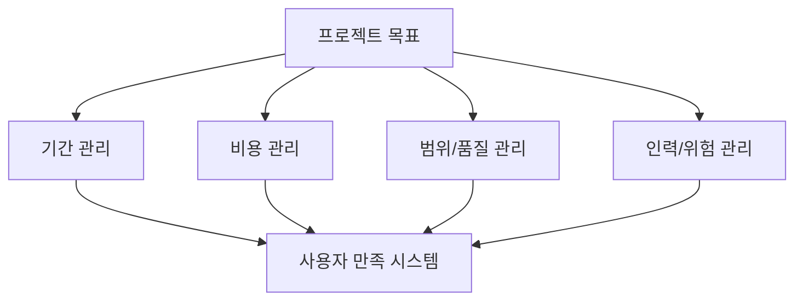
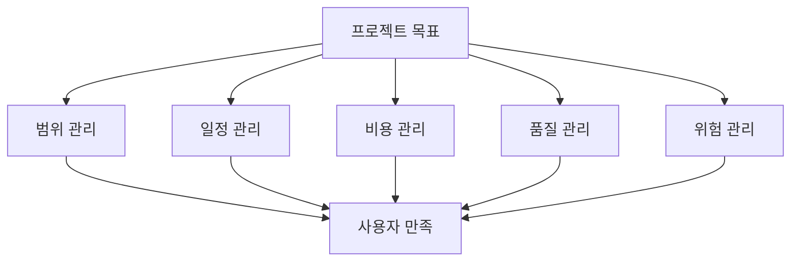

# 240 소프트웨어 프로젝트 관리

작성 기준일: 2026-06-01
검색/보강일: 2026-06-04
기준 PDF: `/Users/nes0903/Documents/study/정보처리기사/핵심요약집_2026_정보처리기사필기핵심요약.pdf`
PDF 확인 위치: 36페이지 `240 소프트웨어 프로젝트 관리`

## 한 줄 요약

- 소프트웨어 프로젝트 관리는 정해진 기간과 비용 안에서 사용자를 만족시키는 시스템을 개발하기 위한 전반적 관리 활동이다.

## 한눈에 보는 구조

## PDF 기준 핵심

- 주어진 기간 내에 최소의 비용으로 사용자를 만족시키는 시스템을 개발하기 위한 전반적인 활동이다.
- 시간, 비용, 품질, 범위, 위험, 인력 등 여러 관리 영역을 통합해 다룬다.

## 개념 설명

- 프로젝트 관리는 단순 일정 작성이 아니라 계획, 실행, 통제, 종료까지 이어지는 관리 활동이다.
- 소프트웨어 프로젝트는 요구사항 변경, 기술 불확실성, 인력 의존성이 크기 때문에 체계적인 관리가 중요하다.
- 비용 산정, 일정 계획, 위험 관리, 품질 관리, 형상 관리가 서로 연결된다.
- PMI는 프로젝트 관리를 지식, 기술, 도구, 기법을 프로젝트 활동에 적용해 요구를 충족하는 것으로 설명한다.

## 시험 포인트

- PDF 문장의 `기간`, `최소 비용`, `사용자 만족`을 함께 기억한다.
- 프로젝트 관리는 개발 자체가 아니라 개발을 성공시키기 위한 전반적 활동이다.
- 위험 관리는 프로젝트 관리의 하위 활동으로 볼 수 있다.
- 간트 차트, PERT, 비용 산정 기법은 프로젝트 관리 도구·기법으로 연결된다.

## 헷갈리는 비교

| 구분 | 프로젝트 관리 | 개발 방법론 |
|---|---|---|
| 초점 | 일정, 비용, 품질, 위험 통제 | 개발 절차와 산출물 |
| 목표 | 프로젝트 성공 | 소프트웨어 개발 수행 방식 |
| 대표 도구 | 간트 차트, PERT, 비용 산정 | 구조적, 정보공학, CBD |
| 시험 단서 | 기간, 비용, 사용자 만족 | 방법론, 절차 |

## 예시 또는 암기 포인트

- 개발 기간 6개월, 예산 1억 원, 요구 기능 30개를 관리하며 위험 대응 계획을 세우는 활동이 프로젝트 관리이다.
- 암기식: `프로젝트 관리는 기간·비용·만족의 균형`.

## 빠른 복습

- 프로젝트 관리의 PDF 목표는? 기간 내, 최소 비용, 사용자 만족.
- 위험 관리는 독립된 개발 방법론인가? 프로젝트 관리 활동 중 하나이다.
- 일정 시각화 도구는? 간트 차트.

## 상세 보강

- 소프트웨어 프로젝트 관리는 제한된 기간과 비용 안에서 요구 품질을 만족하는 시스템을 만들기 위한 통제 활동이다.
- 관리 대상은 범위, 일정, 비용, 품질, 인력, 위험, 의사소통 등이다.
- PDF의 `최소의 비용`, `사용자 만족`, `주어진 기간`은 프로젝트 관리의 3대 제약인 비용·일정·범위/품질과 연결해 이해한다.
- 프로젝트 관리가 약하면 요구사항 변경, 일정 지연, 비용 초과, 품질 저하가 동시에 발생할 수 있다.
- 시험에서는 프로젝트 관리를 단순 일정표 작성이 아니라 개발 전반을 조정하는 활동으로 본다.

| 관리 영역 | 질문 |
|---|---|
| 범위 | 무엇을 만들 것인가 |
| 일정 | 언제까지 만들 것인가 |
| 비용 | 얼마로 만들 것인가 |
| 품질 | 요구 수준을 만족하는가 |
| 위험 | 무엇이 실패를 유발할 수 있는가 |

## 참고 링크

- [PMI - What is Project Management?](https://www.pmi.org/about/learn-about-pmi/what-is-project-management)
