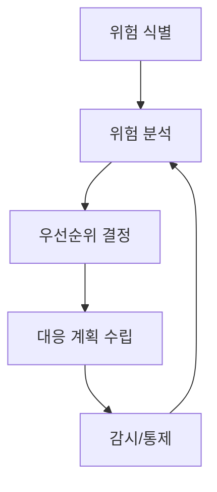

# 241 위험 관리(Risk Analysis)

작성 기준일: 2026-06-01
검색/보강일: 2026-06-04
기준 PDF: `/Users/nes0903/Documents/study/정보처리기사/핵심요약집_2026_정보처리기사필기핵심요약.pdf`
PDF 확인 위치: 36페이지 `241 위험 관리(Risk Analysis)`

## 한 줄 요약

- 위험 관리는 프로젝트 중 발생 가능한 위험을 미리 예측하고 적절한 대응책을 수립하는 활동이다.

## 한눈에 보는 구조

## PDF 기준 핵심

- 프로젝트 추진 과정에서 예상되는 각종 돌발 상황, 즉 위험을 미리 예상한다.
- 이에 대한 적절한 대책을 수립하는 일련의 활동이다.
- `미리 예상`, `대책 수립`, `돌발 상황`이 핵심 단서이다.

## 개념 설명

- 위험은 발생할 수도 있고 발생하지 않을 수도 있지만, 발생하면 프로젝트 목표에 영향을 주는 사건이다.
- 위험 관리는 위험을 무시하지 않고 가능성과 영향을 분석해 대응 우선순위를 정한다.
- 대응 전략에는 회피, 완화, 전가, 수용 등이 있다.
- 소프트웨어 프로젝트에서는 요구사항 변경, 일정 지연, 핵심 인력 이탈, 기술 미성숙, 보안 취약점 등이 위험이 될 수 있다.

## 시험 포인트

- 위험 관리는 문제가 터진 뒤 처리하는 사후 수습이 아니라 사전 예측과 대응 계획이다.
- `Risk Analysis`라는 표현이 나오면 위험 식별과 분석, 대책 수립 흐름을 떠올린다.
- 위험과 이슈를 구분한다. 위험은 가능성, 이슈는 이미 발생한 문제이다.
- 프로젝트 관리의 한 활동으로 출제될 수 있다.

## 헷갈리는 비교

| 구분 | 위험(Risk) | 이슈(Issue) |
|---|---|---|
| 상태 | 발생 가능성 | 이미 발생 |
| 관리 초점 | 예방/대응 계획 | 해결 조치 |
| 예 | 핵심 개발자 이탈 가능성 | 핵심 개발자 실제 퇴사 |
| 시험 단서 | 미리 예상 | 문제 발생 |

## 예시 또는 암기 포인트

- 신규 기술 도입으로 일정 지연 가능성이 있으면, 사전 학습 기간과 대체 기술을 계획하는 것이 위험 관리이다.
- 암기식: `위험 관리는 터지기 전에 본다`.

## 빠른 복습

- 위험 관리의 핵심은? 위험을 미리 예상하고 대책을 수립한다.
- 위험과 이슈의 차이는? 위험은 가능성, 이슈는 발생한 문제.
- 소프트웨어 프로젝트 위험 예는? 요구사항 변경, 일정 지연, 기술 미성숙.

## 상세 보강

- 위험 관리는 아직 발생하지 않았지만 프로젝트 목표에 영향을 줄 수 있는 사건을 미리 다루는 활동이다.
- 위험은 기술 위험, 일정 위험, 비용 위험, 인력 위험, 요구사항 변경 위험 등으로 나눌 수 있다.
- 위험 분석은 발생 가능성과 영향도를 평가해 우선순위를 정하는 단계이다.
- 대응 전략은 회피, 완화, 전가, 수용으로 정리하면 실무적으로 이해하기 쉽다.
- 시험에서는 `돌발 상황을 미리 예상`, `대책 수립`, `프로젝트 추진 과정`이 핵심 단서이다.

| 대응 | 의미 | 예 |
|---|---|---|
| 회피 | 위험 원인 제거 | 위험 기술 사용 중단 |
| 완화 | 가능성/영향 감소 | 추가 테스트, 예비 일정 |
| 전가 | 제3자에게 이전 | 보험, 외주 계약 |
| 수용 | 감수하고 대비 | 예비비 확보 |

## 참고 링크

- [PMI - What is Project Management?](https://www.pmi.org/about/learn-about-pmi/what-is-project-management)
