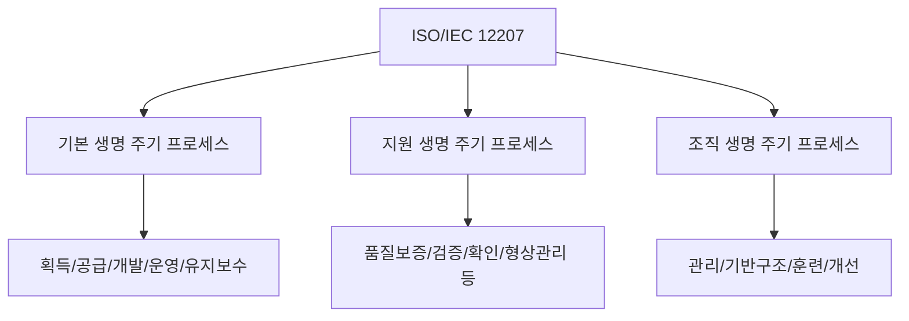
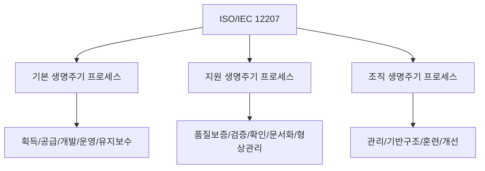

# 242 ISO/IEC 12207

작성 기준일: 2026-06-01
검색/보강일: 2026-06-04
기준 PDF: `/Users/nes0903/Documents/study/정보처리기사/핵심요약집_2026_정보처리기사필기핵심요약.pdf`
PDF 확인 위치: 36페이지 `242 ISO/IEC 12207`

## 한 줄 요약

- ISO/IEC 12207은 소프트웨어 생명주기 프로세스를 정의하는 표준이며, 시험 PDF는 기본·지원·조직 생명주기 프로세스로 정리한다.

## 한눈에 보는 구조

## PDF 기준 핵심

- 기본 생명 주기 프로세스: 획득, 공급, 개발, 운영, 유지보수 프로세스.
- 지원 생명 주기 프로세스: 품질 보증, 검증, 확인, 활동 검토, 감사, 문서화, 형상 관리, 문제 해결 프로세스.
- 조직 생명 주기 프로세스: 관리, 기반 구조, 훈련, 개선 프로세스.
- 현재 ISO 표준의 세부 분류가 개정되어도 정보처리기사 학습에서는 PDF 분류를 우선한다.

## 개념 설명

- ISO/IEC/IEEE 12207은 소프트웨어 시스템, 제품, 서비스의 생명주기 동안 필요한 프로세스와 활동을 정의한다.
- 획득과 공급은 계약과 조달 관점, 개발과 운영·유지보수는 제품 생명주기 관점이다.
- 지원 프로세스는 품질과 추적성, 검토와 감사를 통해 기본 프로세스를 보조한다.
- 조직 프로세스는 조직 차원의 관리 능력, 인프라, 훈련, 개선을 다룬다.

## 시험 포인트

- `기본 = 획득/공급/개발/운영/유지보수`를 먼저 외운다.
- `지원 = 품질보증/검증/확인/검토/감사/문서화/형상관리/문제해결`이다.
- `조직 = 관리/기반구조/훈련/개선`이다.
- 프로세스 이름을 다른 그룹에 섞어 내는 보기에 주의한다.

## 헷갈리는 비교

| 그룹 | 목적 | 대표 프로세스 |
|---|---|---|
| 기본 | 소프트웨어 생명주기 직접 수행 | 획득, 공급, 개발, 운영, 유지보수 |
| 지원 | 품질과 통제 지원 | 검증, 확인, 감사, 형상 관리 |
| 조직 | 조직 역량과 환경 관리 | 관리, 기반 구조, 훈련, 개선 |

## 예시 또는 암기 포인트

- 형상 관리는 개발 자체가 아니라 변경과 산출물 통제를 지원하므로 지원 생명주기 프로세스이다.
- 암기식: `기본은 만들고 운영, 지원은 보증과 통제, 조직은 환경과 개선`.

## 빠른 복습

- ISO/IEC 12207의 시험 기준 3그룹은? 기본, 지원, 조직 생명주기 프로세스.
- 형상 관리는 어느 그룹인가? 지원 생명주기 프로세스.
- 훈련은 어느 그룹인가? 조직 생명주기 프로세스.

## 상세 보강

- ISO/IEC 12207은 소프트웨어 생명주기 프로세스를 체계화한 국제 표준이다.
- PDF는 시험용으로 3개 큰 범주와 세부 프로세스를 제시한다. 범주명과 예시를 함께 암기해야 한다.
- 기본 생명주기 프로세스는 소프트웨어를 획득·공급·개발·운영·유지보수하는 직접 활동이다.
- 지원 생명주기 프로세스는 품질보증, 검증, 확인, 형상관리처럼 기본 활동을 뒷받침한다.
- 조직 생명주기 프로세스는 조직 차원의 관리, 기반 구조, 훈련, 개선을 다룬다.

| 구분 | 핵심 역할 | PDF 세부 항목 |
|---|---|---|
| 기본 | 제품/서비스 직접 수행 | 획득, 공급, 개발, 운영, 유지보수 |
| 지원 | 품질과 통제 지원 | 품질 보증, 검증, 확인, 문서화, 형상 관리 등 |
| 조직 | 조직 역량 확보 | 관리, 기반 구조, 훈련, 개선 |

## 참고 링크

- [ISO - ISO/IEC/IEEE 12207:2026](https://www.iso.org/standard/90219.html)
