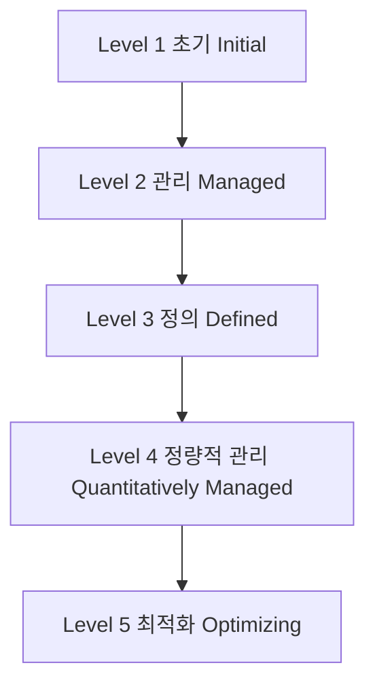
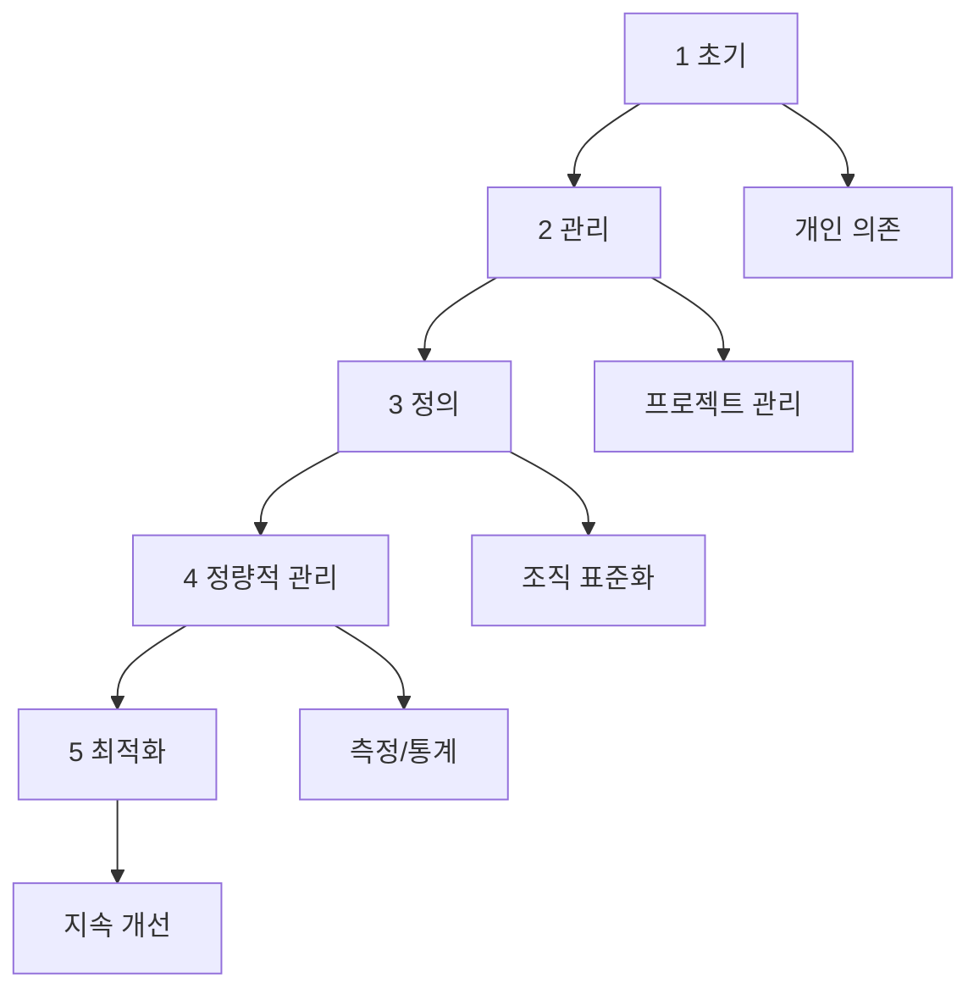

# 243 CMMI의 소프트웨어 프로세스 성숙도 5 단계

작성 기준일: 2026-06-01
검색/보강일: 2026-06-04
기준 PDF: `/Users/nes0903/Documents/study/정보처리기사/핵심요약집_2026_정보처리기사필기핵심요약.pdf`
PDF 확인 위치: 36페이지 `243 CMMI의 소프트웨어 프로세스 성숙도 5 단계`

## 한 줄 요약

- CMMI 성숙도는 조직의 프로세스가 초기 수준에서 관리, 정의, 정량 관리, 최적화로 발전하는 5단계 모델이다.

## 한눈에 보는 구조

## PDF 기준 핵심

- 초기(Initial).
- 관리(Managed).
- 정의(Defined).
- 정량적 관리(Quantitatively Managed).
- 최적화(Optimizing).

## 개념 설명

- CMMI는 조직의 프로세스 개선과 성숙도 평가에 쓰이는 모델이다.
- 초기 단계는 프로세스가 개인 역량에 의존하고 예측이 어렵다.
- 관리 단계는 프로젝트 단위로 계획·추적·통제가 이뤄진다.
- 정의 단계는 조직 표준 프로세스가 수립되어 프로젝트에 적용된다.
- 정량적 관리는 데이터와 통계 기반으로 프로세스를 통제하고, 최적화는 지속 개선에 초점을 둔다.

## 시험 포인트

- 순서를 정확히 외운다: `초기 → 관리 → 정의 → 정량적 관리 → 최적화`.
- CMMI는 5단계이고, SPICE는 Level 0부터 Level 5까지 6단계로 출제된다.
- `Defined`는 3단계, `Quantitatively Managed`는 4단계이다.
- `Optimizing`은 CMMI와 SPICE 모두 최상위 단계 이름으로 나온다.

## 헷갈리는 비교

| 단계 | 한글 | 핵심 단서 |
|---|---|---|
| 1 | 초기 | ad hoc, 예측 어려움 |
| 2 | 관리 | 프로젝트 관리 |
| 3 | 정의 | 조직 표준 프로세스 |
| 4 | 정량적 관리 | 측정, 통계적 관리 |
| 5 | 최적화 | 지속적 개선 |

## 예시 또는 암기 포인트

- 조직 표준 프로세스가 있고 프로젝트가 이를 맞춤 적용하면 Level 3 정의 단계로 이해한다.
- 암기식: `초관정정최` 또는 `Initial-Managed-Defined-Quantitative-Optimizing`.

## 빠른 복습

- CMMI 5단계 순서는? 초기, 관리, 정의, 정량적 관리, 최적화.
- 정량적 관리는 몇 단계인가? 4단계.
- 최상위 단계는? 최적화.

## 상세 보강

- CMMI는 조직의 프로세스가 얼마나 예측 가능하고 개선 가능한지를 성숙도 단계로 설명한다.
- `초기`는 성공이 개인 역량에 의존해 반복성이 낮다.
- `관리`는 프로젝트 단위로 계획·측정·통제가 이루어진다.
- `정의`는 조직 표준 프로세스가 수립되고 프로젝트에서 이를 맞춤 적용한다.
- `정량적 관리`는 통계와 측정값으로 프로세스를 관리하며, `최적화`는 원인 분석과 개선을 반복한다.
- SPICE와 비교할 때 CMMI는 1~5단계, SPICE는 0~5단계라는 숫자 차이가 자주 함정이다.

| 단계 | 핵심 단어 | 함정 |
|---|---|---|
| 1 초기 | ad hoc, 예측 어려움 | 수행 단계가 아님 |
| 2 관리 | 프로젝트 관리 | 조직 표준화는 3단계 |
| 3 정의 | 조직 표준 프로세스 | 정량 관리는 4단계 |
| 4 정량적 관리 | 측정, 통계 | 최적화와 구분 |
| 5 최적화 | 지속 개선 | 최상위 |

## 참고 링크

- [CMMI Institute - CMMI Levels](https://k12.cmmiinstitute.com/learning/appraisals/levels)
- [CMMI Institute - What is CMMI?](https://dev.cmmiinstitute.com/products/cmmi/what-is-cmmi)
