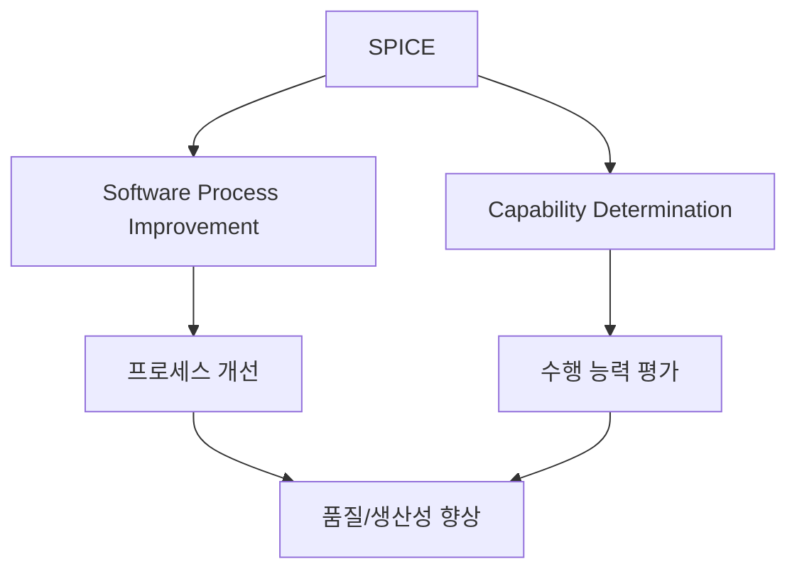

# 244 SPICE(소프트웨어 처리 개선 및 능력 평가 기준)

작성 기준일: 2026-06-01
검색/보강일: 2026-06-04
기준 PDF: `/Users/nes0903/Documents/study/정보처리기사/핵심요약집_2026_정보처리기사필기핵심요약.pdf`
PDF 확인 위치: 36페이지 `244 SPICE(소프트웨어 처리 개선 및 능력 평가 기준)`

## 한 줄 요약

- SPICE는 소프트웨어 프로세스를 평가하고 개선해 품질과 생산성을 높이기 위한 국제 표준 기반 평가 모델이다.

## 한눈에 보는 구조

## PDF 기준 핵심

- 소프트웨어의 품질 및 생산성 향상을 위해 소프트웨어 프로세스를 평가 및 개선하는 국제 표준이다.
- SPICE는 Software Process Improvement and Capability dEtermination의 약자로 연결된다.
- 시험에서는 ISO/IEC 15504 계열과 함께 설명되는 경우가 많다.

## 개념 설명

- SPICE는 조직이나 프로젝트의 소프트웨어 프로세스가 목표를 얼마나 잘 달성하는지 평가한다.
- 평가 결과는 프로세스 개선 방향을 정하거나 공급자 역량을 판단하는 데 활용된다.
- 기존 ISO/IEC 15504는 SPICE로 널리 알려졌고, 현재는 ISO/IEC 33000 계열로 발전했다.
- 정보처리기사에서는 표준의 최신 번호보다 `프로세스 평가 및 개선`이라는 목적과 수행 능력 단계가 더 중요하다.

## 시험 포인트

- `품질 및 생산성 향상`, `프로세스 평가 및 개선`, `국제 표준`이 나오면 SPICE이다.
- CMMI는 조직 성숙도 5단계, SPICE는 프로세스 수행 능력 Level 0~5로 구분한다.
- SPICE의 단계명은 다음 주제인 Level 0~5와 함께 암기한다.
- `Capability Determination`은 능력 평가 기준이라는 뜻으로 연결된다.

## 헷갈리는 비교

| 구분 | SPICE | CMMI |
|---|---|---|
| 초점 | 프로세스 평가와 수행 능력 | 조직 프로세스 성숙도 |
| 단계 | Level 0~5 | Level 1~5 |
| 목적 | 평가 및 개선 | 성숙도 향상 |
| 시험 단서 | ISO/IEC 15504, Capability | Initial, Managed, Defined |

## 예시 또는 암기 포인트

- 외주 업체의 개발 프로세스 역량을 평가하고 개선점을 도출하는 활동은 SPICE 관점으로 이해할 수 있다.
- 암기식: `SPICE = Process Improvement + Capability Evaluation`.

## 빠른 복습

- SPICE의 목적은? 프로세스 평가와 개선을 통한 품질·생산성 향상.
- SPICE 단계는 몇부터 시작하는가? Level 0.
- CMMI와 가장 큰 구분점은? CMMI는 Level 1부터 5단계이다.

## 상세 보강

- SPICE는 소프트웨어 프로세스를 평가하고 개선하기 위한 국제 표준 계열로 이해한다.
- PDF의 `품질 및 생산성 향상`은 평가 자체가 목적이 아니라 개선 방향을 찾기 위한 것임을 뜻한다.
- SPICE는 특정 개발 방법론이 아니라 프로세스 능력을 평가하는 기준이다.
- CMMI가 조직 성숙도 모델로 자주 설명된다면, SPICE는 프로세스 수행 능력 평가와 개선 기준으로 출제된다.
- 시험에서는 `평가 및 개선`, `국제 표준`, `프로세스 수행 능력 단계`가 핵심 단서이다.

| 구분 | CMMI | SPICE |
|---|---|---|
| 초점 | 조직 성숙도 | 프로세스 능력 평가 |
| 단계 | 1~5 | 0~5 |
| 핵심 단어 | 성숙도 | 평가, 개선, 능력 |
| 최상위 | Optimizing | Optimizing |

## 참고 링크

- [TIPA - ISO/IEC 15504 Standard](https://tipaonline.org/en/tipa/iso-15504-standard)

<!-- study-links:start -->
## 관련 문서

- `수행 능력 단계`: [[정보처리기사/5과목 정보시스템 구축 관리/245 SPICE의 프로세스 수행 능력 단계/245 SPICE의 프로세스 수행 능력 단계|245 SPICE의 프로세스 수행 능력 단계]]
- `cmmi`: [[정보처리기사/5과목 정보시스템 구축 관리/243 CMMI의 소프트웨어 프로세스 성숙도 5 단계/243 CMMI의 소프트웨어 프로세스 성숙도 5 단계|243 CMMI의 소프트웨어 프로세스 성숙도 5 단계]]
- `iec`: [[정보처리기사/1과목 소프트웨어 설계/024 ISO IEC 9126의 품질 특성/024 ISO IEC 9126의 품질 특성|024 ISO/IEC 9126의 품질 특성]]
<!-- study-links:end -->
