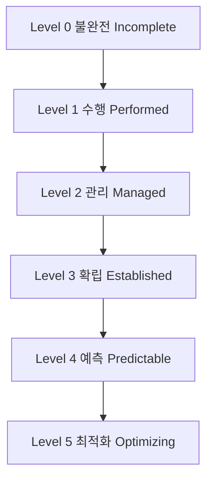
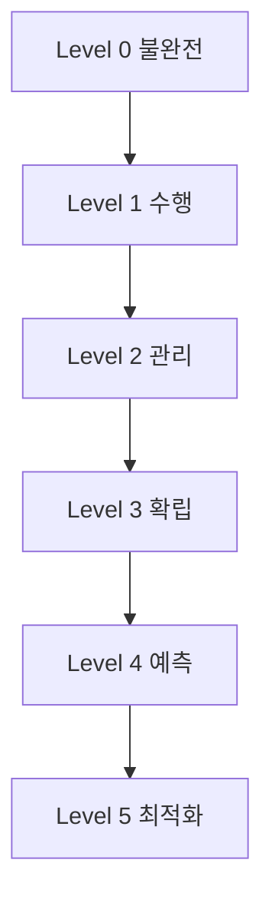

# 245 SPICE의 프로세스 수행 능력 단계

작성 기준일: 2026-06-01
검색/보강일: 2026-06-04
기준 PDF: `/Users/nes0903/Documents/study/정보처리기사/핵심요약집_2026_정보처리기사필기핵심요약.pdf`
PDF 확인 위치: 36페이지 `245 SPICE의 프로세스 수행 능력 단계`

## 한 줄 요약

- SPICE 수행 능력 단계는 Level 0 불완전부터 Level 5 최적화까지 6단계로 프로세스 역량을 평가한다.

## 한눈에 보는 구조

## PDF 기준 핵심

- Level 0 - 불완전(Incomplete).
- Level 1 - 수행(Performed).
- Level 2 - 관리(Managed).
- Level 3 - 확립(Established).
- Level 4 - 예측(Predictable).
- Level 5 - 최적화(Optimizing).

## 개념 설명

- Level 0은 프로세스가 목적을 달성하지 못하거나 수행 증거가 부족한 상태이다.
- Level 1은 프로세스가 목적을 수행해 기본 산출물을 만든 상태이다.
- Level 2는 프로세스가 계획·감시·조정되어 관리되는 상태이다.
- Level 3은 조직 표준에 맞춰 정의되고 확립된 프로세스가 적용되는 상태이다.
- Level 4는 정량적 측정으로 예측 가능하게 관리되고, Level 5는 지속 개선과 최적화가 이뤄진다.

## 시험 포인트

- 순서가 핵심이다: `불완전 → 수행 → 관리 → 확립 → 예측 → 최적화`.
- SPICE는 Level 0이 있다는 점이 CMMI와 다르다.
- Level 3은 `확립`, Level 4는 `예측`이다.
- 영어명까지 같이 묻는 보기에서 Incomplete, Performed, Established, Predictable을 놓치지 않는다.

## 헷갈리는 비교

| Level | 한글 | 영어 | 핵심 단서 |
|---|---|---|---|
| 0 | 불완전 | Incomplete | 목적 미달 |
| 1 | 수행 | Performed | 수행됨 |
| 2 | 관리 | Managed | 계획·감시 |
| 3 | 확립 | Established | 정의된 프로세스 |
| 4 | 예측 | Predictable | 정량적 예측 |
| 5 | 최적화 | Optimizing | 지속 개선 |

## 예시 또는 암기 포인트

- 프로세스가 반복 수행되지만 조직 표준으로 확립되지 않았다면 Level 2 관리 수준으로 볼 수 있다.
- 암기식: `불수관확예최`.

## 빠른 복습

- SPICE Level 0은? 불완전(Incomplete).
- Level 4는? 예측(Predictable).
- 최상위 단계는? Level 5 최적화(Optimizing).

## 상세 보강

- SPICE 단계는 0부터 시작한다. 이 점이 CMMI와 가장 큰 숫자 함정이다.
- Level 0은 프로세스가 목적을 달성하지 못하거나 거의 수행되지 않는 상태이다.
- Level 1은 프로세스가 수행되어 산출물을 만들지만 관리 체계는 약할 수 있다.
- Level 2는 계획·감시·통제 등 관리가 붙고, Level 3은 표준 프로세스로 확립된다.
- Level 4는 측정값으로 예측 가능한 상태, Level 5는 지속적으로 최적화하는 상태이다.

| 단계 | 한글 | 핵심 단서 |
|---|---|---|
| 0 | 불완전 | 목적 미달성 |
| 1 | 수행 | 프로세스 수행 |
| 2 | 관리 | 계획·관리 |
| 3 | 확립 | 표준화·정의 |
| 4 | 예측 | 측정·예측 가능 |
| 5 | 최적화 | 지속 개선 |

## 참고 링크

- [TIPA - ISO/IEC 15504 Standard](https://tipaonline.org/en/tipa/iso-15504-standard)
- [CMMI and ISO/IEC 15504 Capability Scale](https://citeseerx.ist.psu.edu/document?doi=785bdcebb7b6e5f862d2377971c09bae941fb62f&repid=rep1&type=pdf)
