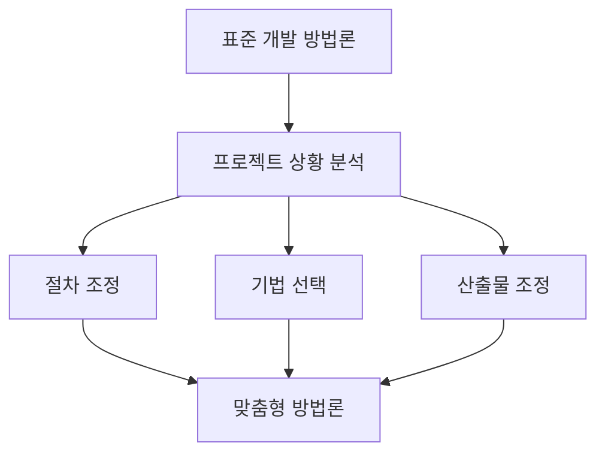
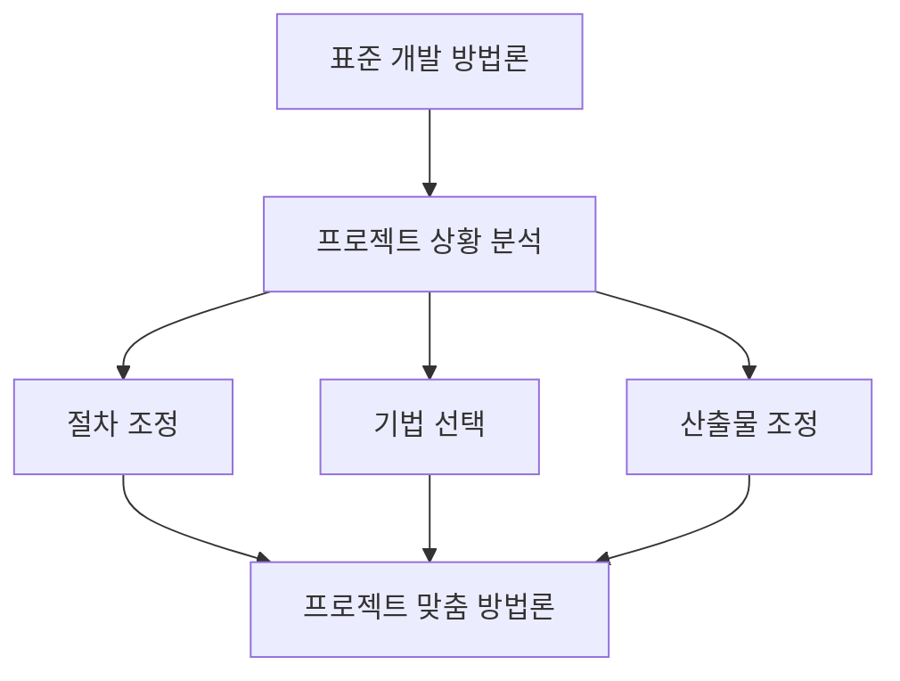

# 246 소프트웨어 개발 방법론 테일러링

작성 기준일: 2026-06-01
검색/보강일: 2026-06-04
기준 PDF: `/Users/nes0903/Documents/study/정보처리기사/핵심요약집_2026_정보처리기사필기핵심요약.pdf`
PDF 확인 위치: 36페이지 `246 소프트웨어 개발 방법론 테일러링`

## 한 줄 요약

- 방법론 테일러링은 프로젝트 상황과 특성에 맞게 표준 개발 방법론의 절차와 기법을 수정·보완하는 작업이다.

## 한눈에 보는 구조

## PDF 기준 핵심

- 프로젝트 상황 및 특성에 맞도록 정의된 소프트웨어 개발 방법론의 절차, 사용기법 등을 수정 및 보완하는 작업이다.
- 표준 방법론을 그대로 적용하기 어려울 때 프로젝트 맥락에 맞게 조정한다.

## 개념 설명

- 모든 프로젝트에 같은 절차와 산출물을 강제하면 비용과 시간이 불필요하게 늘 수 있다.
- 테일러링은 프로젝트 규모, 위험도, 법적 요구, 기술 환경, 조직 역량에 따라 활동과 산출물을 조정한다.
- 무작정 생략하는 것이 아니라 근거를 남기고 품질과 통제 수준을 유지해야 한다.
- CMMI의 정의된 프로세스 적용도 조직 표준을 프로젝트에 맞게 조정하는 관점과 연결된다.

## 시험 포인트

- `수정 및 보완`, `프로젝트 상황 및 특성`, `절차와 사용기법 조정`이 핵심 단서이다.
- 테일러링은 방법론을 폐기하는 것이 아니라 맞춤 적용하는 것이다.
- 다음 주제의 내부적 기준과 외부적 기준 목록을 함께 외운다.
- 개발 방법론과 프로젝트 관리 사이를 연결하는 개념으로 이해한다.

## 헷갈리는 비교

| 구분 | 테일러링 | 표준 방법론 |
|---|---|---|
| 의미 | 프로젝트에 맞게 조정 | 조직이 정한 기본 절차 |
| 목적 | 적합성 향상 | 일관성 확보 |
| 위험 | 과도한 생략 | 과도한 경직성 |
| 시험 단서 | 수정·보완 | 정의된 절차 |

## 예시 또는 암기 포인트

- 소규모 내부 시스템은 일부 산출물을 간소화하고, 금융권 시스템은 법적 검토와 품질 산출물을 강화할 수 있다.
- 암기식: `테일러링 = 프로젝트에 맞춘 수선`.

## 빠른 복습

- 테일러링이란? 방법론 절차와 기법을 프로젝트 특성에 맞게 수정·보완.
- 테일러링은 생략만 의미하는가? 아니다. 추가와 강화도 포함한다.
- 고려 기준은 크게? 내부적 기준과 외부적 기준.

## 상세 보강

- 테일러링은 표준 방법론을 그대로 적용하지 않고 프로젝트 특성에 맞게 조정하는 작업이다.
- 조정 대상은 절차, 산출물, 역할, 기법, 도구, 품질 활동 등이 될 수 있다.
- 규모가 작은 프로젝트에 과도한 산출물을 요구하면 비효율이 커지고, 위험이 큰 프로젝트에서 통제를 줄이면 품질 문제가 생길 수 있다.
- 따라서 테일러링은 단순 생략이 아니라 프로젝트 목표와 위험에 맞춘 최적화로 이해해야 한다.
- 시험에서는 `프로젝트 상황 및 특성`, `절차`, `사용기법`, `수정 및 보완`이 핵심 단서이다.

| 잘못된 이해 | 올바른 이해 |
|---|---|
| 산출물을 마음대로 줄이는 것 | 프로젝트 특성에 맞게 절차와 산출물을 조정 |
| 방법론을 버리는 것 | 표준 방법론을 기반으로 맞춤 적용 |
| 개발자 편의 작업 | 품질·일정·비용·위험을 고려한 관리 활동 |

## 참고 링크

- [CMMI Institute - What is CMMI?](https://dev.cmmiinstitute.com/products/cmmi/what-is-cmmi)
