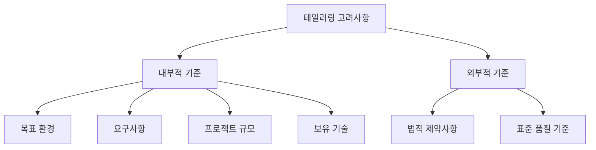
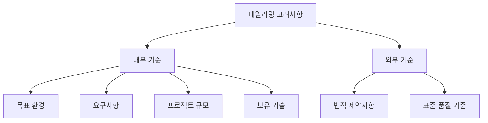

# 247 소프트웨어 개발 방법론 테일러링 고려사항

작성 기준일: 2026-06-01
검색/보강일: 2026-06-04
기준 PDF: `/Users/nes0903/Documents/study/정보처리기사/핵심요약집_2026_정보처리기사필기핵심요약.pdf`
PDF 확인 위치: 36페이지 `247 소프트웨어 개발 방법론 테일러링 고려사항`

## 한 줄 요약

- 테일러링 고려사항은 내부적 기준인 목표 환경·요구사항·규모·보유 기술과 외부적 기준인 법적 제약·표준 품질 기준으로 나뉜다.

## 한눈에 보는 구조

## PDF 기준 핵심

- 내부적 기준: 목표 환경, 요구사항, 프로젝트 규모, 보유 기술.
- 목표 환경: 시스템의 개발 환경과 유형.
- 요구사항: 개발, 운영, 유지보수 등.
- 프로젝트 규모: 비용, 인력, 기간 등.
- 보유 기술: 프로세스, 개발 방법론, 산출물, 구성원의 능력 등.
- 외부적 기준: 법적 제약사항, 표준 품질 기준.
- 법적 제약사항: 프로젝트별로 적용될 IT Compliance.
- 표준 품질 기준: 금융, 제도 등 분야별 표준 품질 기준.

## 개념 설명

- 내부적 기준은 프로젝트와 조직 내부에서 통제하거나 파악할 수 있는 요소이다.
- 외부적 기준은 법, 규제, 산업 표준처럼 프로젝트 외부에서 요구되는 요소이다.
- 보안, 개인정보, 금융 규정이 강한 프로젝트는 산출물과 검토 절차를 강화해야 한다.
- 조직의 기술 역량이 낮거나 새로운 기술을 쓰는 경우 교육, 검토, 위험 관리 절차를 더 두어야 한다.

## 시험 포인트

- 내부/외부 기준의 분류가 가장 중요하다.
- `IT Compliance`는 외부적 기준의 법적 제약사항에 들어간다.
- 비용, 인력, 기간은 프로젝트 규모로 내부적 기준이다.
- 구성원의 능력과 보유 기술도 내부적 기준이다.

## 헷갈리는 비교

| 구분 | 항목 | 시험 단서 |
|---|---|---|
| 내부적 기준 | 목표 환경 | 개발 환경, 시스템 유형 |
| 내부적 기준 | 요구사항 | 개발, 운영, 유지보수 |
| 내부적 기준 | 프로젝트 규모 | 비용, 인력, 기간 |
| 내부적 기준 | 보유 기술 | 프로세스, 산출물, 능력 |
| 외부적 기준 | 법적 제약사항 | IT Compliance |
| 외부적 기준 | 표준 품질 기준 | 금융, 제도 |

## 예시 또는 암기 포인트

- 개인정보 처리 시스템은 외부 법적 제약이 강하므로 보안 검토와 로그 관리 산출물을 강화할 수 있다.
- 암기식: `내부는 환경·요구·규모·기술, 외부는 법·품질`.

## 빠른 복습

- 테일러링 내부 기준 4가지는? 목표 환경, 요구사항, 프로젝트 규모, 보유 기술.
- 외부 기준 2가지는? 법적 제약사항, 표준 품질 기준.
- IT Compliance는 어느 쪽인가? 외부적 기준.

## 상세 보강

- 내부 기준은 프로젝트나 조직 내부에서 통제 가능한 요소이다.
- 목표 환경은 개발하려는 시스템의 유형, 운영 환경, 기술 환경을 뜻한다.
- 요구사항은 개발·운영·유지보수 요구까지 포함해 방법론 절차와 산출물 수준을 결정한다.
- 프로젝트 규모는 비용, 인력, 기간에 영향을 주므로 산출물과 검토 단계를 조정하는 근거가 된다.
- 외부 기준은 법, 규제, 산업 표준처럼 프로젝트 밖에서 요구되는 조건이다.

| 기준 | 세부 항목 | 시험 단서 |
|---|---|---|
| 내부 | 목표 환경 | 시스템 개발 환경과 유형 |
| 내부 | 요구사항 | 개발, 운영, 유지보수 |
| 내부 | 프로젝트 규모 | 비용, 인력, 기간 |
| 내부 | 보유 기술 | 프로세스, 방법론, 산출물, 구성원 능력 |
| 외부 | 법적 제약사항 | IT Compliance |
| 외부 | 표준 품질 기준 | 금융, 제도, 분야별 기준 |

## 참고 링크

- [ISO - ISO/IEC/IEEE 12207:2026](https://www.iso.org/standard/90219.html)

<!-- study-links:start -->
## 관련 문서

- `소프트웨어 개발 방법론 테일러링`: [[정보처리기사/5과목 정보시스템 구축 관리/246 소프트웨어 개발 방법론 테일러링/246 소프트웨어 개발 방법론 테일러링|246 소프트웨어 개발 방법론 테일러링]]
- `위험 관리`: [[정보처리기사/5과목 정보시스템 구축 관리/241 위험 관리(Risk Analysis)/241 위험 관리(Risk Analysis)|241 위험 관리(Risk Analysis)]]
- `iec`: [[정보처리기사/1과목 소프트웨어 설계/024 ISO IEC 9126의 품질 특성/024 ISO IEC 9126의 품질 특성|024 ISO/IEC 9126의 품질 특성]]
<!-- study-links:end -->
