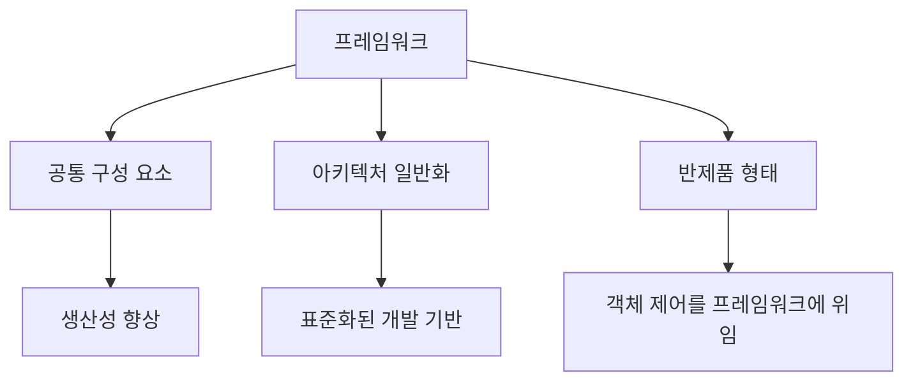
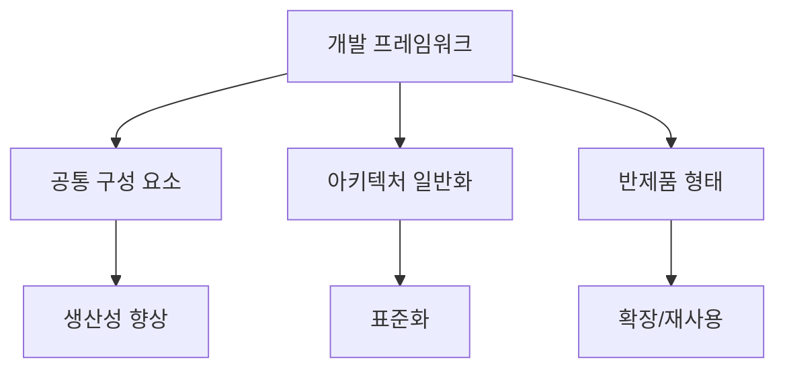

# 248 소프트웨어 개발 프레임워크

작성 기준일: 2026-06-01
검색/보강일: 2026-06-04
기준 PDF: `/Users/nes0903/Documents/study/정보처리기사/핵심요약집_2026_정보처리기사필기핵심요약.pdf`
PDF 확인 위치: 37페이지 `248 소프트웨어 개발 프레임워크`

## 한 줄 요약

- 소프트웨어 개발 프레임워크는 공통 구성 요소와 아키텍처를 제공해 개발자가 표준화된 기반 위에서 애플리케이션을 구현하도록 돕는 반제품 형태의 시스템이다.

## 한눈에 보는 구조

## PDF 기준 핵심

- 소프트웨어 개발에 공통적으로 사용되는 구성 요소와 아키텍처를 일반화하여 손쉽게 구현할 수 있도록 여러 기능을 제공해 주는 반제품 형태의 소프트웨어 시스템이다.
- 선행 사업자의 기술에 의존하지 않은 표준화된 개발 기반으로 인해 사업자 종속성이 해소된다.
- 개발자가 관리하고 통제해야 하는 객체들의 제어를 프레임워크에 넘김으로써 생산성을 향상시킨다.

## 개념 설명

- 프레임워크는 라이브러리보다 더 큰 구조와 실행 흐름을 제공한다.
- 개발자는 프레임워크가 정한 규칙과 확장 지점에 맞춰 업무 로직을 작성한다.
- 객체 생성, 의존성 연결, 생명주기 관리 등을 프레임워크가 맡는 구조를 제어의 역전(IoC)이라고 한다.
- Spring Framework 문서의 IoC 컨테이너도 객체 생성과 의존성 관리를 프레임워크가 담당하는 대표 예이다.

## 시험 포인트

- `반제품`, `공통 구성 요소`, `아키텍처 일반화`, `표준화된 개발 기반`이 핵심 단서이다.
- `객체들의 제어를 프레임워크에 넘김`은 제어의 역전과 연결된다.
- 사업자 종속성 해소와 생산성 향상은 PDF에 명시된 효과이다.
- 라이브러리는 개발자가 호출하지만, 프레임워크는 프레임워크가 개발자 코드를 호출하는 구조로 이해하면 쉽다.

## 헷갈리는 비교

| 구분 | 라이브러리 | 프레임워크 |
|---|---|---|
| 제어 흐름 | 개발자가 호출 | 프레임워크가 호출 |
| 제공 범위 | 특정 기능 묶음 | 구조, 규칙, 공통 기능 |
| 시험 단서 | 함수/모듈 사용 | 반제품, 아키텍처 |
| 효과 | 기능 재사용 | 표준화, 생산성, 종속성 완화 |

## 예시 또는 암기 포인트

- Spring, Django, 전자정부프레임워크처럼 공통 구조와 개발 규칙을 제공하는 도구를 프레임워크로 볼 수 있다.
- 암기식: `프레임워크 = 틀을 주고 제어도 가져간다`.

## 빠른 복습

- 프레임워크의 성격은? 반제품 형태의 소프트웨어 시스템.
- PDF의 주요 효과는? 사업자 종속성 해소, 생산성 향상.
- 객체 제어를 프레임워크에 넘기는 개념은? 제어의 역전(IoC).

## 상세 보강

- 프레임워크는 애플리케이션 개발에 반복적으로 필요한 구조와 공통 기능을 미리 제공하는 반제품 형태의 소프트웨어 시스템이다.
- 라이브러리는 개발자가 필요한 때 호출하지만, 프레임워크는 전체 구조를 제공하고 개발자의 코드를 정해진 지점에서 실행하게 한다.
- PDF의 `객체들의 제어를 프레임워크에 넘김`은 제어의 역전(IoC) 개념과 연결된다.
- 표준화된 개발 기반을 쓰면 특정 선행 사업자 기술에 묶이는 위험을 줄일 수 있다.
- 시험에서는 `공통 구성 요소`, `아키텍처 일반화`, `반제품`, `사업자 종속성 해소`, `생산성 향상`을 함께 외운다.

| 구분 | 프레임워크 | 라이브러리 |
|---|---|---|
| 제어 흐름 | 프레임워크가 큰 흐름 제어 | 개발자가 직접 호출 |
| 제공 범위 | 구조, 규칙, 공통 기능 | 특정 기능 |
| 시험 단서 | 반제품, 아키텍처, IoC | 함수/모듈 재사용 |

## 참고 링크

- [Spring Framework - IoC Container](https://docs.spring.io/spring-framework/reference/core/beans.html)
