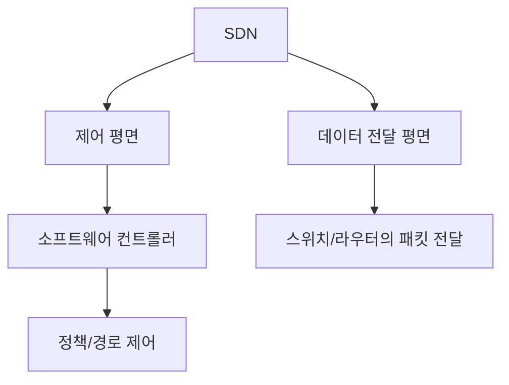
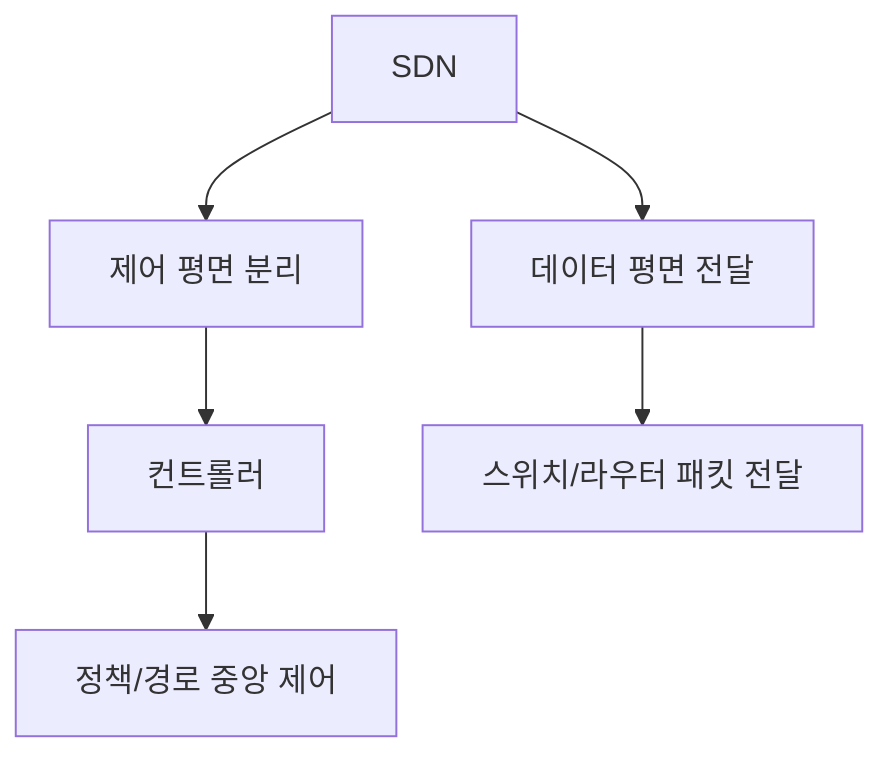

# 249 SDN(Software Defined Networking)

작성 기준일: 2026-06-01
검색/보강일: 2026-06-04
기준 PDF: `/Users/nes0903/Documents/study/정보처리기사/핵심요약집_2026_정보처리기사필기핵심요약.pdf`
PDF 확인 위치: 37페이지 `249 SDN(Software Defined Networking)`

## 한 줄 요약

- SDN은 네트워크 제어 기능을 소프트웨어로 분리·중앙화하여 네트워크를 가상화하고 유연하게 제어·관리하는 기술이다.

## 한눈에 보는 구조

## PDF 기준 핵심

- 네트워크를 컴퓨터처럼 모델링한다.
- 여러 사용자가 각각의 소프트웨어들로 네트워킹을 가상화하여 제어하고 관리하는 네트워크이다.
- `소프트웨어`, `네트워킹 가상화`, `제어와 관리`가 핵심 단서이다.

## 개념 설명

- 기존 네트워크 장비는 제어 기능과 전달 기능이 장비 안에 함께 있는 경우가 많다.
- SDN은 제어 로직을 컨트롤러로 분리해 네트워크 정책을 중앙에서 프로그래밍할 수 있게 한다.
- 데이터 평면 장비는 컨트롤러가 정한 규칙에 따라 패킷을 전달한다.
- 클라우드, 데이터센터, 대규모 네트워크에서 빠른 정책 변경과 자동화에 유리하다.

## 시험 포인트

- `네트워크 가상화`, `소프트웨어로 제어`, `컨트롤러`가 나오면 SDN이다.
- SDS는 스토리지, SDDC는 데이터센터 전체를 소프트웨어로 정의한다.
- SDN은 단순 VLAN이 아니라 네트워크 제어 구조 자체를 소프트웨어 중심으로 바꾸는 개념이다.
- 네트워크 기능 가상화(NFV)와 함께 나오면, SDN은 제어 분리·프로그래밍성에 초점을 둔다.

## 헷갈리는 비교

| 구분 | SDN | SDS | SDDC |
|---|---|---|---|
| 대상 | 네트워크 | 스토리지 | 데이터센터 전체 |
| 핵심 | 제어와 전달 분리 | 저장장치 가상화 | 컴퓨트·네트워크·스토리지 가상화 |
| 시험 단서 | Networking | Storage | Data Center |

## 예시 또는 암기 포인트

- 운영자가 컨트롤러에서 정책을 바꾸면 여러 스위치의 전달 규칙이 자동으로 바뀌는 구조가 SDN이다.
- 암기식: `SDN = 네트워크를 소프트웨어로 정의`.

## 빠른 복습

- SDN의 대상은? 네트워크.
- SDN의 핵심은? 소프트웨어 기반 가상화 제어와 관리.
- SDS와의 차이는? SDS는 스토리지 자원을 다룬다.

## 상세 보강

- SDN은 네트워크 장비가 직접 판단하던 제어 기능을 소프트웨어 컨트롤러 쪽으로 분리해 관리하는 접근이다.
- 전통적 장비는 제어 평면과 데이터 평면이 장비 내부에 결합되어 있지만, SDN은 이를 논리적으로 분리한다.
- PDF의 `네트워크를 컴퓨터처럼 모델링`은 네트워크도 소프트웨어 정책으로 프로그래밍하고 자동화한다는 의미로 이해한다.
- SDN은 클라우드 데이터센터, 네트워크 가상화, 자동화된 정책 적용과 연결된다.
- 시험에서는 `네트워킹 가상화`, `소프트웨어 제어`, `컨트롤러`, `제어/전달 분리`가 핵심 단서이다.

| 구분 | SDN | NFV |
|---|---|---|
| 초점 | 네트워크 제어 구조 | 네트워크 기능의 가상화 |
| 핵심 | 제어 평면과 전달 평면 분리 | 방화벽, 라우터 등 기능을 VM/컨테이너로 구현 |
| 단서 | Controller, OpenFlow | Virtual Network Function |

## 참고 링크

- [ONF - Software Defined Networking](https://opennetworking.org/sdn-definition/)
