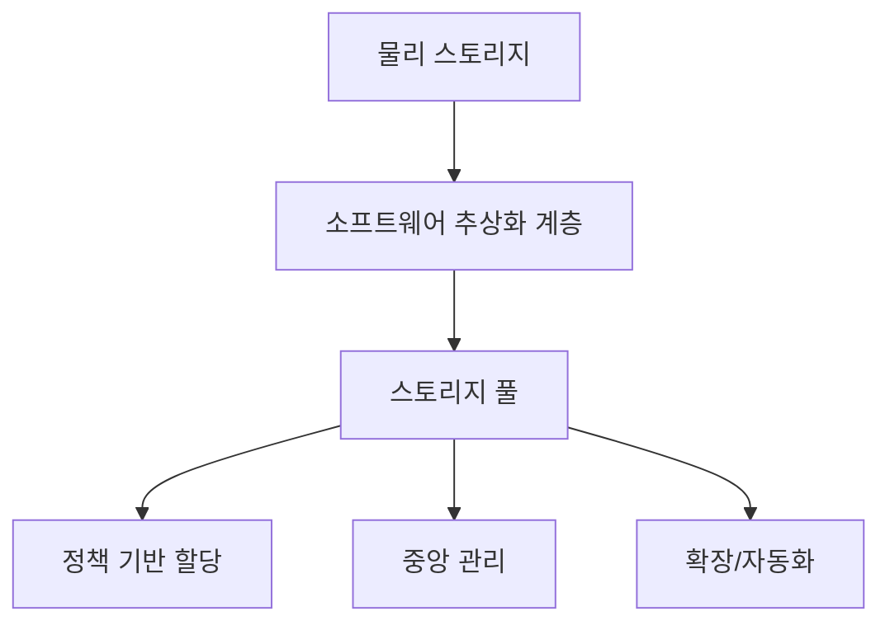
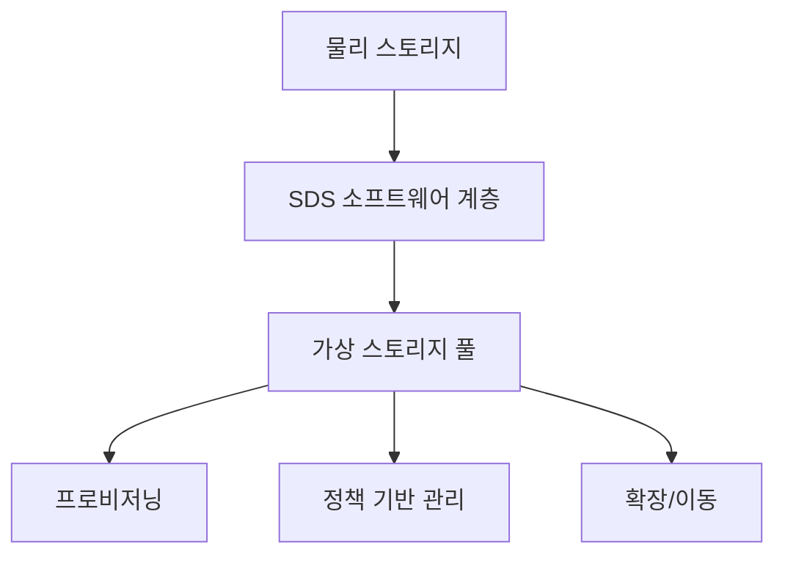

# 250 SDS(Software-Defined Storage)

작성 기준일: 2026-06-01
검색/보강일: 2026-06-04
기준 PDF: `/Users/nes0903/Documents/study/정보처리기사/핵심요약집_2026_정보처리기사필기핵심요약.pdf`
PDF 확인 위치: 37페이지 `250 SDS(Software-Defined Storage)`

## 한 줄 요약

- SDS는 물리적 스토리지를 소프트웨어로 추상화해 여러 저장 자원을 하나처럼 관리하는 기술이다.

## 한눈에 보는 구조

## PDF 기준 핵심

- 물리적인 데이터 스토리지(Data Storage)를 가상화한다.
- 여러 스토리지를 하나처럼 관리하는 기술이다.
- `스토리지`, `가상화`, `하나처럼 관리`가 핵심 단서이다.

## 개념 설명

- SDS는 저장 기능과 관리 기능을 특정 하드웨어에 고정하지 않고 소프트웨어 계층에서 제어한다.
- 여러 디스크, 스토리지 장비, 서버 저장 공간을 하나의 논리적 자원 풀처럼 다룰 수 있다.
- 정책 기반 프로비저닝, 복제, 확장, 장애 대응을 자동화하는 데 유리하다.
- IBM과 VMware 자료도 SDS를 하드웨어와 스토리지 관리 소프트웨어를 분리하는 방식으로 설명한다.

## 시험 포인트

- `Storage`가 나오면 SDS, `Networking`이 나오면 SDN, `Data Center`가 나오면 SDDC로 구분한다.
- SDS는 저장장치를 없애는 것이 아니라 물리 장치를 추상화해 관리한다.
- 가상화 대상은 데이터 저장 자원이다.
- SDDC는 SDS를 포함하는 더 넓은 데이터센터 가상화 개념으로 볼 수 있다.

## 헷갈리는 비교

| 구분 | 전통적 스토리지 | SDS |
|---|---|---|
| 관리 위치 | 장비별 관리 | 소프트웨어 계층 통합 관리 |
| 확장 | 장비 종속성 큼 | 자원 풀 확장 |
| 제어 | 하드웨어 중심 | 정책/소프트웨어 중심 |
| 시험 단서 | 물리 저장장치 | 스토리지 가상화 |

## 예시 또는 암기 포인트

- 여러 서버의 디스크를 묶어 하나의 저장소처럼 할당하면 SDS 개념으로 이해할 수 있다.
- 암기식: `SDS = Storage를 Software로`.

## 빠른 복습

- SDS의 대상은? 데이터 스토리지.
- SDS의 핵심은? 물리 스토리지 가상화와 통합 관리.
- SDDC와의 관계는? SDDC의 구성 요소가 될 수 있다.

## 상세 보강

- SDS는 저장 장치의 물리적 특성을 감추고 소프트웨어 계층에서 저장 자원을 통합 관리한다.
- 여러 스토리지를 하나의 풀처럼 다루기 때문에 용량 할당, 복제, 이동, 확장을 정책 기반으로 처리할 수 있다.
- SDN이 네트워크를 소프트웨어로 정의한다면 SDS는 스토리지 자원을 소프트웨어로 정의한다.
- 하드웨어가 필요 없다는 뜻이 아니라, 하드웨어 종속적인 관리 방식을 줄인다는 뜻이다.
- 시험에서는 `Data Storage`, `가상화`, `여러 스토리지를 하나처럼 관리`가 핵심이다.

| 구분 | SDS | SDN | SDDC |
|---|---|---|---|
| 대상 | 저장소 | 네트워크 | 데이터센터 전체 |
| 핵심 | 스토리지 가상화 | 네트워크 제어 가상화 | 모든 자원 가상화 |
| 단서 | Storage | Networking | Data Center |

## 참고 링크

- [IBM - What is Software-Defined Storage?](https://www.ibm.com/topics/software-defined-storage)
- [VMware - What is Software-Defined Storage?](https://www.vmware.com/topics/software-defined-storage)
