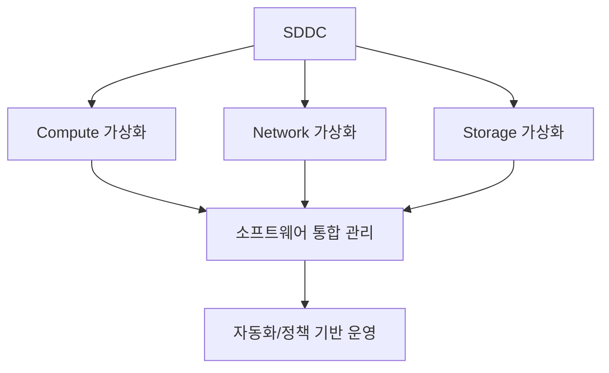
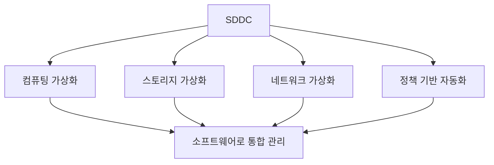

# 251 SDDC(Software Defined Data Center)

작성 기준일: 2026-06-01
검색/보강일: 2026-06-04
기준 PDF: `/Users/nes0903/Documents/study/정보처리기사/핵심요약집_2026_정보처리기사필기핵심요약.pdf`
PDF 확인 위치: 37페이지 `251 SDDC(Software Defined Data Center)`

## 한 줄 요약

- SDDC는 데이터센터의 컴퓨팅, 네트워크, 스토리지 등 모든 자원을 가상화해 소프트웨어로 관리·제어하는 데이터센터이다.

## 한눈에 보는 구조

## PDF 기준 핵심

- 데이터 센터의 모든 자원을 가상화한다.
- 인력의 개입 없이 소프트웨어 조작만으로 관리 및 제어되는 데이터 센터이다.
- `모든 자원`, `가상화`, `소프트웨어 조작만으로 관리`가 핵심 단서이다.

## 개념 설명

- SDDC는 서버, 스토리지, 네트워크, 보안 기능을 소프트웨어로 추상화하고 자동화하는 개념이다.
- IBM 자료도 SDDC를 컴퓨트에서 스토리지와 네트워킹까지 가상화를 확장한 데이터센터로 설명한다.
- 운영자는 물리 장비를 하나씩 설정하기보다 정책과 템플릿으로 자원을 배치한다.
- 클라우드 데이터센터의 자동 프로비저닝과 탄력적 운영의 기반 개념으로 이해할 수 있다.

## 시험 포인트

- SDN과 SDS를 포함하는 더 넓은 개념이 SDDC이다.
- `데이터 센터의 모든 자원`이라는 표현을 놓치지 않는다.
- 인력 개입 없이 소프트웨어 조작으로 관리한다는 PDF 문구가 중요하다.
- 데이터센터 자원 자동화, 정책 기반 운영, 가상화가 핵심 단서이다.

## 헷갈리는 비교

| 구분 | SDN | SDS | SDDC |
|---|---|---|---|
| 범위 | 네트워크 | 저장장치 | 데이터센터 전체 |
| 가상화 대상 | 네트워킹 | 스토리지 | 컴퓨트·네트워크·스토리지 |
| 운영 효과 | 네트워크 자동화 | 저장 자원 통합 | 전체 인프라 자동화 |

## 예시 또는 암기 포인트

- 관리자가 포털에서 서버, 네트워크, 저장 공간을 한 번에 배치하면 SDDC 운영에 가깝다.
- 암기식: `SDDC = Data Center 전체를 Software로`.

## 빠른 복습

- SDDC의 대상은? 데이터센터의 모든 자원.
- SDDC는 어떤 방식으로 관리하는가? 소프트웨어 조작과 자동화.
- SDN/SDS와의 차이는? SDDC가 더 넓다.

## 상세 보강

- SDDC는 데이터센터의 서버, 네트워크, 스토리지, 보안 등 주요 자원을 소프트웨어로 추상화해 관리한다.
- PDF의 `인력의 개입 없이 소프트웨어 조작만으로 관리 및 제어`는 자동화와 정책 기반 운영을 강조한다.
- SDN, SDS는 SDDC를 구성하는 일부 영역으로 볼 수 있다.
- SDDC는 클라우드 인프라, 가상화, 자동 프로비저닝과 함께 이해하면 쉽다.
- 시험에서는 SDDC를 단순 서버 가상화가 아니라 데이터센터 전체 자원 가상화로 구분한다.

| 항목 | 설명 |
|---|---|
| 컴퓨팅 | 서버/VM/컨테이너 자원 관리 |
| 스토리지 | 저장소 풀링과 정책 관리 |
| 네트워크 | 가상 네트워크와 정책 제어 |
| 자동화 | 소프트웨어 조작으로 배포·변경 |

## 참고 링크

- [IBM - What is a Software-Defined Data Center?](https://www.ibm.com/think/topics/software-defined-data-center)

<!-- study-links:start -->
## 관련 문서

- `sdn`: [[정보처리기사/5과목 정보시스템 구축 관리/249 SDN(Software Defined Networking)/249 SDN(Software Defined Networking)|249 SDN(Software Defined Networking)]]
- `sds`: [[정보처리기사/5과목 정보시스템 구축 관리/250 SDS(Software-Defined Storage)/250 SDS(Software-Defined Storage)|250 SDS(Software-Defined Storage)]]
<!-- study-links:end -->
