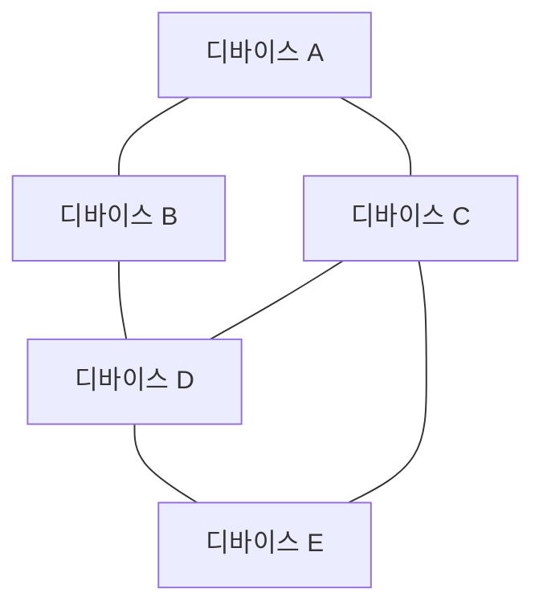
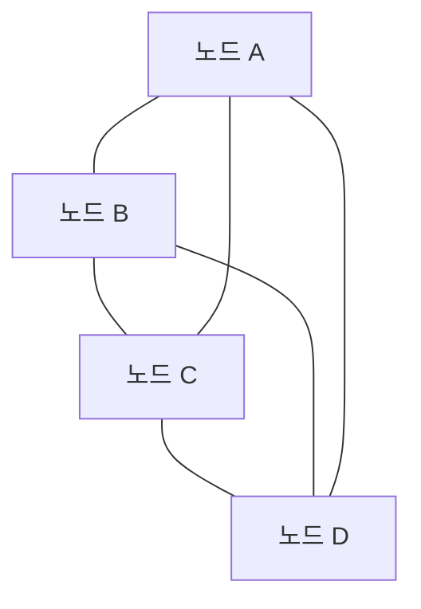

# 252 메시 네트워크(Mesh Network)

작성 기준일: 2026-06-01
검색/보강일: 2026-06-04
기준 PDF: `/Users/nes0903/Documents/study/정보처리기사/핵심요약집_2026_정보처리기사필기핵심요약.pdf`
PDF 확인 위치: 37페이지 `252 메시 네트워크(Mesh Network)`

## 한 줄 요약

- 메시 네트워크는 여러 디바이스가 그물망처럼 서로 연결되어 안정적인 네트워크를 구성하는 방식이다.

## 한눈에 보는 구조

## PDF 기준 핵심

- 수십에서 수천 개의 디바이스를 그물망(Mesh)과 같이 유기적으로 연결한다.
- 모든 구간을 동일한 무선망처럼 구성하여 사용자가 안정적인 네트워크를 사용할 수 있게 한다.
- `그물망`, `다수 디바이스`, `안정적인 네트워크`가 핵심 단서이다.

## 개념 설명

- 메시 네트워크는 노드들이 서로 직접 또는 중계 방식으로 연결되어 여러 경로를 제공한다.
- 일부 노드나 경로에 문제가 생겨도 다른 경로를 통해 통신할 수 있어 안정성과 확장성이 높다.
- Bluetooth SIG는 Bluetooth mesh를 다대다 통신에 적합하고 대규모 디바이스 네트워크에 최적화된 방식으로 설명한다.
- IoT 센서망, 스마트홈, 빌딩 자동화, 산업 현장 네트워크에 자주 쓰인다.

## 시험 포인트

- `Mesh = 그물망`을 바로 연결한다.
- 피코넷은 소규모 Bluetooth/UWB 네트워크이고, 메시 네트워크는 수십~수천 디바이스를 그물망처럼 연결한다.
- 안정성 단서는 다중 경로와 우회 가능성에서 나온다.
- 모든 장치가 반드시 모든 장치와 직접 연결된다는 뜻은 아니며, 논리적으로 그물망 구조를 이룬다는 의미로 이해한다.

## 헷갈리는 비교

| 구분 | 메시 네트워크 | 피코넷 |
|---|---|---|
| 규모 | 수십~수천 디바이스 | 비교적 소규모 |
| 구조 | 그물망, 다중 경로 | 블루투스/UWB 기반 무선망 |
| 강점 | 안정성, 확장성 | 근거리 장치 연결 |
| 시험 단서 | Mesh, 그물망 | PICONET |

## 예시 또는 암기 포인트

- 스마트 조명 수백 개가 서로 중계하며 건물 전체 네트워크를 구성하면 메시 네트워크로 이해한다.
- 암기식: `Mesh는 그물처럼 얽혀 안정적`.

## 빠른 복습

- 메시 네트워크의 구조는? 그물망.
- PDF에 나온 규모는? 수십에서 수천 개 디바이스.
- 장점은? 안정적인 네트워크 사용.

## 상세 보강

- 메시 네트워크는 여러 노드가 그물망처럼 서로 연결되어 경로를 유연하게 구성하는 네트워크이다.
- 일부 경로가 끊겨도 다른 노드를 거쳐 통신할 수 있어 안정성과 확장성이 좋다.
- 무선 메시에서는 각 디바이스가 단말이면서 중계 노드 역할도 할 수 있다.
- PDF의 `수십에서 수천 개 디바이스`, `그물망`, `동일한 무선망처럼 구성`, `안정적인 네트워크`가 핵심이다.
- 시험에서는 중앙 장비 하나에만 의존하는 스타형 구조와 비교해 이해한다.

| 구분 | 메시 | 스타 |
|---|---|---|
| 연결 | 다중 경로 | 중앙 노드 중심 |
| 장애 대응 | 우회 경로 가능 | 중앙 장애에 취약 |
| 확장 | 노드 추가로 확장 | 중앙 장비 용량 영향 |

## 참고 링크

- [Bluetooth SIG - What is Bluetooth Mesh?](https://support.bluetooth.com/hc/en-us/articles/360049491971-What-is-Bluetooth-mesh)
